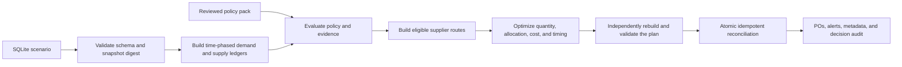

# Apex Procurement Agent

Apex Procurement converts a manufacturing scenario stored in SQLite into a verified procurement plan. It expands scheduled production through the bill of materials, accounts for inventory and existing inbound orders, evaluates the reviewed procurement policy, selects supplier quantities and dates, independently validates the result, and atomically writes purchase orders and operational alerts.

The planning path is deterministic and offline by default. An LLM cannot authorize a supplier, change a policy rule, replace optimization, waive validation, or bypass the commit boundary.

## Quick start

Python 3.11 or newer is required.

```bash
python3 -m venv .venv
source .venv/bin/activate
python3 -m pip install --upgrade pip
python3 -m pip install -e '.[test]'
```

Live residual model resolution additionally requires the optional HTTP client:

```bash
python3 -m pip install -e '.[model]'
```

Inspect a scenario without writing to it:

```bash
python3 agent.py \
  --scenario data/scenarios/scenario_06_simple.sqlite \
  --contract benchmark \
  --llm off \
  --dry-run \
  --json \
  2> /tmp/apex-run-audit.jsonl
```

To test a commit, work on a copy because normal execution updates the selected database in place:

```bash
cp data/scenarios/scenario_06_simple.sqlite /tmp/apex-demo.sqlite
python3 agent.py --scenario /tmp/apex-demo.sqlite --contract benchmark --llm off
```

The installed command is equivalent:

```bash
apex-procurement --scenario /tmp/apex-demo.sqlite
```

## How it works



1. **Load the snapshot.** The repository validates types, foreign keys, dates, identifiers, and supported schema before creating an immutable snapshot and digest.
2. **Build ledgers.** Production schedules are expanded through the BOM into dated component demand. On-hand inventory and existing purchase orders become the supply ledger.
3. **Evaluate policy.** Effective rules, supplier attributes, certifications, memos, and missing evidence are evaluated from the checked-in policy pack.
4. **Construct routes.** Each catalog offer becomes a candidate route with price, MOQ, lead time, eligibility, evidence, exceptions, and approval requirements.
5. **Optimize per component.** An integer-scaled model chooses compliant supplier quantities and allocations while prioritizing coverage, timing, policy comparators, and known cost.
6. **Validate independently.** A separate validator reconstructs the important facts and solver constraints from source data. Incomplete proof or inconsistent business fields cannot commit.
7. **Reconcile atomically.** The database digest is checked again under a write transaction. Agent-owned rows are inserted or reconciled without modifying external rows.

## Architecture

| Area | Main modules | Responsibility |
|---|---|---|
| CLI and orchestration | `cli.py`, `config.py` | Runtime modes, planning phases, exit codes, and audit events |
| Scenario boundary | `repository.py`, `snapshot.py` | Defensive SQLite loading, canonical snapshots, and source digests |
| Demand and policy | `ledgers.py`, `policy/` | Time-phased requirements, reviewed rules, evidence, and typed parameters |
| Candidate generation | `candidates.py` | Supplier routes, policy gates, exceptions, and approvals |
| Planning | `optimizer.py` | Integer-scaled MILP and bounded exact fallback with solver certificates |
| Independent checks | `validator.py`, `isolation.py` | Decimal recomputation, invariant checks, and safe component isolation |
| Outputs | `decisions.py`, `explanations.py` | Stable action identity, readable rationales, alerts, and decision records |
| Persistence and audit | `persistence.py`, `audit.py` | Agent-owned tables, atomic reconciliation, hashes, and JSON audit lines |

The domain objects in `domain.py` are immutable contracts shared by these layers. Infrastructure boundaries are expressed as protocols in `protocols.py`, including the optional model seam.

## Outputs and auditability

### Business tables

- `purchase_orders` contains executable procurement actions. Its `rationale` explains the demand trigger, supplier-selection reason, non-obvious quantity rules, sourcing exceptions, and material assumptions. It deliberately does not repeat component, supplier, quantity, price, or delivery columns.
- `alerts` contains only problems and recommendations that merit attention. Every agent alert starts with `Error:` for a current failure or blocked outcome, or `Recommendation:` for a non-blocking action.

Successful-run summaries, raw assumption codes, immaterial surplus, and resolved counterfactuals are not alerts. They remain available in audit data.

### Agent-owned SQLite tables

The following tables are created inside the same transaction as the business rows. A dry run does not create or modify them.

| Table | What it records | Why it exists |
|---|---|---|
| `apex_po_metadata` | PO ownership marker, action key, demand/source fingerprints, policy version, route identity, and field/group digests | Idempotency, tamper detection, safe upgrades, and collision prevention |
| `apex_alert_metadata` | Alert ownership, category, scope, stable key, and full diagnostic description | Keeps `alerts.description` readable while retaining diagnostic detail |
| `apex_decision_audit` | One canonical JSON decision per component requirement, plus its digest and policy version | Preserves demand buckets, supply ledger, evidence, selected and alternative plans, comparators, lateness, assumptions, and autonomy parameters |

This separation is intentional: operators get concise business rows, while reviewers can reconstruct why the agent acted.

### Run audit event

Every invocation emits one structured success or failure JSON line to `stderr`. Successful events include the input and snapshot hashes, policy identity, evidence contract, model status, active rules, solver outcomes, validation status, timings, exclusions, and commit accounting. A failure writes the structured event first, followed by a human-readable error line. Capture the stream independently from result output:

```bash
python3 agent.py --scenario /tmp/apex-demo.sqlite --json \
  > /tmp/apex-result.json \
  2> /tmp/apex-run-audit.jsonl
```

### Inspecting the checked-in results

The six benchmark outputs are in [`results/`](results/) and can be opened directly in DB Browser for SQLite. Start with these views:

```sql
SELECT * FROM purchase_orders ORDER BY component_id, supplier_id;
SELECT * FROM alerts ORDER BY alert_id;

SELECT component_id,
       json_extract(decision_json, '$.initial_eventual_gap') AS initial_shortage,
       json_extract(decision_json, '$.residual_gap') AS residual_shortage,
       json_extract(decision_json, '$.selected_plan.total_cost') AS selected_cost
FROM apex_decision_audit
ORDER BY component_id;

SELECT a.alert_id, a.description, m.category, m.scope, m.audit_description
FROM alerts AS a
LEFT JOIN apex_alert_metadata AS m USING (alert_id)
ORDER BY a.alert_id;
```

## Evidence contracts

Missing evidence is never silently converted to `false`, zero, or supplier ineligibility.

| Contract | Behavior |
|---|---|
| `benchmark` | Default for the assignment scenarios. Applies only the reviewed benchmark fallbacks, labels the assumptions, and may create POs with a consolidated evidence recommendation. |
| `production` | Keeps required missing evidence as `UNKNOWN`, withholds affected procurement actions, and emits traceable decision/evidence errors. |

Use `production` when the database is expected to represent authoritative operational evidence.

## LLM capability

The planner can optionally classify policy-concept membership that structured attributes and reviewed lexical rules leave `UNKNOWN`. It sends only the component's bounded master-data fields and the reviewed concept definition to an OpenAI-compatible `/v1/chat/completions` endpoint. Responses are strict `{member, confidence, reason}` objects, cached during the run, fingerprint-bound, and accepted only at confidence `0.85` or higher.

| Mode | Behavior |
|---|---|
| `--llm off` | Default. No model call; reports `model_status=disabled`. |
| `--llm auto` | Uses a configured provider for active residual component concepts. Missing configuration, provider failure, malformed output, or insufficient confidence falls back visibly to deterministic `UNKNOWN` behavior. |
| `--llm required` | Requires provider configuration and accepted responses for residual calls; otherwise exits 4 before optimization or writes. |

Configure any OpenAI-compatible provider with the three variables below. This
OpenAI example uses the current flagship GPT model:

```bash
export LLM_BASE_URL="https://api.openai.com"
export LLM_MODEL="gpt-5.6-sol"
export LLM_API_KEY="your-openai-project-api-key"

cp data/scenarios/scenario_06_simple.sqlite /tmp/apex-model-demo.sqlite
python3 agent.py \
  --scenario /tmp/apex-model-demo.sqlite \
  --contract benchmark \
  --llm auto \
  --json
```

`LLM_API_KEY` is sent only as a bearer token and is never written to SQLite, stdout, or audit output. The provider receives component name, description, category, unit, hazard/certification flags, and the reviewed concept quote/fixtures; scenario demand, supplier prices, purchase orders, customer names, and database contents are not sent. Requests use seed 0, a 30-second timeout, and no retry. Compatible providers also receive temperature 0; GPT-5.6 requires its default temperature, so that field is omitted while the strict response schema and all downstream guards remain unchanged.

An accepted benchmark classification is recorded as `MODEL_RESIDUAL_CLASSIFICATION` and can change which reviewed rules apply, but it remains `EXECUTE_WITH_ASSUMPTION`. Production converts the same dependency to `DECISION_REQUIRED`. The model cannot create suppliers, prices, lead times, certifications, quantities, approvals, or policy rules. Exact optimization and the independent validator consume the same fingerprint-bound classification, and no plan can commit without the ordinary validation and atomic-write boundary.

Result JSON and the audit event report model status, model identifier, attempted/accepted/low-confidence/failure counts, concept/entity classifications, confidence, bounded model reasons, and evidence hashes. They never include the API key or endpoint URL.

After configuring a provider, run the repeatable six-scenario comparison with:

```bash
python3 scripts/compare_model_modes.py --contract benchmark
```

The comparison defaults to `--llm=required` for the model-on copies, so a timeout or rejected response cannot masquerade as a successful live A/B.

## Design choices and tradeoffs

| Choice | Benefit | Tradeoff |
|---|---|---|
| Deterministic core | Reproducible actions, stable tests, and explainable failures | Less flexible than free-form agent planning |
| Reviewed, checked-in policy JSON | Versioned rules, provenance, effective dates, and reproducible evaluation | Policy PDFs are not recompiled automatically at runtime |
| `Decimal` facts plus integer-scaled optimization | Avoids silent floating-point business decisions | More implementation and validation complexity |
| Separate independent validator | Catches planner, renderer, and solver-integration errors before writes | Repeats work and increases runtime |
| Explicit benchmark/production evidence contracts | Makes missing-data behavior visible and fail-safe | Benchmark results are not automatically production-ready |
| Sparse alerts plus deep audit tables | Operational tables remain readable without losing traceability | Detailed review requires opening metadata or decision JSON |
| In-place SQLite transaction | Simple delivery, atomic writes, and easy inspection | Designed for one snapshot and local transactional concurrency, not a distributed service |
| Stable action keys and source fingerprints | Exact reruns are no-ops and changed alternatives cannot create duplicate demand | Conservative source changes may preserve an old PO as physical inbound rather than silently replacing it |
| Optional component isolation | A local internal defect need not discard independently valid components | Exclusions require engineering review; `--strict` is available for all-or-nothing behavior |

## Safety and idempotency

- Agent-owned POs use stable action keys and complete source fingerprints covering relevant demand, suppliers, catalog routes, existing inbound, policy, and contract facts.
- Exact reruns preserve PO rows, alert IDs, metadata, audit decisions, and SQLite sequences.
- External POs and alerts are never updated or deleted.
- Malformed ownership markers, forged metadata, APX number collisions, changed stored fields, or incomplete line groups fail closed.
- The commit transaction rechecks file identity and snapshot digest. One full replan is allowed after concurrent modification; a second change exits without duplicate writes.
- Non-strict component isolation commits survivors only after a second independent validation. `--strict` disables partial survivors.
- Any safe partial result identifies its excluded components and validation failures in the run audit.

## CLI reference

| Option | Meaning |
|---|---|
| `--scenario PATH` | Required readable SQLite scenario; commit mode updates it in place |
| `--contract {benchmark,production}` | Select missing-evidence behavior |
| `--llm {off,auto,required}` | Select the optional model mode described above |
| `--dry-run` | Plan, validate, and render without database writes |
| `--explain COMPONENT_ID` | Include the canonical detailed decision explanation for one demanded component |
| `--strict` | Fail on validation warnings and disable component-level survivor commits |
| `--alert-prefixes` | Add diagnostic category tags such as `[LATE_ARRIVAL]` after the required `Error:` or `Recommendation:` prefix |
| `--json` | Emit deterministic result JSON to `stdout` |

### Exit codes

| Code | Meaning |
|---:|---|
| 0 | Validated completion, including dry run, no-op, alert-only, or safe partial-survivor result |
| 2 | Invalid CLI scope or unsafe/missing scenario path |
| 3 | Invalid or unreadable scenario data/schema |
| 4 | Invalid policy pack or unavailable required model |
| 5 | Planning, solver proof, or independent validation failure |
| 6 | Scenario changed twice during planning; nothing duplicated |
| 7 | Ownership, reconciliation, or atomic commit failure |

## Policy-pack workflow

`src/apex_procurement/policy/compiled_policy.json` and `concepts.json` are reviewed runtime inputs. Their schema, provenance, hashes, effective dates, references, and typed parameters are validated on every run.

Runtime planning never reparses the source PDFs or recompiles policy. Updating policy is a separate controlled workflow: edit or compile the source, review the semantic diff, and check in the new artifacts. There is deliberately no runtime policy-waiver or `--recompile-policy` flag.

## Testing

```bash
python3 -m pytest -q
```

The suite covers all six supplied scenarios plus unit, integration, mutation, generative-fixture, isolation, idempotency, CLI, and performance contracts. Important assertions include optimizer/validator agreement, exact Decimal recomputation, no-network model fallback, atomic rollback, tamper detection, external-row preservation, repeat-run no-ops, and readable output contracts.

## Known limitations

- Catalog lead times use calendar days; comparator windows use Monday–Friday business days, and there is no holiday calendar.
- There is no supplier capacity history in the supplied snapshots; capacity remains explicitly unknown.
- No safety-stock policy or safety-stock source data is represented.
- Known catalog price is used when freight, tax, tariff, and other landed-cost facts are unavailable.
- Existing PO dates are validated but not refreshed from an external shipment-status feed.
- The planner operates on one SQLite snapshot and performs at most one optimistic-concurrency replan.
- Benchmark assumptions support evaluation of the assignment; they do not turn the sample database into an authoritative production system.

## Repository map

| Path | Contents |
|---|---|
| `agent.py` | Source-tree CLI entry point |
| `src/apex_procurement/` | Planner implementation |
| `src/apex_procurement/policy/` | Reviewed policy and concept artifacts plus evaluation code |
| `data/scenarios/` | Untouched input scenarios |
| `results/` | Populated databases for the six benchmark scenarios |
| `tests/` | Unit, integration, mutation, generative-fixture, and performance coverage |
| `docs/` | Design history, decision logs, and correctness reviews |
