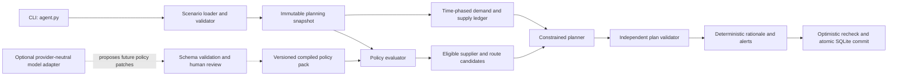

# Apex Autonomous Procurement Agent - Technical Design

Status: Proposed interim-prototype design  
Audience: Reflection AI engineering, Apex Manufacturing Operations, Procurement, and Quality  
Primary command: `python3 agent.py --scenario <scenario.sqlite>`

## 1. Executive summary

The prototype should be an autonomous, deterministic procurement planner with a narrow, replaceable AI boundary. It reads a complete scenario snapshot, turns the production schedule into time-phased component demand, accounts for on-hand and inbound supply, evaluates suppliers against effective policy, solves for feasible purchase quantities, validates every action, and atomically appends purchase orders and alerts.

The model should not do arithmetic, select a supplier, decide whether a policy applies, or write to SQLite. A model is useful for turning future policy documents into a proposed structured rule set and optionally improving prose, but those outputs must pass schema validation and review before they affect execution. The supplied policy and memos should be compiled into a versioned rule pack shipped with the application, so the prototype works offline and produces the same result on every run. A provider-neutral `ModelClient` protocol allows a Reflection model to replace any development-time backend without changing planning code.

The core planner must be driven by database contents and effective dates, not by scenario filenames, row order, known IDs, or six golden outputs. Held-out robustness comes from:

- relational BOM expansion and time-phased inventory allocation;
- explicit policy predicates and precedence;
- a constrained optimizer for lead times, MOQs, eligibility, concentration, and preferences;
- conservative handling of missing approval and historical data;
- deterministic validation, idempotent writes, and evidence-rich rationales;
- property, metamorphic, and adversarial tests rather than fixture memorization.

This design deliberately distinguishes a compliant action from a useful recommendation. If mandatory evidence or an approval is missing, the agent records a specific alert rather than pretending that an order was placed compliantly.

## 2. Assignment contract

### 2.1 Required behavior

The application receives one scenario database path, without interactive prompting. It must:

1. Read the scenario's current date, products, BOM, inventory, production schedule, suppliers, supplier catalog, and existing purchase orders.
2. Determine the component demand needed by each material deadline.
3. Place only defensible incremental orders in `purchase_orders`.
4. Write natural-language problems and recommendations to `alerts`.
5. Honor the company-wide base policy and all memos effective on the scenario date, with a conflicting memo taking precedence.
6. Run against unseen databases conforming to the declared schema.
7. Keep the model/orchestration layer portable to Reflection's future open model and avoid a proprietary single-provider framework.

### 2.2 Success criteria

A successful run has all of these properties:

- It buys no component whose projected supply already covers time-phased demand.
- It never counts an inbound PO before its expected delivery date.
- It never uses a supplier known to be disallowed by a hard policy.
- It meets MOQs, computes dates from the scenario date, and records catalog-consistent prices.
- It surfaces every deadline shortfall, unknown mandatory fact, required approval, and material data inconsistency.
- It is idempotent: rerunning against an unchanged database creates neither duplicate orders nor duplicate agent-owned alerts.
- Its outputs can be reconstructed from the source rows, effective policy rules, assumptions, and optimizer result.
- It fails closed and writes no partial plan when the input schema is incompatible, the snapshot changes during planning, or final validation fails.

### 2.3 Non-goals for the interim prototype

- Forecasting speculative demand or choosing safety-stock targets.
- Negotiating with suppliers, transmitting an external PO, or inventing an approval.
- Estimating freight without weight, lane, and rate data.
- Treating free-form model output as policy or as authorization.
- Inferring capacity, accepted-shipment history, reservations, or delivery status that the database does not contain.
- Hard-coding the six provided scenario descriptions or expected PO lists.

## 3. Evidence from the provided artifacts

### 3.1 Data inventory

The data folder contains:

- one three-page procurement policy, effective 2025-01-15, version 3.2;
- three one-page management memos dated 2025-04-15, 2025-07-01, and 2025-08-20;
- six SQLite scenario databases plus a JSON manifest.

All six databases have the same schema and identical master data:

| Entity | Rows | Relevant observation |
|---|---:|---|
| `products` | 4 | Motors, controller, and sensor finished goods |
| `components` | 19 | Fractional BOM use exists; 2 components are hazardous |
| `bom` | 41 | Flat, single-level product/component relationships |
| `suppliers` | 13 | 12 ASL-approved; 1 explicitly removed |
| `supplier_catalog` | 44 | Each component has 2-4 offers before policy filtering |
| `inventory` | 19 per scenario | One balance per component, with no reservation or lot status |
| `production_schedule` | 1-5 per scenario | Material deadlines are ISO dates |
| `purchase_orders` | 0 or 4 initially | Only the partial-procurement scenario has inbound orders |

Database integrity checks pass in every supplied file: `PRAGMA integrity_check` is `ok`, foreign-key checks find no violations, all components have inventory, and there are no orphan BOM or schedule rows. Quantities, prices, lead times, and MOQs are nonnegative where required.

The tables do not fully enforce their relationships in DDL: for example, `bom` and `production_schedule` omit foreign-key declarations. Application validation is therefore mandatory even when `PRAGMA foreign_key_check` passes.

### 3.2 Scenario coverage

The manifest's dates agree with `scenario_config`; runtime behavior must use `scenario_config.current_date`, not the manifest or host clock.

| Scenario | Current date | Schedule rows | Existing POs | Components with a cumulative shortage before new buying | Main capability exercised |
|---|---|---:|---:|---:|---|
| baseline | 2025-09-01 | 4 | 0 | 13 | Ordinary multi-product planning |
| partial procurement | 2025-09-01 | 4 | 4 | 11 | Inbound supply and residual need |
| tight timeline | 2025-09-01 | 5 | 0 | 17 | Infeasible early deadlines and alerts |
| low inventory | 2025-09-01 | 4 | 0 | 19 | Broad procurement, MOQs, and policy interactions |
| competing demand | 2025-10-05 | 4 | 0 | 18 | Shared-component allocation and expired memo behavior |
| simple | 2025-09-01 | 1 | 0 | 2 | Minimal control case |

The shortage count is a diagnostic before considering new POs. It comes from allocating on-hand and already scheduled inbound supply in deadline order; it is not a hard-coded target for the planner.

The partial-procurement file contains four orders: 200 units of steel, 50 PCBs, and magnet orders of 100 and 50 units from two suppliers. Those receipts eliminate some baseline shortages and must not be purchased again. The simple scenario needs only pressure transducers and sensor housings, so ordering unrelated components is a clear regression.

### 3.3 Effective policy timeline

| Source | Effective interval | Operational effect |
|---|---|---|
| POL-PROC-001 v3.2 | 2025-01-15 onward | Base supplier, sourcing, concentration, MOQ, hazmat, criticality, approval, sustainability, strategic, and lead-time rules |
| MEMO-2025-041 | 2025-04-15 onward | Neodymium magnet single-supplier cap becomes 50%; at least 20% secondary allocation |
| MEMO-2025-072 | 2025-07-01 through 2025-09-30 inclusive | Approved international air freight can reduce lead time by 14 days, floor 7; confirmed production only; individual approval and a $25,000 period cap |
| MEMO-2025-085 | 2025-08-20 onward, until revoked | PCB CoC/cross-section requirement and freeze on suppliers without previously accepted PCB shipments |

Thus the air-freight memo is active in scenarios 1-4 and 6, but expired in scenario 5. The other two memos are active in every supplied scenario.

### 3.4 Material data and policy gaps

These are system-design issues, not excuses to ignore rules:

1. **Identifier mismatch.** The memos call magnets `RM-3003` and PCBs `RM-3005`, while the database uses `CMP-003` and `CMP-005`. Numeric-suffix guessing is unsafe. A reviewed semantic entity mapping is required.
2. **Domestic conflict.** Policy defines the United States and Canada as domestic, but Canadian supplier SUP-110 has `is_domestic = 0`. Policy semantics must override the convenience flag, and the inconsistency should be logged.
3. **Incomplete certification column.** Only CMP-005 has `requires_certification`, although policy requires ISO-9001 for all electronics, PCBs, and safety-critical parts, plus UL listing for capacitor banks and transformer cores. Eligibility is the union of structured component requirements and policy-derived requirements.
4. **No rolling history.** The 12-month concentration calculation cannot be proven from a snapshot containing only a few open POs. Current rows are a lower bound, not demonstrated complete history.
5. **No PCB receipt history.** The quality memo requires suppliers with previously accepted PCB shipments, but no receipt/quality-lot table exists. Supplier and catalog notes are not equivalent to accepted-shipment evidence.
6. **No order status.** A `purchase_orders` row has no open/received/cancelled status. An expected date in the past is ambiguous and must not silently become available supply.
7. **No approval state.** There is nowhere to record Procurement Manager, VP, air-freight, sustainability, or supplier-review approval.
8. **Incomplete total cost.** The schema has unit price but no currency, shipping cost, component weight, handling cost, tax, or lane. Air-freight spend and total cost of ownership cannot be calculated.
9. **No capacity or reservation data.** The planner cannot prove MagnetPro capacity, distinguish free from allocated inventory, or apply customer priority beyond deadline order.
10. **No receiving duration.** Hazmat and enhanced PCB receiving may extend availability, but no inspection/handling buffer is specified.
11. **No pack-size precision.** Quantities and BOM factors are real-valued while MOQs are integer-valued. The legal purchasing increment is unknown.
12. **Ambiguous day convention.** Catalog lead time is expressed as days, while another policy clause explicitly says business days. The prototype should treat catalog lead time as calendar days and disclose the assumption.
13. **Quoted dates differ from naive lead-time arithmetic.** The four existing POs arrive 3-4 calendar days later than `order_date + catalog lead_time_days`. Their stored expected dates are authoritative for inbound netting; the discrepancy reinforces the need to confirm the convention for newly generated orders.

## 4. Design principles

1. **Policy is code and data, not prompt text.** Effective rules are typed, versioned, testable, and cited.
2. **Deterministic core, optional model.** The same snapshot and policy pack produce the same result without a network call.
3. **Three-valued evidence.** Every mandatory predicate evaluates to `PASS`, `FAIL`, or `UNKNOWN`; unknown is never silently treated as pass.
4. **Time-phased planning.** Aggregated demand alone is insufficient because a later receipt cannot repair an earlier shortage.
5. **Policy before optimization.** Hard-ineligible supplier/route pairs never enter the optimizer.
6. **Feasibility before cost.** Meeting the earliest feasible confirmed demand outranks price or preference.
7. **No invented facts.** Missing approvals, accepted-shipment history, freight spend, or supplier capacity become blockers/recommendations.
8. **Every write is explainable.** Rationales identify demand, netting, dates, price, MOQ effect, and policy evidence.
9. **Safe repetition.** Existing actions are treated as committed supply; each run plans only the delta.
10. **Generalize by transformation.** Renaming IDs or adding valid products, suppliers, and schedule rows must not change business logic.

## 5. Proposed architecture



### 5.1 Component responsibilities

| Component | Responsibility | Explicitly must not do |
|---|---|---|
| CLI | Parse exactly one scenario path, set logging, return meaningful exit codes | Infer scenario behavior from filename |
| Scenario repository | Validate schema/types/relations; load a typed snapshot; compute a state digest | Apply procurement policy |
| Policy registry | Resolve effective rules, precedence, semantic selectors, and provenance | Generate quantities |
| Demand ledger | Expand BOM and net inventory/inbound supply by deadline | Select suppliers |
| Candidate builder | Compute eligibility, arrival, approval, and policy facts for each offer/route | Optimize using prose |
| Planner | Solve quantities and supplier allocations under typed constraints | Relax hard rules implicitly |
| Plan validator | Independently recompute all invariants from source facts | Trust optimizer status alone |
| Explanation service | Render facts and sources into rationale/alerts | Add claims absent from the plan |
| Decision repository | Recheck snapshot, write atomically, deduplicate owned output | Modify source/master tables |

## 6. Domain and policy representation

### 6.1 Typed domain model

Use immutable Python dataclasses or Pydantic models for `Scenario`, `ProductionOrder`, `Component`, `DemandBucket`, `Supplier`, `Offer`, `ExistingPO`, `PolicyRule`, `CandidateRoute`, `PlannedPO`, and `Alert`.

Key normalization rules:

- Parse all dates into `datetime.date`; never use local time or `date.today()` for planning.
- Convert SQLite numeric text through `Decimal(str(value))` and scale per component to exact integer planning units. Reject unsupported precision instead of rounding silently.
- Normalize certification tokens case-insensitively (`ISO 9001`, `ISO-9001`) into canonical codes.
- Normalize countries through an explicit country vocabulary; calculate `is_policy_domestic` from the active policy definition, not the stored boolean alone.
- Normalize sustainability ratings to an ordered enum such as `A+ > A > B+ > B > B-`, while treating unknown labels as `UNKNOWN`.
- Preserve source row IDs and policy citations on every derived fact.

### 6.2 Compiled policy pack

The supplied documents should be reviewed once and represented in a checked-in YAML or JSON rule pack. A rule contains at least:

```yaml
rule_id: MEMO-2025-041.magnet_concentration
source_document: MEMO-2025-041
source_section: body
effective_from: 2025-04-15
effective_through: null
priority: 200
selector:
  semantic_tags: [neodymium_magnet]
constraint:
  kind: supplier_volume_cap
  maximum_fraction: "0.50"
supersedes: [POL-PROC-001.section_4.critical_cap]
```

The runtime pack also includes a content hash, compiler version, review status, and source-document hash. Only `review_status: approved` rules can constrain live actions.

Rule precedence is deterministic:

1. Ignore sources not yet effective or already expired on `scenario_config.current_date`.
2. A scoped memo rule explicitly naming a superseded base rule wins for that scope.
3. Otherwise, more specific selectors win over broader selectors.
4. For equally specific conflicting rules, later effective date wins only when authority is equal and the pack declares conflict resolution safe.
5. Any unresolved hard-rule conflict is `UNKNOWN`, blocks the affected action, and emits an alert.

### 6.3 Semantic entity resolution

Hard rules cannot depend only on today's component IDs. Resolve policy terms to semantic tags through a reviewed classification layer:

- component attributes and normalized names provide evidence (`PCB Assembly` -> `printed_circuit_board`; `Neodymium Magnets` -> `neodymium_magnet`);
- document identifiers such as `RM-3003` are retained as aliases and provenance, not assumed equal from their numeric suffix;
- exact known aliases may be approved in the compiled pack;
- ambiguous, fuzzy, or model-only matches remain `UNKNOWN` and cannot activate or waive a hard rule.

This separates company vocabulary from scenario keys. A held-out database can use different IDs while matching the same semantic rule, and a genuinely new component fails visibly rather than accidentally inheriting an unrelated rule.

### 6.4 Policy decision table

| Concern | Enforcement | Prototype interpretation |
|---|---|---|
| ASL | Hard | `on_approved_list = 1`; SUP-113 is excluded regardless of price |
| Certification | Hard | Apply component column plus policy-derived ISO/UL requirements; unknown supplier certificate is not certified |
| Domestic sourcing | Hard conditional | US and Canada are domestic; international allowed only under a documented timeline, price-premium, or availability exception |
| Domestic premium | Hard conditional | `(best_domestic - best_international) / best_international`; threshold is strictly greater than 35%, or 50% for critical components |
| MOQ | Hard | Quantity is zero or at least the catalog MOQ; pack increment remains an open requirement |
| Critical supplier coverage | Hard/diagnostic | Require at least two qualified suppliers unless an evidenced sole-source exception applies |
| Concentration | Hard with incomplete-history warning | 70% critical, 85% non-critical; magnet memo lowers to 50% and requires at least 20% secondary allocation |
| Hazmat | Review flag | PO may be planned if otherwise compliant; create a receiving/review alert and never invent added days |
| Financial threshold | Approval gate | More than $50k requires manager; more than $150k requires VP; without approval evidence, recommend but do not insert as placed |
| Emergency procurement | Conditional gate | Up to $75k can bypass standard threshold only with a documented production-stoppage inference and retroactive-approval alert |
| Sustainability | Soft preference/review | Prefer A or better when price is within 10% and delivery within 5 business days; below B needs review and only when no alternative exists |
| ISO-14001 | Soft preference | Tie-breaking preference |
| Strategic relationship | Soft preference/approval | Retain strategic volume when alternatives save no more than 15%; undefined "significant" shift is surfaced |
| Standard lead time | Hard calculation | Order date plus catalog calendar days; arrival on the material date counts as on time, pending customer confirmation |
| International air | Approval-gated route | Only while memo active and for confirmed schedule demand; lead time `max(7, standard - 14)`; no auto-execution without approval and freight-budget evidence |
| PCB quality memo | Hard and operational | Require CoC/cross-section terms in rationale; prior accepted-shipment evidence is mandatory for supplier eligibility |

### 6.5 Missing-evidence behavior

The evaluator returns a value and its evidence:

- `PASS`: candidate may proceed for this predicate.
- `FAIL`: candidate is removed and the reason is retained for infeasibility explanations.
- `UNKNOWN`: mandatory policy cannot be proven. The affected action becomes a recommendation alert, not an inserted PO.

For the interim data, concentration can still be optimized against all visible POs in the rolling window, but the rationale and a run-level alert must state that full 12-month compliance is unverified. Apex must decide whether this warning is acceptable for prototype auto-execution or should block critical-component POs. The recommended production default is to block; a clearly named demo configuration may permit the conservative current-batch fallback.

The PCB supplier freeze should block new PCB POs until an approved grandfathered-supplier list or receipt history is supplied. Supplier notes can identify a likely candidate for a recommendation, but cannot prove an accepted PCB shipment.

## 7. Planning algorithm

### 7.1 Load and validate a snapshot

Open the user-provided path as SQLite, check it is a regular database file, and validate an explicit schema contract. Do not interpolate user-controlled identifiers into SQL. Read only the known tables with parameterized values.

Validation includes:

- exactly one parseable `scenario_config` row;
- required tables and columns with compatible values;
- unique primary business keys;
- valid dates and finite, nonnegative numeric fields;
- all schedule products in `products`, all scheduled products with BOM rows, and all BOM components in `components`;
- one inventory row per required component;
- catalog rows referencing real component/supplier pairs;
- existing POs with valid references, quantities, and dates;
- no unexpected duplicate supplier/component offers.

Create a canonical state digest over the sorted relevant rows and the policy-pack hash. Planning runs outside a long write lock. At commit time, acquire `BEGIN IMMEDIATE`, recompute the digest, and retry once if the world changed.

### 7.2 Build time-phased demand

For production order `o` and component `c`:

`gross_demand[o,c] = production_schedule.quantity[o] * bom.quantity_per[o.product,c]`

Group demand into ascending `materials_needed_by` buckets for each component. When dates tie, use stable `order_id` ordering only for explanation/allocation; planning must not depend on SQLite row order.

Do not aggregate away dates. For every component and deadline `t`, calculate cumulative demand:

`D[c,t] = sum(gross_demand[o,c] where o.materials_needed_by <= t)`

### 7.3 Construct usable supply

Initial supply is `inventory.quantity_on_hand`, assumed available on the scenario date because no reservations are represented. Existing POs are fungible inbound supply only on or after their expected delivery date.

- Count an existing PO in cumulative supply for deadline `t` only if `expected_delivery_date <= t`.
- Treat all non-stale rows as committed because there is no status column.
- Exclude an expected delivery earlier than the current date from new availability and emit a reconciliation alert; counting it risks double-counting inventory, while assuming it is still coming is unjustified.
- Include existing PO volume dated within the visible rolling window in concentration calculations, while marking history completeness unknown.

The pre-procurement cumulative deficit is:

`deficit[c,t] = max(0, D[c,t] - on_hand[c] - inbound[c,t])`

After solving, replay inventory, inbound, and planned receipts using earliest-deadline-first allocation. This produces order-level shortfalls for alerts without inventing a customer priority.

### 7.4 Build candidate supplier routes

For each catalog offer, produce zero or more `CandidateRoute` records:

1. Evaluate ASL and required certifications.
2. Resolve domestic status from country and record disagreement with the stored flag.
3. Apply PCB grandfathering and other scoped memo rules.
4. Calculate standard arrival from the scenario date and catalog lead time.
5. If the air memo is effective, create a separate air candidate only for confirmed demand and attach its required approval, unknown freight cost, and effective arrival.
6. Evaluate conditional international exceptions against eligible domestic alternatives for the relevant demand deadline.
7. Attach MOQ, price, relationship tier, sustainability, concentration history, approval needs, and every policy citation.

Hard `FAIL` routes are excluded. Hard `UNKNOWN` routes may appear only in a recommendation set, never the executable set.

### 7.5 Solve procurement quantities

A small mixed-integer linear program is appropriate because MOQs, supplier-use switches, time buckets, and concentration limits interact. Use an open-source solver such as HiGHS behind a local `Solver` protocol; the application is not tied to an AI or orchestration provider.

For each component `c`, supplier `s`, and approved route `r`:

- `x[c,s,r] >= 0`: exact scaled order quantity;
- `y[c,s,r] in {0,1}`: whether a PO line is used;
- `u[c,t] >= 0`: unresolved cumulative demand at deadline `t`.

Core constraints include:

1. **MOQ:** `x >= MOQ * y`, and `x <= safe_upper_bound * y`.
2. **Cumulative coverage:** on-hand plus inbound and planned receipts arriving by `t`, plus `u[c,t]`, must cover `D[c,t]`.
3. **Eligibility:** only prevalidated candidate variables exist.
4. **Concentration:** when history `H` is available, `H[c,s] + x[c,s] <= cap[c] * (H[c,total] + sum_s x[c,s])`.
5. **Magnet secondary allocation:** selected secondary volume is at least 20% of applicable planned volume, and no supplier exceeds the 50% rule.
6. **Approval:** an executable variable cannot use a route whose approval gate is unresolved.

The problem is usually separable by component. Solve components independently for simple, interpretable behavior; introduce a unified model only when real cross-component constraints such as a known air-freight budget are available.

Use staged lexicographic optimization, not a single arbitrary weighted sum across incompatible units:

1. Minimize unresolved quantity at the earliest deadline, then each later deadline, per component.
2. Minimize total unresolved final demand.
3. Minimize policy-review exposure among executable candidates.
4. Minimize known purchase cost, then excess caused by MOQ.
5. Apply strategic and sustainability preferences within the policy's comparison bands.
6. Minimize PO-line count and use stable supplier IDs only as the final deterministic tie-breaker.

All financial comparison uses `Decimal`; solver coefficients use explicit scaling. A solver timeout may return an incumbent only if the independent validator proves it feasible. Otherwise the agent writes an alert and no POs for the affected component.

### 7.6 Approval and recommendation boundary

Writing a row is treated as placing an order, not drafting one. Therefore:

- orders needing no unresolved approval can be inserted;
- manager/VP, air-freight, below-B supplier, unknown PCB history, or other mandatory review produces an `[APPROVAL_REQUIRED]` or `[POLICY_UNCERTAIN]` alert with the proposed action;
- the action is inserted only if a future `ApprovalService` provides verifiable approval metadata;
- an emergency order up to $75,000 can be placed only when the configured policy interpretation accepts a confirmed imminent stoppage as evidence; it must generate a five-business-day retroactive-approval alert.

This boundary is conservative because the current schema has no `status` or `approval_id`. Apex can relax it only after specifying how a database row maps to external commitment.

### 7.7 Independent plan validation

Before any write, rebuild the plan facts independently from the proposed rows. At minimum, assert:

- positive finite quantities and exact catalog component/supplier pairs;
- ordered quantity meets MOQ and supported precision;
- unit price equals the catalog snapshot used for planning;
- order date equals scenario current date;
- expected delivery equals the selected route's approved lead-time calculation;
- supplier is ASL-approved and meets all proven certifications;
- any international source has an explicit valid exception in rationale;
- concentration and magnet allocation constraints hold against the chosen history interpretation;
- no approval-gated row lacks approval evidence;
- no component is overbought except for a quantified MOQ, concentration, or indivisibility reason;
- every unresolved production shortage has an alert;
- all policy citations referenced by the rationale are active on the scenario date.

The validator should know nothing about the optimizer's internal constraint objects. This separation catches both modeling mistakes and solver-integration errors.

### 7.8 Rationales and alerts

Rationales are generated from structured facts using templates. Each rationale should state:

- the production order(s) and deadline(s) creating the need;
- on-hand and inbound quantities already netted;
- ordered quantity and any MOQ-driven excess;
- supplier eligibility, route, unit price, and arrival calculation;
- domestic exception, concentration allocation, preference, review, and policy source IDs when applicable;
- explicit assumptions, such as incomplete rolling history.

Example shape, not a scenario-specific string:

> Net requirement: 60 units of COMPONENT by 2025-09-15 after 20 on hand and 0 usable inbound. Ordered 60 from SUPPLIER at $32/unit (MOQ 10) on 2025-09-01; standard lead time 14 calendar days gives 2025-09-15. Supplier is ASL-approved and meets ISO-9001. Sources: POL-PROC-001 sections 2.1 and 10.

Alerts use the ownership prefix `[APEX-AGENT]`, then a stable machine-readable category, followed by natural language:

- `[UNMET_DEMAND]`: production order, component, quantity, deadline, and earliest eligible arrival;
- `[NO_ELIGIBLE_SUPPLIER]`: failed/unknown predicates summarized by supplier;
- `[APPROVAL_REQUIRED]`: exact candidate, cost, approver, and consequence of delay;
- `[POLICY_UNCERTAIN]`: missing history or unresolved entity mapping;
- `[DATA_QUALITY]`: contradictory flags, stale inbound, unsupported precision, or incomplete source data;
- `[HAZMAT_REVIEW]`: handling location and unknown receiving buffer;
- `[POLICY_PREFERENCE]`: chosen exception or a recommendation that does not block execution.

An optional model may paraphrase a template, but it cannot remove required facts or introduce new ones. Default production mode should use the deterministic template.

### 7.9 Idempotent atomic writes

Generate PO numbers such as `AGT-<date>-<component>-<supplier>-<short-hash>`, where the hash covers the input digest, policy-pack hash, route, quantity, and arrival. Use a single transaction and parameterized inserts.

At commit:

1. `BEGIN IMMEDIATE`.
2. Revalidate the schema and state digest.
3. `INSERT` planned POs; a duplicate deterministic key is a no-op only if every stored field matches.
4. Replace only alerts owned by this agent, identified by the exact `[APEX-AGENT]` prefix; preserve any external alert.
5. Insert the newly validated alert set with exact-text deduplication.
6. Re-read inserted rows and rerun postconditions.
7. Commit, or roll back everything.

Never delete or rewrite an existing PO automatically. A subsequent run treats it as committed inbound and plans only a delta; if cancellation seems necessary, emit an alert.

## 8. Expected behavior on supplied scenarios

These are validation invariants derived from the general algorithm, not runtime branches:

- **Baseline:** the planner should identify multiple shortages and an unavoidable early magnet gap: 80 magnets are missing by 2025-09-12, while the domestic magnet lead time is 14 days and the international air-adjusted lead time is at least 21 days from 2025-09-01. It should order feasible later needs and alert the early gap.
- **Partial procurement:** steel and PCB inbound quantities must be counted by their delivery dates, and only residual needs should be ordered. Existing magnet volumes also affect the visible concentration calculation.
- **Tight timeline:** the 2025-09-10 controller order exposes genuine infeasibility. In particular, PCB and UL-qualified power-component supply cannot all arrive by that date under the listed leads. The agent must not falsify an on-time date to make the plan look complete.
- **Low inventory:** all 19 components become short somewhere in the horizon before new buying. The result should exercise fast suppliers, MOQs, certification, hazmat review, and magnet constraints without buying a blanket buffer.
- **Competing demand:** shared components must be planned once against cumulative demand, not separately per finished-good order. The air memo is expired on 2025-10-05. Domestic magnets can arrive before 2025-11-01, but international standard supply cannot; the 50% concentration rule makes the tradeoff visible.
- **Simple:** only the short pressure-transducer and sensor-housing balances should cause procurement. It is the clearest idempotency and no-overbuy smoke test.

## 9. Model portability and AI safety

Define a small internal interface rather than importing provider semantics throughout the codebase:

```python
class ModelClient(Protocol):
    def generate_structured(
        self,
        *,
        messages: Sequence[Message],
        response_schema: type[T],
        temperature: float = 0.0,
    ) -> T: ...
```

Possible adapters can target an OpenAI-compatible HTTP server, Hugging Face Transformers, or a local inference engine. The planner depends only on the protocol and typed output. No proprietary agent graph, tool-call format, memory product, or hosted vector database is required.

The only justified model-assisted workflow is policy ingestion:

1. Extract document text with page/section provenance.
2. Ask the model for a `PolicyPatch` conforming to a strict JSON schema.
3. Reject unknown rule kinds, unparseable dates/numbers, missing citations, contradictory intervals, or unresolved entity selectors.
4. Diff the patch against the active pack.
5. Require human approval for new or changed hard rules.
6. Sign/hash and ship the approved compiled pack.

Runtime planning uses only the approved pack. If a future product requirement demands live policy reading, newly extracted hard rules remain non-executable until validated; the agent can still alert on the proposed interpretation.

## 10. Proposed project layout

```text
agent.py
pyproject.toml
README.md
src/apex_procurement/
  cli.py
  config.py
  domain.py
  repository.py
  snapshot.py
  demand.py
  candidates.py
  optimizer.py
  validator.py
  decisions.py
  explanations.py
  policy/
    schema.py
    registry.py
    evaluator.py
    entity_resolution.py
    model_adapter.py
    compiled_policy.yaml
tests/
  unit/
  integration/
  property/
  metamorphic/
  fixtures/
```

The CLI's only required input remains `--scenario`. Policy data is packaged relative to the installed application, not resolved relative to the current working directory. Optional operational configuration comes from a checked, typed config file or environment variables and must never contain scenario-specific expected answers.

Recommended exit codes:

- `0`: plan validated and committed, including runs that correctly emit business alerts;
- `2`: CLI/path error;
- `3`: incompatible or invalid scenario data;
- `4`: policy pack invalid or mandatory interpretation unresolved globally;
- `5`: solver/validator failure;
- `6`: concurrent modification after bounded retry;
- `7`: commit failure.

## 11. Testing strategy

### 11.1 Unit tests

- fractional BOM multiplication and exact decimal scaling;
- deadline-inclusive arrivals and past/current deadlines;
- existing receipts before, on, and after a material date;
- stale PO handling;
- MOQ excess and zero-order switch;
- ASL removal regardless of low price;
- case/format-insensitive ISO and UL parsing;
- policy-derived certification overriding a null component field;
- Canada treated as policy-domestic despite stored flag;
- strict 35%/50% premium boundary behavior;
- critical-category and semantic-tag resolution;
- effective-date edges: 2025-09-30 active and 2025-10-01 expired for air freight;
- memo precedence and unresolved rule conflicts;
- visible-history concentration, 50% magnet cap, and 20% secondary minimum;
- sustainability comparison windows and rating order;
- deterministic IDs, rationale facts, alert deduplication, and transaction rollback.

### 11.2 Integration tests

Run on temporary copies of all six fixtures. Assert invariants rather than one fragile exact PO set:

- all final rows pass independent validation;
- scenario 2 buys less residual material than an otherwise identical no-inbound snapshot;
- scenario 3 produces specific unmet-deadline alerts;
- scenario 5 never applies the expired air rule;
- scenario 6 creates no unrelated component PO;
- a second identical run makes zero changes;
- forced failure before commit leaves both output tables unchanged.

### 11.3 Property and metamorphic tests

Generate valid databases and test relations that should survive held-out variation:

- randomly permuting row order changes no plan;
- consistently renaming all product, component, supplier, and order IDs changes only rendered identifiers;
- adding inventory cannot increase required ordered quantity for the same demand;
- adding an on-time inbound PO cannot increase a shortfall;
- moving a deadline later cannot worsen lead-time feasibility;
- increasing an offer's price cannot make it preferred solely on cost;
- removing an eligible supplier cannot improve the feasible frontier;
- adding demand cannot reduce final cumulative shortage;
- adding a disapproved cheap supplier never changes executable actions;
- duplicating a finished-good component across products is aggregated once per component/time bucket;
- new products/components/suppliers are handled through joins and policy tags, without code changes.

Also mutate policy rules and verify that behavior changes for the rule's semantic scope only. Fuzz malformed dates, nulls, NaN/inf values, extreme quantities, empty catalogs, duplicate-like identifiers, and adversarial text in names/rationales.

### 11.4 Differential and audit tests

For small generated cases, compare the optimizer with exhaustive enumeration. Store a machine-readable plan trace and independently recompute each rationale number from it. Solver version, seed, policy hash, input digest, and application version must be present in structured logs.

## 12. Operational qualities

### 12.1 Observability

Emit JSON logs to stderr or a run-specific local audit file, never into arbitrary database tables. Record:

- run ID, versions, input and policy hashes;
- row counts and validation warnings;
- active/inactive memo IDs;
- gross demand, usable supply, and deficits by component/deadline;
- candidate rejection reasons;
- solver status/objective stages;
- validation results and committed PO/alert IDs;
- duration by phase.

Do not log secrets or full document text. A `--dry-run` flag may be offered for engineering, but normal evaluation still uses the required command and commits by default.

### 12.2 Reliability and concurrency

- Use an optimistic snapshot digest plus a short `BEGIN IMMEDIATE` commit.
- Configure a bounded SQLite busy timeout and one replan retry.
- Never commit a partial component set if the plan was optimized as one coherent snapshot.
- Treat a validated infeasible plan as a successful business outcome with alerts; distinguish it from a technical failure.
- Keep the solver deterministic through stable ordering, fixed tolerances, and a fixed seed.

### 12.3 Security

- Resolve and validate the explicit scenario file without scanning arbitrary directories.
- Use fixed SQL and bound parameters.
- Do not load SQLite extensions or execute content from database text/PDFs.
- Put model-backed policy ingestion outside the live write path and treat document content as untrusted data.
- Make no network calls in default planning mode.
- Limit rationale size and sanitize control characters while preserving ordinary Unicode names.

### 12.4 Performance

The supplied instances are tiny. Even dozens of product lines should reduce to hundreds of component/deadline buckets and supplier candidates. Relational loading is linear in source rows; component-wise MIPs are small and parallelizable later. Correctness and auditability take priority over premature caching. Cache only the immutable compiled policy pack, keyed by its content hash.

## 13. Failure-mode policy

| Failure | Safe response |
|---|---|
| Missing required table/column or invalid relation | Exit nonzero; no writes; stderr diagnostic |
| Unknown hard policy mapping for one component | Block that component's actions, alert affected production orders, continue independent components, then commit the entire validated action/alert set atomically |
| No eligible on-time supplier | Buy feasible later demand if useful; alert exact early shortage and earliest arrival |
| Approval required but unavailable | Alert the recommended action and business impact; do not insert a placed PO |
| Stale existing PO | Exclude as new inbound; emit reconciliation alert |
| Incomplete concentration/PCB history | `UNKNOWN`; follow configured safe mode and disclose it |
| Solver infeasible | Extract an irreducible/conflict explanation where possible; emit business alerts; do not relax hard policy |
| Solver timeout/error | Use only a validator-proven incumbent; otherwise no affected POs and a technical alert/error |
| Snapshot changes before commit | Roll back and replan once; then exit with concurrency error |
| One insert or postcondition fails | Roll back the entire transaction |
| Model unavailable or malformed | Runtime planning continues from approved pack; policy-ingestion job fails closed |

## 14. Implementation sequence

### Milestone 1: deterministic vertical slice

- Typed SQLite loader, schema validation, scenario date, BOM expansion, deadline ledger.
- Existing-PO netting, simple MOQ-aware planning, deterministic rationale/alerts.
- Atomic/idempotent writes and independent post-validation.
- Integration coverage for simple, baseline, and partial scenarios.

### Milestone 2: full supplied policy

- Approved compiled rule pack with provenance and effective-date engine.
- Certifications, ASL, domestic exceptions, criticality, concentration, sustainability, strategic, hazmat, PCB, and approval logic.
- MILP planner and infeasibility explanations.
- Full six-scenario and property/metamorphic suite.

### Milestone 3: operational hardening

- Optimistic concurrency, structured audit artifacts, solver timeouts, package/reproducible environment, and performance checks.
- Customer-approved data contracts for history, approvals, shipping, receiving, and capacity.

### Milestone 4: Reflection model integration

- Implement `ModelClient` for the selected open-model serving stack.
- Add offline policy-patch extraction, validation, review UI/process, and policy-pack signing.
- Evaluate extraction accuracy on perturbed and unseen policy documents; keep it outside autonomous execution until acceptance thresholds are met.

## 15. Customer decisions and data requests

These questions materially change whether the agent may place an order rather than merely recommend one:

1. Does inserting a `purchase_orders` row mean an externally committed order, or a proposed order awaiting downstream approval?
2. Which source contains manager/VP approvals, air-freight approvals, and emergency-retroapproval status?
3. Is `purchase_orders` a complete rolling 12-month history, only open POs, or a mixture? What are order statuses and receipt dates?
4. What is the authoritative prior accepted-shipment list for the PCB freeze?
5. Should `RM-3003`/`RM-3005` be formally aliased to semantic magnet/PCB classes, and will future documents use another identifier namespace?
6. Should policy's US-and-Canada definition override `suppliers.is_domestic`? This design says yes.
7. Are catalog lead times calendar or business days, and is arrival on `materials_needed_by` acceptable?
8. What receiving/inspection buffer applies to hazmat and PCB shipments?
9. What are component weights, shipping rates, current air-freight spend, and currency so total cost and the $25,000 cap can be enforced?
10. What pack increments, rounding rules, and maximum overbuy are allowed by unit of measure?
11. Is supplier capacity represented elsewhere, especially MagnetPro's N52 capacity?
12. Are any on-hand quantities reserved, quarantined, expired, or subject to safety-stock floors?
13. How should production orders sharing a deadline be prioritized: customer tier, revenue, lateness penalty, or explicit priority?
14. What does a "significant" strategic-volume shift mean, and over what historical window?
15. May the interim prototype use visible/current-batch concentration with a warning, or must missing history block every affected critical-component PO?

## 16. Acceptance checklist

Before presenting the prototype:

- [ ] The required CLI runs from a clean environment against an arbitrary scenario path.
- [ ] No code branches on scenario filename, description, known row count, or fixture-specific answer.
- [ ] All current dates come from `scenario_config`; memo edges are tested.
- [ ] Demand is cumulative by deadline and existing inbound is date-aware.
- [ ] Hard policy uses `PASS`/`FAIL`/`UNKNOWN` with citations and deterministic precedence.
- [ ] Canada and memo/database identifier inconsistencies are handled explicitly.
- [ ] Every inserted PO passes the independent validator and all required approvals are evidenced.
- [ ] Every unmet demand or unresolved policy fact produces a useful alert.
- [ ] Rerunning is idempotent and concurrent changes cannot yield a stale commit.
- [ ] Supplied, generated, property, and metamorphic tests pass on fresh database copies.
- [ ] Default execution needs no hosted model or network and the model adapter is replaceable.
- [ ] README documents assumptions, limitations, setup, run command, test command, and expected alert categories.

The strongest interim demo is not one that always emits a PO. It is one that can show, for each component and deadline, exactly what was needed, what supply was available, which rules were effective, why a supplier was eligible or rejected, what was ordered, and which missing fact prevented safe autonomous action.
