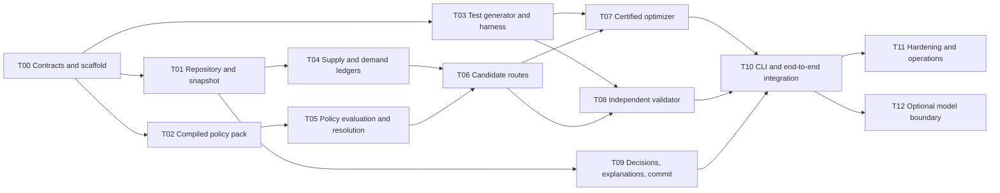

# Apex Autonomous Procurement Agent — Technical Design

**Document:** `docs/MERGED_PLAN.md`
**Supersedes:** `docs/CLAUDE_PLAN.md`, `docs/CODEX_PLAN.md`
**Status:** Design for interim prototype (milestone check-in with Apex Head of Operations)
**Command:** `python3 agent.py --scenario <scenario.sqlite>`

This is the implementation design produced by merging two independently authored proposals and
subjecting the result to repeated adversarial review. Contested rationale, reversal conditions, and the
review-corrections history live in [DECISION_LOG.md](./DECISION_LOG.md); references such as D21 point
to entries in that companion document.

---

## 0. Summary

An autonomous procurement planner with a **deterministic core and a narrow, optional AI boundary**.
It reads a scenario snapshot plus the company policy corpus, converts the production schedule into
time-phased component demand, nets against on-hand and inbound supply, evaluates suppliers against
policy effective on the scenario date, solves an integer-scaled model for quantities and supplier
splits, verifies independently, and atomically appends purchase orders and alerts.

Five commitments define the system:

1. **No model in the numeric path.** An LLM compiles policy documents into a reviewable rule pack and
   may assist entity classification and prose. It never does arithmetic, selects a supplier, or writes
   to SQLite.
2. **A proven policy violation is never written to `purchase_orders`.** Non-compliant options are
   surfaced in `alerts` as decision support.
3. **Optimization is certified and independently checked.** The system may not execute a supplier
   selection, claim infeasibility, or take an exception unless every supporting stage has a completed
   solver certificate and passes exact Decimal post-validation; small cases must also match enumeration.
4. **Evidence policy is declared, not implied — and absent evidence is not zero evidence.** Each rule
   carries an evidence basis, and each contract maps unsatisfied bases to dispositions. Missing
   rolling history holds a constraint `UNKNOWN` rather than asserting `H = 0`; prospective per-order
   rules bind regardless. The agent states which contract it operated under on every run, so an empty
   `purchase_orders` is never ambiguous.
5. **Nothing keys off identifiers.** Policy concepts resolve to whatever components and suppliers
   exist in the database being planned.

## 1. Problem and success criteria

Given one scenario path and no human prompting, the agent must explode the production schedule
through the BOM, net demand against inventory and inbound POs by deadline, source compliantly, write
defensible purchase orders, and write every problem, assumption, and approval requirement to alerts.

| Criterion | Test |
|---|---|
| Correctness | Exact arithmetic and date math; every executed PO satisfies every hard rule |
| Generalization | Runs unmodified on unseen components, suppliers, products, dates, and memos. Zero hardcoded IDs, CI-enforced |
| Defensibility | A planner can reconstruct any decision from the rationale, including why each rejected supplier lost |
| Honesty | Where data cannot support a rule, the agent says so rather than inventing an answer |
| Safety | Policy is never silently violated; exceptions are explicit, bounded, and never auto-executed |
| Determinism | Two runs on identical inputs produce identical output |
| Idempotence | Rerunning creates no duplicate orders and no duplicate agent-owned alerts |

**Non-goals:** demand forecasting, safety-stock policy, supplier negotiation, external PO
transmission, freight estimation without weight/lane/rate data, multi-level BOM explosion, inventing
approvals, or modifying pre-existing purchase orders.

## 2. Data findings

Findings are marked **[V]** where confirmed directly against the provided files, and **[I]** where
they are interpretations of policy text that the data cannot settle. Every **[I]** finding is carried
through robust both-ways evaluation (§5.3) and disclosed in the run's assumption alerts. The
distinction matters: an interpretation presented as a verified fact is exactly how a wrong reading
survives review.

### 2.1 Scenario structure

**[V]** `products`, `components`, `suppliers`, `bom`, and `supplier_catalog` are **row-identical
across all six databases by canonical checksum** (sorted row dumps hashed; file bytes were not
compared and are not expected to match). Only `scenario_config`, `inventory`, `production_schedule`,
and `purchase_orders` vary. `PRAGMA integrity_check` returns `ok` and `foreign_key_check` returns zero
violations on all six; note that `bom` and `production_schedule` carry **no FK declarations**, so
application-level validation is mandatory regardless.

> **Primary overfitting hazard.** The local scenarios exercise demand, dates, inventory, and inbound
> supply, and never vary the master data. Held-out scenarios almost certainly will. Any logic that
> assumes this catalog — a hardcoded critical list, two suppliers per component, an inventory row for
> every component — passes all six and fails the held-out set.

### 2.2 Landmines

**`current_date` is a SQLite reserved word.** Unquoted, `SELECT current_date FROM scenario_config`
returns the host date. Must be `"current_date"` or `scenario_config.current_date`. Unit-tested.

**Memos and databases use different ID namespaces.** `RM-3003` (April memo) and `RM-3005` (August
memo) do not exist in any database; the components are `CMP-003` and `CMP-005`. `MFG-5030` appears in
the assignment brief's sample alert, in a third namespace absent from everything else. Policy rules
therefore cannot key off identifiers.

**[V] The critical-component list is English categories, not IDs.** Policy §6: microcontroller ICs,
power MOSFETs, PCB blanks, neodymium magnets, and all sensor ICs (temperature, pressure, humidity).

**[I] Three of the seven mappings are inferences, not readings.**

- `CMP-005 "PCB Assembly (6-layer)"` ← "PCB blanks". A blank is an unpopulated board and an assembly
  is populated; these are different articles. The August memo's broader "printed circuit board
  components (RM-3005)" proves `CMP-005` is in *that memo's* scope, but does **not** establish that
  it is a critical "PCB blank" under §6.
- `CMP-014 "Pressure Transducer"` ← "all sensor ICs (temperature, pressure, humidity)". A transducer
  is not literally an IC, though the parenthetical names pressure.

- `CMP-015 "Humidity Sensor"` ← "all sensor ICs (… humidity)". Like `CMP-014`, it is not labelled an
  IC; only the parenthetical connects it.

Only **four** of the seven are direct name matches: `CMP-006` (Microcontroller IC), `CMP-007` (Power
MOSFET), `CMP-003` (Neodymium Magnets), and `CMP-013` (Temperature Sensor IC). The other three are
treated as members under both-ways evaluation only where that is safe under either reading, and all
three appear in the run's assumption alerts.

**The `CMP-014` classification is load-bearing, but an inference does not decide it.** Its domestic
premium is **45.5%**, which clears the non-critical 35% bar but not the critical 50% bar. While
membership remains unresolved, §5.3's both-ways intersection permits only an action valid under both
readings, so the international route cannot execute merely because the looser reading admits it. An
explicit configured classification would resolve the branch and could change the selected supplier;
until then the run discloses the assumption and may surface the cheaper route only as a non-executable
classification-dependent alternative.

> Non-membership is the **looser** classification, and this is counterintuitive enough to state
> plainly: non-critical means a *35%* premium threshold (international unlocks at a **lower** premium,
> not a higher one), an *85%* concentration cap instead of 70%, and no dual-source diagnostic. A
> classification miss is therefore unsafe in three places at once, which is why §5.3 keeps both-ways
> evaluation for §6 membership rather than defaulting unmatched components to non-critical.

**`suppliers.is_domestic` contradicts Policy §3.** Policy defines domestic as United States and
Canada; `SUP-110 EcoBoard Solutions` is `country='Canada'` with `is_domestic=0`. Policy wins;
disagreement raises a data-quality alert.

**`components.requires_certification` is sparse** — only `CMP-005` carries `ISO-9001`. Requirements
are the union of the column and policy-derived rules.

**Certification rules bind differently than they first appear.** Policy §2.1 requires ISO-9001 for
electronic components, PCBs, and safety-critical parts; UL listing is an **additional** requirement
for power-supply components only (capacitor banks, transformer cores). Consequences:

- `CMP-017` (Capacitor Bank): catalog has SUP-101 and SUP-106; SUP-106 holds ISO-9001 but not UL →
  **SUP-101 sole-eligible**.
- `CMP-018` (Transformer Core): catalog has SUP-101 and SUP-104; SUP-104 holds ISO-9001 and ISO-14001
  but not UL → **SUP-101 sole-eligible**.
- `CMP-005` (PCB): catalog has SUP-113, SUP-103, SUP-101, SUP-110. All hold ISO-9001 except SUP-113,
  which is off the ASL. **UL is irrelevant here.** SUP-103 and SUP-110 are eliminated by the August
  memo's incumbency freeze, leaving **SUP-101 sole-eligible**.

**The August PCB memo asks a question the schema cannot answer.** It permits only suppliers "from whom
we have previously received and accepted PCB shipments." No receipts table exists, and
`purchase_orders` is empty in five of six scenarios. §5.3 documents the inference we adopt.

**Memo effective windows are already exercised.** The air-freight authorisation (MEMO-2025-072) runs
2025-07-01 through 2025-09-30. Scenario 05 is dated **2025-10-05 — outside the window**. All rules
gate on `scenario_config."current_date"`, never the host clock or the manifest.

**[V] Visible pre-existing PO volume sits above the memo's figure — compliance is undetermined.**
Scenario 02's `EXIST-003`/`EXIST-004` give SUP-107 **66.7%** of *visible* magnet volume against
MEMO-2025-041's 50% figure. Because the cap is a rolling-12-month measure and no history exists (§3),
true compliance **cannot be determined** — 66.7% of two orders is not a proven breach. The agent
reports the visible ratio and does not assert a violation. The memo nonetheless directs that open
orders be
updated.

**Existing PO delivery dates do not match catalog lead times.** Verified:

| PO | Component/Supplier | Order date | Catalog lead | Naive arrival | Stored arrival | Δ |
|---|---|---|---:|---|---|---:|
| EXIST-001 | CMP-002 / SUP-105 | 2025-08-20 | 10d | 2025-08-30 | 2025-09-02 | +3d |
| EXIST-002 | CMP-005 / SUP-101 | 2025-08-18 | 10d | 2025-08-28 | 2025-09-01 | +4d |
| EXIST-003 | CMP-003 / SUP-107 | 2025-08-01 | 35d | 2025-09-05 | 2025-09-08 | +3d |
| EXIST-004 | CMP-003 / SUP-108 | 2025-08-15 | 14d | 2025-08-29 | 2025-09-02 | +4d |

Not business days (10 business days from Aug 18 lands on Sep 1 for EXIST-002 but the rule misses on
the other three). Stored dates are authoritative for netting inbound supply; our generated dates
follow Policy §10 (`order_date + quoted lead time`). The convention is an open question.

**Fractional demand with discrete units.** `CMP-011` (Conformal Coating, UoM `can`) has BOM factors of
0.25 and 0.5; scenario 01 demand is exactly **15.25 cans**. All quantity and money arithmetic uses
`Decimal`.

**Approval thresholds never fire in the provided data.** Largest possible single line ≈ **$6,050**
(scenario 05, `CMP-008`); largest whole-run spend ≈ **$22,300**. Policy §7's $50k/$150k gates are
covered by synthetic tests only, and §7.1's $75k emergency bypass is declared unsupported (D23)
because its production-stoppage predicate cannot be established from the schema.

### 2.3 Per-scenario fixtures

Time-phased cumulative shortage counts (allocating on-hand and inbound in deadline order):

| Scenario | Date | Sched rows | Existing POs | Components short | Capability exercised |
|---|---|---:|---:|---:|---|
| 01 baseline | 2025-09-01 | 4 | 0 | 13 | Ordinary multi-product planning |
| 02 partial | 2025-09-01 | 4 | 4 | 11 | Inbound netting; MOQ × concentration conflict |
| 03 tight | 2025-09-01 | 5 | 0 | 17 | Genuine infeasibility; cert-vs-deadline collision |
| 04 low inventory | 2025-09-01 | 4 | 0 | 19 | Breadth, MOQ rounding, policy interaction |
| 05 competing | 2025-10-05 | 4 | 0 | **17** | Shared components; expired air-freight memo |
| 06 simple | 2025-09-01 | 1 | 0 | 2 | Control case; idempotency smoke test |

Structural facts below are properties of the data and are stable. Any *allocation* shown is generated
by enumeration under the rule set and defaults current at the time of writing — it illustrates the
machinery and is **not** a golden expectation; §12's golden files come from the implementation.

- **Scenario 01, `CMP-003`:** need 208 (80 due 09-12, 128 due 10-10). The first 80 units are
  unavoidably late — the domestic route arrives 09-15 and the air-adjusted international route is no
  earlier — so **240 unit-late-days is the structural floor**. Ocean freight for SUP-107 arrives
  10-06, inside the later 10-10 bucket. The selected split is intentionally not hand-written here:
  solve Q and solve 1 regenerate it under the conditional §3(b) comparator, named-primary membership,
  MOQs, and the active autonomy parameters.
- **Scenario 02, `CMP-003`:** committed inbound leaves a residual need of 58. Under the shipped
  benchmark interpretation, rolling concentration remains `UNKNOWN` while the prospective ≥20%
  secondary rule binds. The two supplier MOQs force a minimum compliant total of 150
  (`SUP-107=100`, `SUP-108=50`), costing $615 and creating 92 units of **forced** surplus. Solve Q must
  reproduce that quantity; solve 1 executes it with `FORCED_SURPLUS` and the benchmark-contract alert.
  The 58-unit bare-coverage plan remains an explicitly non-executable compliance-cost diagnostic.
- **Scenario 03:** the 2025-09-10 controller order leaves `CMP-005` short 60, `CMP-017` short 20,
  `CMP-018` short 30, all sole-eligible from SUP-101 at 10 days → 09-11, one day late. The only
  on-time option for `CMP-017` (SUP-106 at 5 days) lacks UL listing.
- **Scenario 05, `CMP-003`:** 440 short by 2025-11-01. SUP-107 at 35 days arrives 11-09; SUP-108 at
  14 days arrives 10-19. **No zero-late plan exists at zero surplus** — but overbuy *does* buy time
  back, by letting SUP-108 cover the whole requirement while SUP-107 satisfies the allocation rules
  as surplus. Lateness therefore trades against surplus along a curve. The lexicographic objective
  already makes the finite choice decidable; the autonomy bound draws the line around what Apex has
  delegated the agent to execute. The optimizer, rather than a hand-maintained allocation count or
  table, computes that authorized region (§8.3).

### 2.4 Sole-eligible components — why concentration semantics are load-bearing

**[V under stated assumptions]** — the enumeration below is mechanical, but it inherits the inferred
PCB-incumbency rule (§5.3) and the inferred critical-component mappings (§2.2), so it is verified
*given* those readings rather than independently. After ASL, certification, the PCB freeze, and the
domestic gate, **six of nineteen components have exactly one eligible supplier**, in every scenario:

| Component | Sole supplier | Eliminated by |
|---|---|---|
| `CMP-001` Copper Wire | SUP-111 | Domestic is cheaper than international, so §3's gate never opens |
| `CMP-005` PCB Assembly | SUP-101 | SUP-113 off ASL; SUP-103/SUP-110 by the August memo freeze |
| `CMP-009` Sealed Bearing | SUP-102 | Domestic cheaper → gate closed |
| `CMP-014` Pressure Transducer | SUP-112 | Premium 45.5% < 50% critical threshold → gate closed |
| `CMP-017` Capacitor Bank | SUP-101 | SUP-106 holds ISO-9001 but not UL (§2.1) |
| `CMP-018` Transformer Core | SUP-101 | SUP-104 holds ISO-9001/ISO-14001 but not UL (§2.1) |

**Two of these six depend on suppliers holding no certifications at all**, which is why §7's
certification gate must not over-reach. `SUP-111` (copper wire) and `SUP-107` (one of two magnet
sources) both have an empty `certifications` field. If §2.1's *"safety-critical parts"* clause were
resolved permissively — treating unresolved membership as possible membership and therefore requiring
ISO-9001 — both suppliers would be eliminated: copper wire becomes unorderable in every scenario, and
magnets lose one of only two sources, which makes MEMO-2025-041's ≥20% secondary rule unsatisfiable
and blocks all magnet demand. §5.3 therefore requires **positive evidence** for that concept rather
than both-ways evaluation; the two are different situations and are handled differently.

This is why §3's treatment of missing history is a correctness issue rather than a policy nicety. If
absent rolling history were read as *known-zero* history, the concentration constraint for a
sole-eligible component collapses to `x ≤ cap · x`, forcing `x = 0` — all six components become
unorderable in every scenario. Scenario 04 has all six short simultaneously; scenario 01 has three
(`CMP-005` short 41, `CMP-009` short 22, `CMP-014` short 60); scenario 06's only critical shortage,
`CMP-014`, is one of them.

The underlying error is a category confusion: §4 limits a supplier's share of a **rolling 12-month
volume**, and a single planning run is not that object. Reading it as a per-run split mandate makes
sole-sourcing structurally impossible, which contradicts §4's own sole-source exception clause.

## 3. Evidence contracts

The single most important structural decision. Several policy rules reference evidence the schema
does not contain: rolling 12-month volume history, PCB receipt history, and approval state. Whether
missing evidence blocks action is a **customer policy decision**, not an engineering default, so the
agent runs under a named, declared contract.

| | **Benchmark contract** (default) | **Production contract** |
|---|---|---|
| Rolling 12-month history | **`UNKNOWN` — absent, not zero.** Rolling-window caps are non-blocking and execute as `EXECUTE_WITH_ASSUMPTION`, with visible volume reported for information only | Real history required; absent history yields `DECISION_REQUIRED` wherever a rolling-window rule is in scope — including §4's 85% non-critical cap, not only critical components |
| Prospective per-order allocation rules | **Enforced in both contracts** — provable from the order itself, no history needed | Same |
| PCB accepted-shipment history | Documented inference permitted (§5.3) | Approved incumbent list or receipt records required |
| Approval state | Absent for all POs; explicit approval requirements yield `RECOMMEND_APPROVAL` | Approval service consulted; unapproved actions never execute |
| Capacity-confirmation release state | Without an affirmative confirmation record, the named-primary directive remains active. `CAPACITY_UNKNOWN` is disclosed on allocations to the capacity subject but does not itself change plan disposition | Confirmation service consulted; until an affirmative release exists, the same directive remains active |
| Other unknown hard facts | Proceed under a named assumption with a standing alert | `DECISION_REQUIRED`, naming the missing evidence |

**Absent history is not zero history.** This distinction is the contract's most important clause and
getting it wrong is a correctness bug, not a conservatism preference: treating visible POs as the
complete rolling history makes six of nineteen components unorderable in every scenario (§2.4). The
benchmark contract therefore holds rolling-window concentration at `UNKNOWN` and lets the order
proceed under a named assumption — it does **not** assert `H = 0` and then enforce a cap against it.

What survives regardless of contract is any rule that is **prospective and per-order**, because such
a rule is provable from the order under construction. MEMO-2025-041's ≥20% secondary-allocation
clause is the worked example (§5.1): it binds in both contracts, while the same memo's 50% cap does
not, because the cap inherits §4's rolling-window framing.

**Every run ensures current-state alerts name the active contract and every assumption it licensed.** Without
this, an empty `purchase_orders` cannot be distinguished from "nothing was needed."

The benchmark contract is the shipped default because the assignment supplies each SQLite file as the
complete operational snapshot. A production-conservative default would block most critical-component
procurement. **With today's schema the production contract is advisory-only: it writes no purchase
orders at all**, in any scenario. Policy §4 sets a rolling-window cap on *every* component — 70% for
critical, 85% for the rest — and no order history exists, so under production every requirement
resolves to `DECISION_REQUIRED`. That is the correct behaviour for a contract that demands real
evidence, and it is exactly why the benchmark contract is the shipped default rather than a
convenience. (An earlier draft understated this, saying scenario 06 would place only the sensor-housing
order — that was computed before §4's non-critical 85% cap was recognised as a rolling-window rule too.
Nothing executes.)

## 4. Architecture

```
                    ┌──────────────────────────────────────────────┐
                    │  agent.py --scenario X.sqlite [--contract=…] │
                    └───────────────────────┬──────────────────────┘
                                            │
   ┌────────────────────────────────────────┼─────────────────────────────────────┐
   │                                        │                                     │
┌──▼──────────────────┐        ┌────────────▼────────────┐        ┌───────────────▼──────────┐
│ ScenarioRepository  │        │ Compiled policy pack    │        │ Evidence contract + cfg  │
│ validate → snapshot │        │ (rules + provenance)    │        └───────────────┬──────────┘
│ + state digest      │        └────────────┬────────────┘                        │
└──┬──────────────────┘                     │        ▲ offline compile (LLM #1)   │
   │                             ┌──────────▼─────────┴──────┐  schema-validated, │
   │                             │ Policy evaluator          │  quote-verified,   │
   ├────────────────────────────►│ PASS / FAIL / UNKNOWN     │  human-reviewed    │
   │                             └──────────┬────────────────┘                    │
   │                        ┌───────────────▼───────────────┐  LLM #2 (optional)  │
   ├───────────────────────►│ Entity resolver               │◄────────────────────┤
   │                        │ structured → lexical → model  │  cached, evidence-  │
   │                        └───────────────┬───────────────┘  traced, non-load-  │
   │                                        │                  bearing            │
┌──▼────────────────────────────────────────▼─────────────────────────────────────▼──┐
│                        DETERMINISTIC PLANNING CORE (no model)                       │
│                                                                                     │
│  Supply/demand ledgers  →  Candidate routes  →  Certified optimizer → Outcome       │
│  eventual / on-time /      eligibility,          MILP (HiGHS),      requirement     │
│  recoverable lateness      feasibility, gates    plan + alternatives status + plan  │
│                                                                      disposition     │
└────────────────────────────────────┬────────────────────────────────────────────────┘
                                     │  DecisionRecord[]
                      ┌──────────────▼──────────────┐
                      │ Independent plan validator  │  recomputes every invariant
                      │ (shares no code w/ planner) │  from source facts
                      └──────────────┬──────────────┘
                                     │
                      ┌──────────────▼──────────────┐  LLM #3 (optional, off by default)
                      │ Explanation service         │  templates → optional polish
                      │ rationale + alerts          │  → fact check → fallback
                      └──────────────┬──────────────┘
                                     │
                      ┌──────────────▼──────────────┐
                      │ BEGIN IMMEDIATE · re-verify │
                      │ digest · atomic commit      │
                      └─────────────────────────────┘
```

**Why a deterministic pipeline rather than an LLM agent loop.** "Autonomous" here means *runs without
human prompting*, not *a model in a while-loop*. Procurement planning is constraint satisfaction over
exact numbers and dates with a legal-style rule text on top; the model is good at the text and bad at
the arithmetic. The split buys reproducibility, per-rule unit testing, sub-second runtime, no
per-run token cost that scales with catalog size, and invariant guarantees that survive held-out data.

## 5. Policy representation

### 5.1 Compiled policy pack

Every behavioural rule is a row in a versioned, checked-in **JSON** pack carrying provenance,
effective window, severity, and precedence links. **No policy constant is written in Python.** Adding
a memo changes behaviour with no code change. The snippets below use YAML-like notation only for
readability; the runtime artifacts are `compiled_policy.json` and `concepts.json` and load with stdlib
`json`.

**One memo clause, one rule.** MEMO-2025-041 contains two constraints with different evidence needs,
and collapsing them into one rule is what produced the paralysis bug in §2.4. They compile separately:

```yaml
- rule_id: MEMO-2025-041.magnet_rolling_cap
  source_document: MEMO-2025-041
  evidence:                                      # one span per load-bearing typed value
    effective_from: "Date: April 15, 2025"
    selector:  "the supplier concentration limit for neodymium magnets (RM-3003)"
    threshold: "is reduced from 70% to 50% for any single supplier"
    supersedes: "This supersedes the general critical component concentration limit stated in
                 Procurement Policy Section 4"
    window:    { derived_from: POL-PROC-001.section_4.critical_cap }   # memo states no window
  effective_from: 2025-04-15
  effective_through: null
  severity: hard
  evidence_basis: rolling_window                 # ← needs 12-month history; contract decides outcome
  selector: { semantic_tags: [neodymium_magnet] }
  constraint: { kind: supplier_volume_cap, maximum_fraction: "0.50", window_months: 12 }
  supersedes: [POL-PROC-001.section_4.critical_cap]

- rule_id: MEMO-2025-041.magnet_secondary_allocation
  source_document: MEMO-2025-041
  evidence:
    effective_from: "Date: April 15, 2025"
    selector:  "all purchase orders for neodymium magnets"
    threshold: "must include a secondary supplier allocation of at least 20% of the total order
                volume"
  effective_from: 2025-04-15
  severity: hard
  evidence_basis: prospective_order              # ← provable from the order itself, always
  selector: { semantic_tags: [neodymium_magnet] }
  constraint:
    kind: minimum_secondary_fraction
    value: "0.20"
    group: allocation_group                      # see "allocation unit" below — NOT a single PO row

- rule_id: MEMO-2025-041.magnet_named_primary
  source_document: MEMO-2025-041
  evidence:
    effective_from: "Date: April 15, 2025"
    scope:     "to increase their qualified capacity for N52-grade magnets"   # component scope
    subject:   "work with MagnetPro Inc. (SUP-108) to increase their qualified capacity"
    release:   "Until MagnetPro's capacity is confirmed sufficient"
    directive: "Nanjing Rare Earth Co. (SUP-107) remains our primary volume supplier"
  effective_from: 2025-04-15
  severity: shaping                              # not a base feasibility rule; enforced by
                                                 # objective stage 5 + a solve-1 executability condition
  selector: { semantic_tags: [neodymium_magnet] }
  directive:
    kind: named_primary_supplier
    supplier: { source_id: SUP-107, legal_name: "Nanjing Rare Earth Co." }
    group: allocation_group
  release_condition:                             # affirmative release, not an unknown fact
    predicate: capacity_confirmed_sufficient
    subject: { source_id: SUP-108, legal_name: "MagnetPro Inc." }
    evidence_source: capacity_confirmation_service
    resolution: affirmative_record_required      # absent record => not established for this run
  risk_disclosure:
    kind: CAPACITY_UNKNOWN
    subject_from: release_condition.subject      # SUP-108 only; never every name in the rule
    when: positive_allocation_and_no_numeric_capacity
    disposition_effect: none                     # alert only; memo states no allocation ceiling
  deviation_disposition: DECISION_REQUIRED       # overriding a VP directive is the customer's call.
                                                 # NOT a capacity argument — see the split below
  precedence:
    outranks: [POL-PROC-001.section_3.domestic_preference]
    basis: inferred                              # memo does NOT say it supersedes §3
    reasoning: "memo-over-policy and narrower-scope-over-broader (§5.1); not an explicit link"
```

**One enforcement model, stated once.** An earlier draft modelled this rule four incompatible ways at
the same time — `severity: shaping`, a MILP feasibility constraint, an objective stage, and something
candidates could violate freely. Those are different designs, and while all four were present
neither the executable set nor scenario 05's disposition followed from the specification. The
single model is:

> **Named-primary is shaping.** It is never a base-feasibility constraint, so it does not erase a
> deviating plan from the search space. It appears as objective stage 5 and gates executable-set
> membership: solve Q and solve 1 pin `named_primary_deviation = 0`. Each solve-2 run retains that pin
> unless named-primary is the one explicitly relaxed rule; that run finds, costs, and reports the best
> deviating plan as `DECISION_REQUIRED` rather than executing it (§8.2).

The deviation disposition rests on one thing only: **deviating from an explicit VP directive is a
business decision, not a planning judgement.** The memo names a supplier; overriding that is Apex's
call to make, and the agent's job is to recompute and surface the timing and cost delta.

**Capacity is a separate concern and must not be folded into this one.** An earlier draft justified the
deviation disposition by claiming that moving volume onto SUP-108 assumes capacity the data doubts.
That reasoning does not hold: the directive constrains SUP-107's *relative share*, not SUP-108's
*absolute volume*, so every positive SUP-108 allocation relies on unquantified capacity regardless of
whether the plan honors named-primary. The two mechanisms are therefore
separate:

- **Named-primary** — a shaping share directive; deviation gates executability.
- **Capacity** — unknown for *every* positive SUP-108 allocation. Both `suppliers.notes` and the
  `CMP-003` catalog row read "limited N52 capacity" and no field quantifies it, so **every** magnet
  plan touching SUP-108 carries a `CAPACITY_UNKNOWN` disclosure, whichever way it is disposed. The
  disclosure is **non-dispositive**: the memo does not impose a numeric capacity ceiling or require
  capacity proof before an order may be placed. It uses confirmation only to release the named-primary
  directive. Treating missing throughput as an independent execution gate would invent a policy rule.

The two are correlated — the memo names SUP-107 primary *because* MagnetPro's capacity is limited —
but correlation is not equivalence, and conflating them made the design claim a safety property it
does not have. If Apex supplies a numeric capacity ceiling (Q12), it becomes an ordinary constraint;
an affirmative sufficiency confirmation separately releases the named-primary directive.

**The release condition is affirmative, not an unknown allocation fact.** The immutable policy pack
stores the predicate, subject, evidence source, and affirmative-record rule — never the current state.
At runtime the evaluator resolves the condition against the active evidence provider; with today's
sources no confirmation record exists, so the release is `not_established` for that run and the
directive remains active. Absence is not a claim about how many units MagnetPro can ship, and it is not
mapped to a candidate-plan disposition. The "limited N52 capacity" note supports the
`CAPACITY_UNKNOWN` disclosure but does not establish either a numeric ceiling or the current
confirmation state. If Apex later adds a rule that actually conditions order feasibility on a capacity
value, that rule receives its own evidence basis and contract mapping rather than borrowing this release
condition.

**Precedence over §3 is an inference, recorded as one.** The memo never says it supersedes the
domestic-sourcing preference; that conclusion comes from memo-over-policy and narrower-over-broader.
It is stored as `precedence.basis: inferred` with its reasoning, not as an explicit `supersedes` link,
so a reviewer can see which links the documents assert and which we derived.

Finally: using this same sentence to discharge SUP-107's below-B review (§7) while ignoring its
supplier-selection meaning was incoherent, and is fixed here.

**Evidence coverage, not just literal quotation.** Every span is verified to be a literal, contiguous
substring of its source document — but that alone is insufficient. A span such as *"the concentration
limit … is reduced"* would validate happily against a hallucinated `0.40`, because the span contains
no number. So the compiler requires a **covering span for each load-bearing typed value**: selector,
numeric threshold with its unit and window, effective dates, supersession target, and any exception or
approval authority. A rule whose extracted `0.50` is not witnessed by a span containing "50%" fails
compilation. Where the source document genuinely does not state a value it inherits — the magnet memo
never says "12 months"; it reduces a §4 limit that does — the rule must carry an explicit
`derived_from` pointer to the base rule whose span covers it. Inheritance is allowed; silent
invention is not. Elided or stitched quotations fail by construction — a quote the compiler had to
paraphrase is a quote that cannot be checked.

**Dispositions belong to contracts, not to rules.** An earlier draft put
`unprovable_disposition: EXECUTE_WITH_ASSUMPTION` on the rule itself, which cannot be right: the same
rule may execute-with-assumption under the benchmark contract and yield `DECISION_REQUIRED` under the
production contract. Rules therefore declare only their `evidence_basis` (`rolling_window`, `prospective_order`,
`entity_attribute`, `external_system`), and each **contract** maps unsatisfied bases to dispositions:

Two distinct things were previously mixed in one map — *how* an unsatisfied basis is resolved, and
*what candidate-plan disposition* results. They are separated, and every disposition is one of the
four in §9:

```yaml
evidence_bases:
  prospective_order:  { always_satisfiable: true }        # property of the basis, not a policy choice
  entity_attribute:   { resolution_strategy: both_ways }  # §5.3 robust evaluation
  rolling_window:     { resolution_strategy: contract_disposition }
  external_system:    { resolution_strategy: contract_disposition }

contracts:
  benchmark:
    rolling_window:    EXECUTE_WITH_ASSUMPTION
    external_system:   RECOMMEND_APPROVAL
  production:
    rolling_window:    DECISION_REQUIRED   # not a sixth outcome — the evidence gap IS the decision
    external_system:   RECOMMEND_APPROVAL
```

**Capacity disclosure is scoped by the evidence subject, not by every entity named in a rule.** The
memo names SUP-107 as the directive supplier and SUP-108 as the subject whose confirmation releases
the directive. Only `release_condition.subject` — SUP-108 in this corpus — receives the
`CAPACITY_UNKNOWN` disclosure. A selector such as "suppliers named in a capacity-dependent rule" is
invalid because it also matches SUP-107. Everywhere else, absent throughput is ordinary commercial
risk, not a policy predicate. A procurement planner that refuses every order because no supplier has a
capacity table is a system that has stopped working, not a safer implementation.

Under the production contract the missing basis applies **wherever a rolling-window rule is in
scope** — which includes §4's 85% non-critical cap, not only critical components. §3's table is worded
accordingly.

**Two different `UNKNOWN`s must not be conflated.** A *rule-level* unknown is an evidence gap resolved
by the contract map above, and may execute with assumption. A *candidate-level* unknown is an
unresolved eligibility predicate on a specific supplier route (§7), and may only enter the
recommendation set — a supplier we cannot prove is certified never ships an order regardless of
contract. The first is about whether a rule can be evaluated; the second is about whether a supplier
qualifies.

The pack carries a content hash, compiler version, source-document hashes, and review status. Only
`review_status: approved` rules constrain live actions.

**Allocation unit — what "per purchase order" must mean.** The memo says every purchase order "must
include a secondary supplier allocation," but a `purchase_orders` row holds exactly one
`supplier_id`, so no single row can satisfy it literally. The rule is therefore evaluated over an
**allocation group**, defined as *all new purchase orders for one component created in one planning
run*, with:

- **primary** = the supplier holding the largest share of the group;
- **secondary allocation** = the total share held by all non-primary suppliers, required ≥ 20%;
- existing open POs counted for reporting but **not** in the denominator, since they belong to earlier
  planning runs.

The group needs a **persisted identity**, because nothing in `purchase_orders` otherwise records which
rows were validated together. Each grouped line carries its `allocation_group_id` in the rationale and
in the structured decision record, so a reviewer — or a later run — can reconstruct the set the ≥20%
rule was evaluated over.

Three other groupings are defensible — per demand-cohort/deadline, new plus existing open orders
together, or explicitly linked POs sharing a group ID — and they change scenario 02's minimum
compliant order materially. This is Q21, and it ranks with Q18.

Rule kinds: `supplier_eligibility`, `component_classification`, `sourcing_preference`,
`allocation_constraint`, `quantity_constraint`, `lead_time_modifier`, `approval_threshold`,
`documentation_requirement`.

**Policy §4.1's sub-MOQ route is a modelled rule, not an omission.** *"Orders below MOQ require
written supplier approval."* Without this the planner has only two framings for an extreme MOQ —
overbuy or nothing — and neither is what a human would do when the need is 1 and the MOQ is 1,000.
§4.1 compiles as a `documentation_requirement` with `evidence_basis: external_system`, which under
both contracts maps to `RECOMMEND_APPROVAL`. The optimizer computes a second candidate on any
requirement where MOQ exceeds the net need: the MOQ order (executable, surplus disclosed) and the
sub-MOQ order (carrying the written-approval requirement). If no mutually exclusive executable MOQ
action is committed and the sub-MOQ route remains applicable, it persists as a complete live
`RECOMMEND_APPROVAL`. Once the executable MOQ action is selected for commitment, the sub-MOQ
counterfactual is non-actionable cost diagnostic information only and no live approval request for it
persists.

**Directives with a stated duration but no end date carry `estimated_duration_days`.** MEMO-2025-085
says the PCB freeze runs *"estimated 60-90 days"* and sets no `effective_through`, so it binds
indefinitely — on a scenario dated a year later it would still suppress two PCB suppliers. The field
takes its own covering span, does **not** expire the rule (no memo has rescinded it), and emits a
`POLICY_CONFLICT` alert once `current_date` exceeds the stated estimate: *"MEMO-2025-085 has been in
force 312 days against a stated 60–90 day estimate; confirm it remains current."*

**Precedence** is deterministic: (1) drop rules not effective on the scenario date; (2) an explicit
`supersedes` link wins for its scope; (3) narrower selector beats broader; (4) later effective date
wins only at equal specificity and authority. An unresolved hard-rule conflict is `UNKNOWN`, blocks
the affected action, and alerts — it is never silently averaged.

### 5.2 Three-valued evaluation

Every predicate returns `PASS`, `FAIL`, or `UNKNOWN` with its evidence. `UNKNOWN` means the rule
cannot be proven from available data — never silently a pass, and never automatically a block; what
happens next is set by the active evidence contract (§3) and the robustness test below.

### 5.3 Entity resolution

Policy concepts resolve to whatever entities exist in this database, cheapest tier first:

1. **Structured attributes** — `components.category`, `requires_certification`, `is_hazardous`,
   `suppliers.certifications`, `country`.
2. **Deterministic lexical resolution** against a synonym table in config (`concepts.json`), not
   code: `neodymium_magnet: [neodymium, ndfeb, n52, rare earth magnet]`, etc. This runs dynamically
   over unseen rows and covers the provided data with no model call.
3. **Optional model classification** for residuals only, returning `{member, confidence, reason}`,
   schema-validated, cached by `(concept, component fingerprint, doc hash)`, with an evidence trace.

The model tier adds **recall** for cases lexical matching misses (`NdFeB Magnet, grade N52, axial`).
It is deliberately **not load-bearing**: the evaluator may have no model server, and correctness
cannot depend on connectivity. Schema validation proves the model returned the right *shape*, not
that its classification is *true*; caching makes a mistake reproducible, not correct.

**Lexical matching is on token boundaries, with negative fixtures.** A substring test for `magnet`
matches a held-out *"magnetic reed switch"*, silently pulling an unrelated part into the rare-earth
rules. Every concept ships positive *and* negative fixtures, and the negatives are part of the
generalization suite rather than an afterthought.

**Unresolved membership uses robust evaluation, not a default.** For a restrictive concept, test the
proposed action under both membership interpretations and execute only if it is safe under both. For
a permissive concept (e.g. "supplier from whom we previously accepted PCBs"), deny. If no action
survives both readings, emit `DECISION_REQUIRED`. This is strictly better than defaulting to
membership, because it does not require proving that every rule referencing a concept points the same
direction — a property that happens to hold for "critical" in this policy but cannot be relied on as
Apex amends the corpus.

**Two kinds of unresolved concept, handled differently.** Collapsing them is how a safety rule turns
into a paralysis bug in one direction and a silent relaxation in the other:

| | **Enumerated concept** — §6's critical list | **Unenumerated concept** — §2.1's "safety-critical parts" |
|---|---|---|
| What is closed | The *category list*. No new critical category can be invented | Nothing. The policy names no members and the schema carries no designation |
| What stays open | *Membership*: whether a part is a "sensor IC" or a "PCB blank" is semantic | Everything |
| Resolution | **Both-ways evaluation.** Unresolved membership yields the conservative intersection: the 50% premium threshold **and** the 70% cap **and** the dual-source diagnostic | **Positive evidence required** — structured (`requires_certification`, `category`) or an explicit configured mapping. Absent that it is `not_established`, under a named assumption with a standing alert; the production contract decides whether it blocks |

Defaulting unmatched components to non-critical is **not** the safe direction — §2.2 shows it relaxes
three separate rules at once. Conversely, treating "safety-critical" as possibly-true for every
component eliminates every uncertified supplier and makes copper wire and magnets unorderable (§2.4).
The first case is genuinely ambiguous and gets both-ways; the second has no evidence at all and gets a
declared assumption. Both are disclosed; neither is guessed.

**Supplier attributes are derived, not read.** "Normalised" is not a specification, and every one of
these is a one-line held-out change, so the rules are stated rather than implied. All alias lists live
in the runtime-safe `concepts.json`, never in code:

| Field | Derivation | Unresolved value |
|---|---|---|
| `country` → `is_domestic_effective` | Alias table resolves known names against §3's US-and-Canada definition; disagreement with the stored flag → `DATA_QUALITY` (policy wins) | `UNKNOWN` + `DATA_QUALITY` + both-ways. **Never falls back to `is_domestic`** — the Canada/`SUP-110` case already proves that column unreliable, so it is disclosed as supporting evidence and is never the authority |
| `certifications` | Split on `[,;\|/]`, strip, uppercase, remove non-alphanumerics before comparison, so `"ISO 9001; UL Listed"` and `"iso-9001"` canonicalise correctly | Empty is a valid value meaning *no certifications held*, not unknown |
| `sustainability_rating` | Parsed to an ordinal so "below B" is computable | `UNKNOWN` → evaluate both "below B" and "not below B". If executability differs between readings the route stays recommendation-only; if the same plan survives both it executes with the assumption disclosed. Never silently passes the §8 review gate |
| `relationship_tier` → `is_strategic` | Case-insensitive match | Unknown tier → evaluate both Strategic and non-Strategic; disclose whenever the selected plan or objective vector depends on which |
| `on_approved_list` | Read directly | NULL is **not** approved. Fail closed + alert |

**PCB incumbency inference (benchmark contract).** The memo's own gloss is the operative test: *"If a
PCB supplier is new to us, we cannot order PCBs from them at this time."* Evidence ladder:

1. **[I]** A prior `purchase_orders` row for that (component, supplier) pair. Note what this is and
   is not: an order is **not** a receipt and **not** an acceptance record. The schema has no status
   column, so a row proves only that Apex once ordered the part from that supplier.
2. **[I]** A supplier relationship demonstrably predating the memo's effective date per supplier
   notes, plus a catalog listing for the component and valid ASL/certification status. SUP-101 fits:
   Strategic tier, "Primary electronics supplier since 2018", lists `CMP-005`, ISO-9001, on the ASL.
3. Otherwise not an incumbent.

**What this inference does and does not establish.** The memo's operative gloss is a *relationship*
test — "If a PCB supplier is new to us, we cannot order PCBs from them at this time" — and SUP-101
clearly passes that. It does **not** pass the memo's stricter first sentence, which requires
previously received and accepted shipments; no data in the schema can establish that for any supplier.
So the inference is sound under the gloss reading and unsound under the literal reading, and we ship
it under the benchmark contract precisely because the choice between those readings is Apex's to make.

The purely literal reading is not adopted because it makes PCBs unorderable in five of six scenarios
for a component in all four products' BOMs — but that is an argument about consequences, not about
evidence, and it is recorded as such. This is a **declared data contract, not a hidden safety
toggle**: it ships with a standing alert and is replaced by receipt records under the production
contract.

## 6. Supply and demand ledgers

Aggregate demand alone is insufficient — a later receipt cannot repair an earlier shortage — but
date-blind purchasing is also wrong, because it cannot expedite. The planner maintains **four**
quantities per component.

```
gross[o,c]        = production_schedule.quantity[o] × bom.quantity_per[o.product, c]
D[c,t]            = Σ gross[o,c] for o.materials_needed_by ≤ t          # cumulative demand

eventual[c]       = on_hand[c] + Σ all committed inbound                # any arrival date
on_time[c,t]      = on_hand[c] + Σ inbound whose material_available ≤ t   # not its PO delivery date

eventual_gap[c]   = max(0, total_demand[c] − eventual[c])               # drives baseline buying
on_time_gap[c,t]  = max(0, D[c,t] − on_time[c,t])                       # drives lateness + expedite
recoverable[c,t]  = on_time_gap[c,t] closable by a NEW route arriving strictly earlier
                    than the best already-committed arrival for that demand
surplus[c]        = quantity bought beyond eventual_gap to close recoverable lateness
```

- **Baseline purchasing** is driven by `eventual_gap` — if material is already on order, buying more
  does not make it arrive sooner.
- **Expediting** is driven by `recoverable`. If a committed PO covers demand but lands after the
  deadline while a faster eligible supplier can still make it, the agent may buy a bridge quantity and
  the late PO becomes disclosed surplus. A date-blind planner cannot do this, and expediting is
  routine procurement practice.
- **The strict-improvement condition makes recovery self-terminating.** Scenario 01 buys 104 magnets
  from SUP-108 arriving 09-15 against a 09-12 bucket; on rerun `on_time_gap` is still 80, but the best
  available route is still SUP-108 at 09-15 — no strict improvement — so nothing is ordered. Expedite orders
  arrive on time by construction, so they close their own gap. Idempotency is therefore mostly
  emergent, with stable action identity (§10.3) as the safety net rather than the mechanism.
- **Surplus created by recovery is disclosed and gated.** It is quantified in the rationale and
  subject to the admissibility bound in §8.3.

**Inbound supply rules.** Existing POs are fungible inbound at their **stored**
`expected_delivery_date` (authoritative, per §2.2). The inclusion test is on the **delivery** date, not
the order date:

| Condition | Treatment |
|---|---|
| `expected_delivery_date >= current_date` | **Counted** as committed inbound, netted at its stored delivery date |
| `expected_delivery_date == current_date` | Counted — the boundary is inclusive |
| `expected_delivery_date < current_date` | **Excluded** pending reconciliation, with an alert: receipt status is unknown and counting it risks double-counting against inventory, which under-orders and stops production, whereas excluding it over-orders, which only costs money |
| `expected_delivery_date` is NULL | Excluded + `DATA_QUALITY` — an undated commitment cannot be time-phased |

> An earlier draft wrote this as *"a PO dated before the scenario date is excluded."* Read against
> `order_date` that discards all four of scenario 02's existing POs, whose order dates are in August,
> and scenario 02 would show 13 short components with a 208-unit magnet gap instead of the verified 11
> and 58 (§2.3). Every arithmetic check in this document would still have passed. The rule is stated
> against the delivery date for that reason.

Existing volume inside the visible window counts toward concentration with history completeness marked
`UNKNOWN`. **No safety stock** is planned; the July memo's exclusion of "speculative or safety-stock
orders" indicates safety stock exists at Apex but is not this agent's charter.

**Quantity discipline.** `Decimal` throughout, scaled to exact integer planning units. Order of
operations is fixed, because changing it changes the answer: **aggregate per component and deadline →
round → apply MOQ.**

**Units of measure are classified in `concepts.json`, not inferred.** The supplied data carries `each`,
`kg`, `meter`, `tube`, and `can`; a held-out `box`, `roll`, or `liter` otherwise has no defined
behaviour. Discrete units round **up** to whole units (a disclosed assumption — the schema permits
real quantities and specifies no pack increment); continuous units round to a configured precision. An
**unrecognised UoM is treated as discrete** with an `ASSUMPTION` alert, since rounding a fractional
`box` up is recoverable and shipping a fractional one is not. Pack increments are Q11.

**Degenerate inputs are handled by blast radius, not uniformly.** "Alert, never crash" is right for
faults confined to one route, and wrong for anything that distorts demand — skipping a malformed `bom`
row silently understates a component shared across products, and the run then commits POs that are
quietly too small. §16 carries the same matrix for implementation:

| Fault | Behaviour |
|---|---|
| Component with no inventory row (treated as 0), component with no catalog row, one unparseable catalog row or supplier attribute, null price or lead time on one offer | Skip that route or component, alert, continue |
| Empty schedule, product with no BOM, past deadlines | Alert; the run proceeds and is legitimately alert-only |
| Malformed `bom`, `production_schedule`, `inventory`, or `scenario_config`; non-positive quantities; duplicate logical keys; broken references | **Global failure, no writes, exit 3** — anything that can distort demand is structural |

## 7. Candidate routes

For each catalog offer, build zero or more routes carrying eligibility, arrival, approval needs, and
citations. Hard `FAIL` routes never enter the optimizer; hard `UNKNOWN` routes may enter only the
recommendation set.

**Hard eligibility (never relaxed).** ASL membership (§2); ISO-9001 for electronics/PCB/safety-critical
plus UL for power-supply components (§2.1), unioned with the component's declared requirement; scoped
memo restrictions (PCB incumbency); catalog existence.

**Feasibility.**

```
use_air = air_rule_active(order_date)                  # MEMO-2025-072 window
        ∧ supplier.is_international
        ∧ demand_is_confirmed_production               # never speculative/safety stock
        ∧ standard_lead_would_miss(bucket.due_date)    # "where ocean freight would cause delays"

shipping_lead  = catalog.lead_time_days + (−14 if use_air else 0)
shipping_lead  = max(shipping_lead, 7) if use_air else shipping_lead

expected_delivery  = order_date + shipping_lead          # ← written to the PO. Supplier lead ONLY.
material_available = expected_delivery + receiving_buffer_days   # ← drives feasibility. Never written.
feasible           = material_available <= bucket.due_date
```

**Supplier delivery and material availability are different dates and must not be conflated.** Policy
§10 requires `expected_delivery_date` to reflect the supplier's quoted lead time from the order date;
folding a receiving or inspection buffer into it falsifies a field the supplier is measured against.
The buffer belongs only in the feasibility test. It applies to hazmat receiving (§5) and to PCB
Certificate-of-Conformance inspection (August memo), defaults to 0 pending Q9, and is alerted whenever
it is non-zero or whenever a hazmat/PCB line is planned with it still at zero.

The final air-freight condition matters and is easy to miss: in scenario 01 the magnet demand due
2025-10-10 is met by SUP-107's standard 35-day ocean lead (arrives 10-06), so air freight is not used
even though the authorisation is active — conserving the memo's $25,000 budget and avoiding an
unnecessary Procurement Manager approval. Air freight is **never executed without its required
per-request approval**; it yields `RECOMMEND_APPROVAL`, and §8.2's approval constraint keeps it out of
the executable variable set entirely.

**An exception is scoped to the demand that justifies it.** Both predicates above are evaluated
against `bucket.due_date`, but routes and optimizer variables are built per *component*, so nothing
yet stops quantity that only serves a later, comfortably-servable deadline from riding on a permission
opened by an earlier one. That leaks in two different directions:

- **§3(a) carries no approval gate** — it is pure eligibility. An early deadline domestic supply cannot
  meet makes an international route eligible for the whole component, and later demand that domestic
  supply covers fine can be sourced internationally *inside solve 1*, against §3's stated preference.
  This one writes wrong purchase orders.
- **Air freight leaks into solve 2** — the counterfactual *"approving air freight buys you N
  late-days"* overstates N by air-freighting quantity that never needed it, and a planner approving on
  that basis authorises more air spend than required, against a $25,000 cap this agent cannot track
  (§18). This one gives wrong advice.

The fix is structural and lives in §8.2: route-to-bucket allocation variables `z[r,t]`, positive only
where the route's exception predicate holds for bucket `t`, plus an aggregate cap across all routes
sharing an exception. See Q30.

**Domestic gate (§3).** International is *permitted* — not mandated — when (a) no domestic supplier
meets the deadline, (b) `(best_domestic − best_intl) / best_intl >` threshold (**strictly** greater;
50% for critical, 35% otherwise), or (c) no domestic source exists. Strict inequality matters:
`CMP-007` sits at exactly 50.0% and stays domestic; `CMP-006` at 25.9% stays domestic; `CMP-003`
(78%), `CMP-005` (60%), `CMP-013` (61%) and `CMP-015` (69%) unlock the option. Guard the ratio: with
no international offer there is no denominator, and condition (c) governs instead. Any executed
international PO carries the §3 justification and the computed premium in its rationale.

**Which condition opened the gate determines whether the preference still applies.** An earlier draft
made domestic preference unconditional once eligibility was granted. Tracing that through every path
shows it makes condition (b) — the price-premium exception — *provably never decisive*:

| Gate opened by | Under an unconditional preference | Why |
|---|---|---|
| nothing (shut) | domestic | international is ineligible |
| (a) domestic misses the deadline | international | comparator 1 already decided it |
| **(b) premium exceeds the threshold** | **domestic** | comparator 2 outranks cost — the premium test changes nothing |
| (c) no domestic source | international | the domestic set is empty |

A clause that can never change an outcome is not a clause we have implemented; it is one we have read
wrong — and it is the clause the policy troubled itself to give two different thresholds. The
commercial meaning of a price-premium threshold is the preference, quantified: *we will pay up to 35%
extra (50% for critical parts) to buy domestic, and past that we will not.* Applying an unconditional
preference on top double-counts it. So:

- **Gate shut** — international is ineligible; domestic wins by eligibility.
- **Gate opened by (a) or (c)** — the preference is moot; domestic cannot do the job.
- **Gate opened by (b)** — the premium test has already adjudicated price. Domestic and international
  both compete, and the remaining comparators (Strategic retention, sustainability, known cost, lead
  time) decide. The losing side becomes a `COST_OPPORTUNITY` alert carrying the delta, so the customer
  sees the money whichever way it goes.

**[C]** On the supplied catalog this changes the selected supplier for `CMP-003`, `CMP-013` and
`CMP-015` wherever both routes can meet the deadline (`CMP-005` also opens but is moot under the PCB
freeze), and it makes `CMP-014`'s classification economically material at 45.5% (§2.2). This is a
declared interpretation rather than a literal reading, so every affected run discloses it. Exact
allocations are generated by the implementation and do not appear as normative prose.

**Below-B sustainability is a gate, not a comparator (§8).** Policy §8 says suppliers rated below B
"are subject to additional review and should only be used when no alternatives are available." That
is conditional permission plus a review requirement — it cannot be reduced to a scoring preference
that a higher-ranked comparator can silently outvote. A below-B supplier may be used only when:

1. a completed, independently checked counterfactual solve finds no compliant plan using only
   B-or-better suppliers (§8.2), **and**
2. the required additional review is represented, either as a `DECISION_REQUIRED` disposition, or as
   **[I]** discharged by an effective memo that explicitly directs that supplier's use for that
   component.

**[I]** The discharge route is what keeps every magnet plan from stalling. MEMO-2025-041 is signed by
Sandra Chen, VP of Operations, and states that "Nanjing Rare Earth Co. (SUP-107) remains our primary
volume supplier." Reading a VP directive that names the supplier and the component as satisfying §8's
"additional review" is plausible but **not proven by the text** — §8 may mean a distinct procedural
step. Orders relying on it are therefore `EXECUTE_WITH_ASSUMPTION`, not plain `EXECUTE`, and the
assumption is alerted (Q19). Without this route, SUP-107 is unusable, and since it is one of only two
magnet suppliers the ≥20% secondary rule becomes unsatisfiable — every magnet requirement would fall
to `DECISION_REQUIRED`.

**Comparator chain, not a weighted score.** Applied lexicographically to the survivors of the gates
above, each traceable to a policy sentence: (1) on-time feasibility; (2) **domestic ≻ international,
except where the gate was opened by §3(b)**, in which case the premium test has already settled price
and this comparator is skipped; (3) Strategic retention unless the alternative saves >15% (§9);
(4) sustainability preference for rating ≥ A when price is within 10% and delivery within 5 business
days (§8); (5) known landed cost (§7); (6) shorter lead time; (7) a stable supplier fingerprint for
determinism.

Comparators 3 and 4 are **conditional, and their conditions are part of the comparator.** §9 grants
Strategic retention only up to 15% savings and §8 grants the sustainability preference only inside a
10%-price / 5-business-day comparability window. Outside those windows the policy expresses no
preference at all, and a comparator that ranks anyway invents one. §8.2's objective stages 7 and 8
must carry the same conditions in quantity form, or the two representations disagree and the build
fails its own consistency test.

Tier 2 has now been through three readings and the history is worth keeping, because each one silently
moved every magnet allocation. It was first "domestic unless the §3 gate is open"; then "the gate
controls eligibility, the preference is unconditional"; it is now conditional on *which* §3 condition
opened the gate, for the reason set out above — the unconditional form makes condition (b) inert.
Under all three readings a closed gate still removes international candidates entirely.

The policy is literally written as thresholded tie-breakers, so each sentence maps to exactly one
comparator, each is unit-testable in isolation, and the rationale can name the comparator that decided
the outcome. Business days count Mon–Fri with no holiday calendar; catalog lead times are calendar
days. Both are disclosed assumptions.

## 8. Integer-scaled optimization, the executable set, and counterfactuals

> **Terminology.** Earlier drafts called the two output sets "frontiers" and §8.3 claimed a Pareto
> frontier was computed. It is not: §8.2 produces one executable optimum plus single-rule
> counterfactuals, never a nondominated set. The sets are named the **executable set** and the
> **recommendation set**. *"Frontier-membership condition"* survives as the technical name for the
> solve-1 pin `named_primary_deviation = 0`, because that is exactly what it does — it bounds the
> executable set without removing anything from the search space.

### 8.1 Certified search is a precondition

A heuristic that fails to find a plan is indistinguishable from a plan that does not exist. If
infeasibility detection is approximate, "my search failed" silently becomes "policy gets relaxed."
Scenario 02 is a live instance: a naive greedy allocation finds the 58-unit bare-coverage plan but can
miss the compliant 150-unit MOQ/allocation plan, then request an exception that was not required.
**The system may not claim
infeasibility or take an exception on heuristic evidence.**

### 8.2 Formulation

A small MILP per component. Variables: `x[s,r] ≥ 0` scaled quantity from supplier `s` on route `r`;
`z[r,t] ≥ 0` the part of route `r` allocated to demand bucket `t`; `y[s,r] ∈ {0,1}` line-used switch;
`u[c,t] ≥ 0` unresolved cumulative demand at deadline `t`; and, for solve 0 only, `g[c] ≥ 0` eventual
uncovered quantity.

```
Route/bucket link:       x[s,r] = Σ_t z[r,t]
MOQ (semi-continuous):   MOQ·y ≤ x ≤ U·y
Cumulative coverage:     on_hand + inbound(≤t) + Σ planned available ≤ t + u[c,t] ≥ D[c,t]
Concentration:           H_s + Σ_r x[s,r] ≤ cap · (H_total + Σ_s Σ_r x[s,r])     ← only when provable
Secondary allocation:    Σ_r x[s,r] ≤ (1 − min_secondary) · T_group   ∀s           ← always, ≥2 eligible
                         where T_group = Σ_s Σ_r x[s,r]
Exception scoping:       z[r,t] = 0 unless route r's exception predicate holds for bucket t
                         Σ_{r ∈ E} Σ_{t ∈ qual(E)} z[r,t] ≤ net unresolved shortage of qual(E)
                         for each exception E — aggregate across routes, not per route
Quantity calibration:    q_min = solver-certified minimum T_group for the solve-1 coverage target
                         under all non-autonomy executable-set conditions             ← solve Q
Forced surplus:          forced_surplus = max(0, q_min − net_requirement)
Autonomy surplus:        discretionary_surplus = max(0, T_group − q_min)
                         discretionary_surplus ≤ max_surplus_fraction · net_requirement   ← §8.3
Autonomy cost:           known_cost − cheapest_covering_cost ≤ max_excess_cost_usd
                         where cheapest_covering_cost comes from solve 0 (below)
Frontier membership:     named_primary_deviation = 0                    ← solve Q and solve 1;
                         retained in solve 2 unless it is the one named relaxation
Eligibility:             variables exist only for prevalidated routes
Approval:                executable variables cannot use routes with unresolved approval gates
```

**Exception scoping is what keeps a permission from spreading (§7).** Without `z[r,t]`, an
international or air-freight route admitted because one early bucket could not be served any other way
is free to carry quantity for later buckets that ordinary supply covers. The aggregate form matters:
capping each exception route individually would let three such routes each consume the full allowance.
`qual(E)` is the set of buckets whose predicate opened `E`, and the cap is the *net unresolved*
shortage of those buckets after on-hand and committed inbound are allocated — not their gross demand.

**Surplus is split by who decided it, and the split is itself solved.** `q_min` (the persisted
`minimum_compliant_total`) is not an estimate or a value borrowed from solve 0. Auxiliary **solve Q**
first finds the maximum eventual coverage available to solve 1, pins that coverage, and minimises
`T_group` under the same evidence contract and every non-autonomy condition required for execution —
MOQ, allocation rules, route/bucket scoping, approval eligibility, and shaping membership included.
It ignores lateness-recovery preferences and both economic-autonomy bounds. The gap between `q_min`
and the net requirement is therefore forced by the executable policy/supplier set. Only quantity above
`q_min`, selected to improve timing or another lower-stage outcome, is discretionary and ratio-bounded.
Solve Q must finish with the same solver-certified status required of solve 1; otherwise the component
is `UNRESOLVED` and no PO is written. §8.3 gives the economic interpretation.

Named-primary is absent from **base feasibility** and appears as an executable-set membership condition
in solve Q and solve 1. A solve-2 run retains it unless named-primary is the one explicitly relaxed
rule. That is what keeps it shaping without turning every counterfactual into an undeclared multi-rule
relaxation. The autonomy bounds, by contrast, are solve-1 constraints; applying them as a post-filter
over a hand-picked option set is how an earlier draft produced a "frontier" that omitted better
admissible plans.

The secondary-allocation constraint has a clean linear form under the endogenous-primary definition:
bounding **every** supplier at `(1 − 0.20) = 80%` of the group total guarantees the largest holds at
most 80%, hence all others collectively hold at least 20% — no primary-selection binary needed.

**When fewer than two suppliers are eligible the constraint is infeasible for any positive order, and
that is not a licence to drop it.** It is tempting to reach for the dual-sourcing treatment below —
*"cannot be satisfied by allocating differently, only by qualifying another supplier"* — but the
analogy does not transfer. §4's rule is a property of the *supply base*; MEMO-2025-041's ≥20% is a
property of *an order's allocation*, and a 100% single-supplier order breaches it on its face.
Dropping it would write a proven violation. The handling splits on why the second supplier is missing:

| | Cause | Outcome |
|---|---|---|
| **Structurally unsatisfiable** | Only one supplier in the catalog, *or* every alternative fails a non-relaxable gate (off ASL, missing a required certification) | No PO. `DECISION_REQUIRED` + `SOLE_SOURCE`/`POLICY_CONFLICT`, carrying the fully-costed one-supplier plan **labelled non-executable**. The remediation names the authority that actually exists — qualify or add a supplier, or change the allocation policy. An off-ASL route is never presented as approvable: §2 says such suppliers may not be used under any circumstances |
| **Relaxably unsatisfiable** | A second supplier exists but is blocked by a relaxable gate (below-B review, an approval-dependent route) | An ordinary solve-2 counterfactual: *"relaxing X makes a compliant split available at cost Y"* |

This applies to any `minimum_secondary_fraction` rule, not only the magnet one.

The concentration constraint **must** carry that supplier's existing volume `H_s` on the left;
omitting it lets a supplier already at the cap take a full new allocation. It stays linear in this
form. It is emitted **only when its `evidence_basis` is satisfiable under the active contract**
(§3, §5.1) — under the benchmark contract the rolling-window cap is not emitted at all, and the order
carries `EXECUTE_WITH_ASSUMPTION` plus a disclosure of the visible-volume ratio. The per-order
secondary-allocation constraint is always emitted.

**`U` must be derived, never chosen.** A hand-picked "safe" upper bound that is too small silently
recreates false infeasibility and invalidates the solver certificate without any signal that it had
happened. Derivation:

```
U[s] = max( horizon_demand[c] + authorized_recovery_surplus[c]
            + max_allocation_driven_surplus[c],          # e.g. a secondary MOQ forced by §5.1
            MOQ[s] )
```

`U` must be a **mathematically valid** Big-M — an amount the optimum provably cannot exceed — not an
engineering guess. **Equality with `U` is legal and must not be rejected.** If demand is 100 and the
derived bound is 100, the optimum genuinely is `x = 100`; likewise when MOQ exceeds demand, the only
valid order is `x = U = MOQ`. Treating a binding bound as a modelling error would reject correct
answers, which is the same class of failure as the too-small bound it was meant to catch. Instead:

- derive `U` from the demand and surplus terms above, so equality is meaningful;
- **validate the derivation, not the solution.** The validator independently recomputes `U` from the
  same inputs and asserts the derivation is sound — an optimum sitting at `U` is then correct by
  construction, not suspicious. Re-solving once with `U` doubled is retained only as a cheap smoke
  test in CI; it can detect a too-tight bound but cannot prove exactness, and it is not the guarantee.
- when the binding bound is an **economic autonomy cap** rather than `U`, that is not an error at all.
  Note the boundary carefully: *resting at* the cap is executable, because the comparison is inclusive
  (§8.3). What produces `DECISION_REQUIRED`
  is solve 1 being **infeasible** under the caps, i.e. no plan exists at or below them.

**Critical-component dual-sourcing is a diagnostic, not a constraint.** Policy §4's "maintain at least
two qualified suppliers for every critical component" is a property of the *qualified supply base*,
not of any order's allocation: it cannot be satisfied by allocating differently, only by qualifying
another supplier. Encoding it as an allocation constraint would make `CMP-005` unorderable for a
reason no purchase order can fix. It therefore emits `SOLE_SOURCE` and never blocks execution.

**Recommendation options come from separate counterfactual solves.** Each is generated by
relaxing **exactly one** named rule, re-solving from a clean variable set, and labelling the result
with the rule that was relaxed and the delta it bought. Recommendations never share variables with the
executable solve, so a relaxation cannot contaminate the executable result. This same machinery
produces the "no compliant alternative exists" proof that the below-B gate (§7) requires.

**One-rule relaxation has a bounded exception, declared as one.** Some plans worth reporting violate
several rules at once and so cannot come from any single-rule solve — scenario 02's coverage-only plan
(58 units from SUP-108) breaches both the ≥20% secondary allocation *and* named-primary membership.
Rather than quietly widening solve 2, these are a separate and explicitly enumerated category:

| Category | Origin | Purpose | Disposition |
|---|---|---|---|
| Counterfactual recommendation | solve 2, exactly one named relaxation | "relaxing X buys you Y" | `RECOMMEND_APPROVAL` / `DECISION_REQUIRED` |
| **Compliance-cost diagnostic** | fixed enumerated set, multi-rule | quantify what compliance costs against bare coverage | never executable; reported as context only |

The diagnostic set is small and fixed — currently just "cheapest plan meeting demand and hard
eligibility, ignoring all allocation rules." It exists so an alert can say *what compliance costs*
rather than only what it requires, and it is labelled non-executable at the point of generation so it
can never be mistaken for an option.

**The objective stages are the comparator chain, expressed at quantity level.** They must implement the
same conditional relations or the system contradicts itself. A differential test constructs boundary
cases for every comparator and asserts that route-level ordering and quantity-level optimization choose
the same semantic plan; divergence is a build failure, not a judgement call.

Staged lexicographic objective, each stage's optimum pinned as a constraint with explicitly fixed
tolerances:

| Stage | Minimise | Mirrors |
|---:|---|---|
| 1 | unresolved quantity at the earliest deadline, then each later one | coverage |
| 2 | unit-late-days | comparator 1 (on-time feasibility) |
| 3 | discretionary surplus `max(0, T_group − q_min)` | economic autonomy (§8.3) |
| 4 | policy-review exposure (`RECOMMEND_APPROVAL`/assumption count) | disposition quality |
| 5 | deviation from a **named primary supplier**, where a memo names one | MEMO-2025-041 primary rule |
| 6 | international volume **on routes whose gate was not opened by §3(b)** | comparator 2 (domestic preference) |
| 7 | volume shifted away from Strategic suppliers, **counted only where the alternative saves ≤15%** | comparator 3 (§9) |
| 8 | sustainability-band penalty, **applied only within the 10%-price / 5-business-day window** | comparator 4 (§8) |
| 9 | known landed cost, then MOQ-driven excess | comparator 5 (§7) |
| 10 | total lead time, then line count, then stable supplier fingerprint | comparators 6–7 |

Stages 6–8 carry the conditions in bold because the policy sentences do (§7). Stated as bare
penalties they would rank plans outside the windows the policy actually grants — preferring an A-rated
supplier over one 40% cheaper, or holding a Strategic supplier against 30% savings — and would
disagree with the comparator chain the stage table is asserted to mirror.

**Stages 7 and 8 use fixed route/bucket coefficients, not comparisons between decision variables.** For
each route `r` and bucket `t`, candidate construction precomputes the set of executable alternatives
that can serve the same component and bucket under the same approval/exception state. Let `p(r)` be
known unit landed cost and `a(r,t)` its material-available date:

```
strategic_penalty[r,t] = 1 iff r is non-Strategic, a Strategic alternative r* exists,
                              and (p(r*) - p(r)) / p(r*) <= 0.15
                         0 otherwise

sustainability_penalty[r,t] = ordinal distance below the best-rated alternative r* for which
                              abs(p(r*) - p(r)) / min(p(r*), p(r)) <= 0.10
                              and abs_business_days(a(r*,t), a(r,t)) <= 5
                              0 when no such better-rated comparable alternative exists
```

For stage 7, `r*` is the cheapest eligible Strategic alternative, so a non-Strategic route escapes the
retention preference only when it saves **strictly more than** 15% against the best Strategic option.
For stage 8, rating order comes from the normalized ordinal and the price/date windows are inclusive.
The stage objectives are respectively `Σ strategic_penalty[r,t]·z[r,t]` and
`Σ sustainability_penalty[r,t]·z[r,t]`. These coefficients and their source comparisons are stored in
the candidate trace and independently recomputed by the validator. Unknown tier/rating follows §5.3's
both-ways rule rather than receiving a convenient coefficient.

Each supplier fingerprint is the canonical hash of normalized legal name, country, certifications,
tier, and sustainability rating. A route fingerprint covers the component's semantic fingerprint plus
price, MOQ, lead time, shipping method, and other non-ID catalog terms. A plan's final tie key is the
sorted tuple of `(supplier_fingerprint, route_fingerprint, scaled_quantity)` for its selected lines.
Both fingerprints exclude surrogate supplier and component IDs, so consistently renumbering a database
cannot change a tie. Two suppliers with the same fingerprint are semantically indistinguishable to the
planner; that collision emits `DATA_QUALITY` and prevents autonomous selection rather than falling back
to an unstable identifier.

Stage 5 sits above stage 6 because a memo that names a supplier for a specific component supersedes
the general domestic preference (§5.1 precedence). Stage 3 sits above both because unneeded inventory
is a realised cash cost while the rest are orderings among plans that all cover demand.

Solver: HiGHS behind a local `Solver` protocol — available via `scipy.optimize.milp`, so this is not
an exotic dependency. Exhaustive enumeration remains the **differential test oracle** for bounded
instances.

**The numerical claim is deliberately narrow.** HiGHS is a floating-point solver. A completed run is
described as *solver-certified optimal to the configured tolerances under the integer-scaled model*,
not as an exact proof of global optimality. Quantities and costs are integer-scaled before model
construction, coefficients are bounded, and the selected plan's feasibility and complete objective
vector are recomputed exactly in `Decimal` from source facts. This exact post-validation catches an
invalid or misreported incumbent; it does not turn a floating-point MIP certificate into a proof over
the reals. Small generated cases additionally require agreement with exhaustive enumeration.

A **stdlib fallback** sits behind the same `Solver` protocol for environments without `scipy`:
bounded branch-and-bound over the same integer-scaled model, reporting `UNRESOLVED` on node-budget
exhaustion exactly as a timeout does. It may claim an exact optimum only when its integer/rational
search certificate closes every branch; otherwise it reports `UNRESOLVED`. Exhaustive enumeration is
*not* claimed as a universal fallback — it is tractable at this
catalog's scale (≤ 4 suppliers, `U` in the hundreds) and not for a held-out component with ten
suppliers and `U` in the tens of thousands — so it remains the differential oracle for small cases
rather than a production path. §16 sequences the fallback last, after the `scipy` path works.

**Feasible is not the same as selected
by the policy objective.** A plan may be written only when solve Q, solve 0, and every lexicographic
stage of solve 1 report optimal status at the configured zero-gap request, hit no resource limit, and
pass exact Decimal feasibility/objective revalidation. This remains a solver certificate subject to
the numerical tolerances documented above, not an exact global proof.
On timeout or any unproven stage, the affected component writes no PO and emits a solver-status alert.
A feasible incumbent may be shown only as explicitly non-executable diagnostic context. A timed-out
solve 2 may report its incumbent with the same label, but may not support a claim that the recommendation set is
complete, that no alternative exists, or that a relaxation is necessary.

#### One calibration solve and three decision-solve types per component

A single lexicographic solve cannot produce the intended behaviour. The planner first runs solve Q to
calibrate the minimum quantity forced by the executable set, then uses three decision-solve types over
the same hard rules and evidence contract. Solve 2 is repeated once per named relaxation:

| Solve | Objective | Adds | Produces |
|---|---|---|---|
| **Q — quantity calibration** | maximise eventual coverage, pin it, then minimise `T_group` | every non-autonomy solve-1 condition, including shaping membership; no lateness preference | certified and post-validated `q_min` / `minimum_compliant_total` |
| **0 — baseline** | **its own**, see below — *not* the stage table | no autonomy bounds, no frontier conditions, no relaxations | `cheapest_covering_cost`, the reference for the excess-cost bound |
| **1 — executable** | the stage table | autonomy bounds **and** every frontier-membership condition, including `named_primary_deviation = 0` | the plan that is written, disposed `EXECUTE` / `EXECUTE_WITH_ASSUMPTION` |
| **2 — counterfactual** | the stage table | retain all solve-1 conditions except one named relaxation, using a clean variable set | alternatives, each disposed `RECOMMEND_APPROVAL` / `DECISION_REQUIRED` and labelled with the rule relaxed and the delta it buys |

**Solve 0 needs its own objective, and saying "no bounds, no relaxations" is not enough.** Running the
stage table would minimise lateness before cost and could return an expensive timing plan rather than a
cheapest-covering reference. Solve 0 is therefore defined explicitly:

```
solve 0:
  subject to   the same hard rules and the same evidence contract as solve 1
               (no autonomy bounds, no frontier-membership conditions, no relaxations)
               g[c] >= total_demand[c]
                       - on_hand[c]
                       - sum(committed_inbound[c])
                       - sum(x[s,r] for all eligible s,r)
               g[c] >= 0
  minimise     lexicographically:
    1. sum(g[c])                                                 # eventual uncovered quantity
    2. known landed cost
```

**Stage 1 must be *eventual* coverage, not per-deadline shortfall.** This is the distinction the §6
ledger already draws between `eventual_gap` and `on_time_gap`, and solve 0 takes the first. A
deadline-phased first stage would make the supposedly cheapest-covering reference lateness-sensitive
and can even make the measured excess cost negative. Generated tests construct that failure directly;
the design does not preserve a fixture-specific allocation as normative evidence.

The planning horizon bounds the **demand included**, not the arrival dates counted by this baseline:
consistent with §6, `committed_inbound` includes every known committed receipt for that demand even if
it arrives after the last demand deadline. Deadline performance remains the job of solves 1 and 2.

Stage 1 also keeps the reference **defined when coverage is impossible**. Eventual uncovered quantity
is well-defined whether or not full coverage is reachable, so a component with no eligible supplier, or
demand no route can ever cover, still yields a baseline: pin the best achievable eventual coverage,
and minimise cost within it. Solve 0 does **not** assign requirement state. After solve 1, total eventual
coverage determines the fulfillment field; proof of whether the remaining gap can be closed determines
the separate resolution field (§9). Every non-fulfilled path alerts the exact gap. Solve 0 answers only
"what is the least this much material could cost" — the sole question an excess-cost budget can be
measured against.

Named-primary therefore stays **shaping**: it never removes a plan from base feasibility. A solve-2 run
that explicitly relaxes it finds, costs and reports the best deviating alternative. What the rule does
is gate *executable-frontier membership* — a precise middle position that a hard constraint could not
express, because a hard rule would make the deviating plan disappear rather than remain recommendable.

Solve 0 also supplies the missing half of the autonomy bound (§8.3): `max_excess_cost_usd` is
meaningless without a reference, and that reference must be computed under identical hard rules and
contract — otherwise the bound drifts with whatever relaxations happen to be in play.

### 8.3 The executable and recommendation sets

The system produces a **selected plan and a labelled set of counterfactual alternatives**, split two
ways. An earlier draft called this a Pareto frontier; it is not one, and the name should not survive.
§8.2 produces one executable optimum plus single-rule relaxations — a nondominated set over
compliance, lateness, surplus and cost is never enumerated, and claiming otherwise invites a question
the implementation cannot answer.

- **Executable set** — compliant, authorized, and within economic autonomy bounds. Customer
  configuration may order options *within* this set.
- **Recommendation set** — prohibited, approval-dependent, or evidence-dependent options, with
  their impacts, written to alerts.

**Configuration may never move an option between the executable and recommendation sets.** If config
could rank customer timing above the concentration cap, config would become a waiver mechanism, and no
document grants that authority. Absent an explicit Apex waiver rule, hard policy is not configurable.

**Economic autonomy bound — and what it may not be applied to.** An option is admissible to the
executable set only if its *discretionary* surplus and excess cost are within customer-set review
thresholds. This is a *filter on executability*, not a cross-set ranking, so it cannot launder a
violation. The thresholds are **policy parameters Apex must supply**, held in the policy pack — not
engineering knobs. Until they supply them, the prototype ships these explicit defaults and prints them
in every decision alert:

```yaml
economic_autonomy:
  max_surplus_fraction:   "0.10"   # DISCRETIONARY surplus ≤ 10% of net requirement
  max_surplus_units:      null     # no absolute unit cap by default
  max_excess_cost_usd:    "2500"   # excess over the cheapest covering plan
  boundary: inclusive              # surplus == 10.0% is EXECUTABLE
  provisional: true                # → emits ASSUMPTION alert until Apex sets it

forced_surplus_review_usd: "2500"  # ADVISORY ONLY — emits FORCED_SURPLUS, never gates execution
```

**Forced surplus is not discretionary and is not ratio-gated.** This distinction is the difference
between a planner and a system that stops working. An earlier draft applied `max_surplus_fraction` to
*total* surplus, which silently made routine MOQ orders unexecutable:

```
Held-out scenario: FG-1002 × 2, empty inventory
CMP-002  need 20   MOQ 25   surplus  5 ( 25.0%)  → blocked
CMP-005  need  4   MOQ 25   surplus 21 (525.0%)  → blocked
CMP-011  need  1   MOQ  5   surplus  4 (400.0%)  → blocked
→ 1 purchase order written, 13 components blocked
```

The six supplied scenarios have at most **one** component each where MOQ exceeds 1.1 × net need, which
is exactly why the bound looked harmless: it was calibrated to the fixtures' demand magnitudes. The
`minimum_compliant_total` in §8.2 separates the two quantities. A MOQ floor, or a secondary-allocation
minimum, is imposed by the supplier and the policy — the agent did not choose it, so gating on it
converts a $88 overbuy of conformal coating into a missed customer delivery. Crossing
`forced_surplus_review_usd` emits a **`FORCED_SURPLUS`** alert and nothing more. (Not
`RECOVERY_SURPLUS`, which denotes duplicate supply deliberately bought to recover lateness — a real
decision, and a different one.) Execution remains subject to the *genuine* gates: §7's $50k/$150k
approval thresholds, which are Apex's rules rather than ours.

**Where forced surplus is extreme, compute the third option but keep one live decision frontier.**
Policy §4.1 grants it: *"Orders below MOQ require written supplier approval."* When the need is 1 and
the MOQ is 1,000, the optimizer costs both routes — order the MOQ with surplus disclosed, or seek
written supplier approval for a sub-MOQ order. The sub-MOQ proposal remains a live
`RECOMMEND_APPROVAL` only when no mutually exclusive executable action was committed and current
facts still make it applicable. After an executable MOQ commitment is selected, it is retained at
most as explicitly non-actionable diagnostic context (§5.1). Assuming "every planner just buys the
MOQ" is usually right and wrong at exactly the extremes where it matters.

**Boundary semantics are stated because "within the bound" is ambiguous.** The comparison is
inclusive: a plan at exactly the threshold executes; only a plan strictly above it routes to
`DECISION_REQUIRED`.

The 10% discretionary default is deliberately tight: at the prototype stage an agent that buys extra
inventory *by choice* and quietly is worse than one that asks. It is `provisional: true`, so every run
that hits the bound says so.

> **This changes scenario 02's outcome, and the new one is right.** The old behaviour wrote no magnet
> purchase order at all against a 58-unit need, because the compliant 150-unit minimum (MOQ 100 +
> MOQ 50) is a 92-unit overbuy. That overbuy is forced, not chosen. The agent now writes the 150-unit
> minimum compliant order, emits `FORCED_SURPLUS` with the $615 cost and the 92-unit surplus, and
> offers the non-compliant 58-unit coverage-only plan as the `DECISION_REQUIRED` counterfactual. The
> default and the exception have swapped places.

Scenario 02 then behaves the way a human planner would. Under the benchmark contract the rolling cap
is not enforced, so the binding rule is the per-order ≥20% secondary allocation — and SUP-107's MOQ of
100 makes even that require a 92-unit overbuy at $615 against a 58-unit need (§2.3). That surplus is
**forced**, so it is executed and disclosed rather than deferred: the agent writes the minimum
compliant order, emits `FORCED_SURPLUS` with the quantity and cost, and emits a `DECISION_REQUIRED`
alert carrying every alternative with its numbers — the compliant-overbuy variants by reading, the
58-unit order that satisfies coverage but no allocation rule, an 8-unit shortfall, and re-balancing the
pre-existing commitments. It also reports that pre-existing orders sit at 66.7% of visible volume for
SUP-107 against the memo's 50% figure — a reported ratio, not a proven breach — which the agent will
not remediate itself (D17).

Scenario 05 exercises the intended trade-off without embedding a fragile expected allocation. Need is
440 by 2025-11-01; SUP-108 arrives 10-19, SUP-107 arrives 11-09, and the air-freight authorization has
expired. Additional on-time quantity can reduce lateness while increasing discretionary surplus, so the
authorized choices form a curve rather than a hand-picked shortlist. Solve Q establishes the forced
quantity floor, solve 1 selects the best point inside the inclusive autonomy bounds while honoring
named-primary, and solve 2 recomputes the best alternative when that one directive is relaxed. The
written plan and counterfactual both disclose `CAPACITY_UNKNOWN` for every positive SUP-108 allocation.

The alert also names the operational lever: renewing the expired air-freight authorization changes the
available route and may remove the timing conflict. Exact quantities, costs, and deltas are generated
and reviewed as golden outputs only after the implementation and independent validator agree. They are
not duplicated in this design document.

## 9. Outcome taxonomy

**Requirement fulfillment, resolution, and candidate disposition are orthogonal.** Conflating them
makes partial supply impossible to state coherently: existing or newly ordered material may cover part
of a requirement whose remaining gap is provably infeasible, or whose planning solve is unresolved.
Every requirement therefore carries two fields. First, physical coverage:

| Fulfillment status | Meaning |
|---|---|
| `FULFILLED` | On-hand, committed inbound, and the selected executable plan together close eventual demand; deadline gaps may still be alerted |
| `PARTIALLY_FULFILLED` | Those same sources cover a positive quantity but leave a quantified eventual gap, whether or not a new PO was possible |
| `UNFULFILLED` | Eventual coverage is zero and the entire requirement remains open |

Second, what the planner proved about any remaining gap:

| Resolution status | Meaning |
|---|---|
| `RESOLVED` | No eventual gap remains |
| `INFEASIBLE` | A completed solver run certifies, and the independent validator reproduces, that the remaining gap cannot be closed under the integer-scaled active hard rules |
| `UNRESOLVED` | Approval, customer decision, evidence not licensed by the active contract, timeout, or unproven optimality prevents a safe conclusion; this is never an infeasibility claim |

Only five pairs are valid: `FULFILLED/RESOLVED`; `PARTIALLY_FULFILLED/INFEASIBLE`;
`PARTIALLY_FULFILLED/UNRESOLVED`; `UNFULFILLED/INFEASIBLE`; and
`UNFULFILLED/UNRESOLVED`. In particular, a positive residual can never be `RESOLVED`, and an unproven
solve can never be `INFEASIBLE`.

Separately, every **candidate plan** carries exactly one disposition. A requirement executes **at most
one** `EXECUTE`/`EXECUTE_WITH_ASSUMPTION` candidate and may simultaneously surface any number of
still-applicable, non-mutually-exclusive `RECOMMEND_APPROVAL` or `DECISION_REQUIRED` alternatives in
`alerts`. A computed sub-MOQ counterfactual is therefore live only when no mutually exclusive
executable MOQ action was committed; after commitment it is non-actionable diagnostic information and
does not persist as `RECOMMEND_APPROVAL`. A requirement with no executable candidate writes no purchase
order. A partial PO is never given an `INFEASIBLE` disposition: it carries
an executable disposition while its fulfillment status is `PARTIALLY_FULFILLED`, with the residual gap
in an alert. Its resolution status may simultaneously be `INFEASIBLE` if certified, independently
reproduced search finds the rest cannot be sourced. A requirement with only approval- or
decision-dependent alternatives, or an
unproven solver result, is `UNRESOLVED` rather than `INFEASIBLE`.

This is what lets the agent execute the best directive-compliant plan while separately quantifying the
timing and cost effect of a plan that deviates from the VP directive.

| Disposition | Meaning | Writes a PO? |
|---|---|---|
| `EXECUTE` | Compliant, authorized, within economic autonomy bounds | ✅ |
| `EXECUTE_WITH_ASSUMPTION` | Permitted only by the named benchmark evidence contract | ✅ + standing alert |
| `RECOMMEND_APPROVAL` | An explicit documented approval is missing (air freight, $50k/$150k, sub-MOQ per §4.1, strategic shift) | ❌ alert carrying the complete proposal |
| `DECISION_REQUIRED` | Materially different business outcomes exist and policy establishes no safe winner | ❌ alert with the alternatives |

**A withheld order must still be an actionable one.** The brief describes `purchase_orders` as rows
the agent *places*, and Policy §7 makes orders above $50,000 conditional on approval, so withholding is
the correct commitment behaviour — but an alert reading only "approval required" throws away the work.
Every `RECOMMEND_APPROVAL` alert therefore carries the **complete proposed order**: component,
supplier, quantity, unit price, line total, expected delivery date, the threshold crossed, and the
named approving authority.

Approval does **not** make that snapshot safe to place later. Inventory, demand, prices and lead times
move, so approval evidence is fed back into a *fresh run* which revalidates the snapshot and recomputes
dates before any row is committed. The alert is a dated proposal, not a pre-authorised commitment.

**This is not a configuration knob.** There is no `--approval-gate` flag: a CLI option that moved a
`RECOMMEND_APPROVAL` candidate into `purchase_orders` would be precisely the waiver mechanism §8.3
forbids. If Apex answers Q26 with "rows are proposals", that becomes a **declared data contract** in
the same shape as §3's evidence contracts — named, alerted on every run, reviewable — and not before.
**[C]** The exposure this creates is bounded and known: the supplied data's largest line is ≈$6,050, a
400-unit FG-1002 order produces one $66,725 line, and a 500-unit run across all four products produces
six lines above $50k. Those are the runs where routing a commitment to a human is the right answer.

`DECISION_REQUIRED` covers extreme MOQ/concentration overbuy, large cost increases for small compliance
gains, intentional duplicate supply to recover lateness, substantial split-driven surplus, below-B
supplier use without a memo discharge (§7), and choices between customer delay and wasteful
procurement.

**Emergency procurement (§7.1) is explicitly unsupported in this prototype.** The clause allows a
bypass of standard approval thresholds up to $75,000 for orders "required to prevent production
stoppage." Establishing that predicate requires knowing whether a late arrival actually halts a line —
which needs production lead time, WIP state, and line schedules, none of which exist in the schema.
We can observe that material will arrive after `materials_needed_by`; we cannot observe that
production stops. Since the predicate cannot be established, the bypass cannot be claimed. Candidates
that would otherwise qualify yield `RECOMMEND_APPROVAL` carrying the lateness evidence we do have, and
the five-business-day retroactive-approval requirement is stated in the alert rather than tracked.
This is a decision, not a deferral: implementing a guessed stoppage heuristic would let the agent
self-authorise around an approval gate on evidence it does not have.

## 10. Outputs

### 10.1 Purchase orders

`unit_price` is copied from `supplier_catalog` verbatim and never invented. `order_date` is
`scenario_config."current_date"`. `expected_delivery_date` is the selected route's approved lead-time
calculation.

`po_number` is `APX-<8 hex of the action key>` — deterministic and recognizable in a mixed
table, and checked against existing `po_number` values **inside the write transaction** before insert.
A held-out database may already use any numbering scheme, including the `PO-####` shape that
`production_schedule.order_id` uses, so a sequential scheme risks a primary-key collision on data we
have not seen.

The prefix is convenient, not proof of ownership. Every agent-written PO rationale begins with a
machine-parseable marker containing the format version, full action-key digest, and demand fingerprint,
for example `[APEX_AGENT:v1 action=<64hex> demand=<64hex>]`. A row is considered owned only when the
marker validates against its stored business fields and the recomputed key; an `APX-*` row without a
valid marker is external data and raises `DATA_QUALITY`. The full digest makes reconstruction and
collision diagnosis possible even though the human-facing `po_number` uses only eight hex characters.

**Rationale** is generated deterministically from structured facts and states: the production orders
and deadlines creating the need; on-hand and inbound netted; ordered quantity and any MOQ-driven or
recovery-driven surplus; supplier eligibility, route, price, and arrival arithmetic; the comparator
that decided selection and the material rejections with rule IDs; domestic/sole-source justification
where applicable; approvals and documentation required; and explicit assumptions such as incomplete
rolling history. Every selected line also names its requirement fulfillment and resolution fields; a
`PARTIALLY_FULFILLED` line states the residual eventual quantity explicitly.

### 10.2 Alerts

Plain prose matching the brief's sample, each answering *what is wrong, what the agent did, what a
human should do*, with IDs, dates, and quantities.

The run-local structured decision record persists both fields for every requirement, including
`FULFILLED`/`RESOLVED`. Any other combination requires an owned alert with the residual quantity and
the rule, evidence, decision, or technical limitation preventing full coverage. This preserves the
orthogonal state model even though the supplied SQLite schema has no requirement-status columns.

**Ownership is embedded in `description` and is never optional.** The `alerts` table has only
`alert_id` and `description`, so there is nowhere else to record authorship — and without it,
reconciliation (§10.4) cannot tell an agent-written row from a human-written one and would delete
someone else's alert. The marker is therefore always present in the text. What *is* configurable is
only the human-visible **category** prefix (`[BLOCKER]`, `[ACTION REQUIRED]`), which is off by default
to match the brief's bare-prose sample.

Categories: `UNMET_DEMAND`, `LATE_ARRIVAL`, `NO_ELIGIBLE_SUPPLIER`, `POLICY_CONFLICT`,
`DECISION_REQUIRED`, `APPROVAL_REQUIRED`, `DOCUMENTATION_REQUIRED`, `SOLE_SOURCE`,
`PRE_EXISTING_VIOLATION`, `DATA_QUALITY`, `ASSUMPTION`, `EVIDENCE_CONTRACT`, `COST_OPPORTUNITY`,
`CAPACITY_UNKNOWN`, `RECOVERY_SURPLUS`, `FORCED_SURPLUS`, `SOLVER_UNPROVEN`, `RUN_ACCOUNTING`.

`FORCED_SURPLUS` and `RECOVERY_SURPLUS` are deliberately distinct: the first is overbuy the supplier's
MOQ or an allocation rule imposed, the second is duplicate supply the agent chose to buy to recover
lateness. Only the second is a decision, and only the second is bounded by §8.3's ratio.

**Every run ensures exactly one current-state `RUN_ACCOUNTING` alert**, because an alert-only run and a
broken agent are otherwise indistinguishable from the output tables — and several correct outcomes are
alert-only:

> Managed 19 component requirements: 12 covered by agent orders ($8,430 across 14 POs), 4 deferred for
> decision, 2 have no eligible supplier, 1 fully covered by existing stock. Evidence contract:
> benchmark. Active
> directives: MEMO-2025-041, MEMO-2025-085. Inactive: MEMO-2025-072 (expired 2025-09-30).

### 10.3 Action identity and idempotency

A deterministic action key covers `(canonical demand fingerprint, component, supplier, route,
planning date, policy pack version)`.

**The demand fingerprint must be canonical, not a coarse cohort label.** It hashes the sorted set of
`(order_id, materials_needed_by, resolved quantity)` tuples the action serves, plus the netting inputs
that produced it — on-hand quantity and the inbound rows counted. A coarse label such as "the 09-12
magnet cohort" collides: if externally-changed inventory or demand alters what the action *should* be
while the label stays constant, the rerun matches an existing key and silently skips a legitimately
different order.

**The fingerprint must exclude the agent's own mutable output rows.** Including the input digest, a
run timestamp, or any sequence derived from existing rows breaks stability, because all of those
change after the first write. Owned POs are still physical inbound in the ledgers; excluding them here
only prevents the action's identity from depending on its own output. On rerun, the validated full-key
marker reattaches each owned row to its source demand fingerprint. The decisions layer reconstructs a
current `DecisionRecord` for that managed action, revalidates its fields and still-applicable alerts,
and plans only any residual requirement after all committed inbound is counted. A key match with
differing fields is a hard error, not a silent skip.

This reconstruction is what makes idempotency substantive rather than accidental. On unchanged input,
the same managed orders, disclosures, and current-state accounting alert are regenerated as the target
business rows, so reconciliation performs zero writes. If demand, inventory, policy, or an owned PO
changes, the state is no longer identical: prior commitments remain counted and untouched, their
disclosures are recomputed, and any genuinely new residual action receives a new key.

`--rerun=replace` is **not** offered: deleting agent-written POs contradicts the refusal to cancel
commitments. Reruns append or no-op.

### 10.4 Commit protocol

Plan outside a write lock over an immutable snapshot with a canonical state digest. At commit:
`BEGIN IMMEDIATE` → revalidate schema and digest → insert POs → **reconcile** alerts → re-read and
rerun postconditions → commit or roll back everything.

**Alerts are reconciled, never replaced.** `alerts.alert_id` is `INTEGER PRIMARY KEY AUTOINCREMENT`,
so a delete-and-reinsert cycle changes `alert_id` values and `sqlite_sequence` even when every
description is byte-identical — which would break the zero-change rerun guarantee outright.
Reconciliation instead computes the target owned-alert set and applies the difference:

| Case | Action |
|---|---|
| Owned alert present, description identical | **Preserve** — no write, `alert_id` unchanged |
| Target alert absent from the table | Insert |
| Owned alert no longer in the target set | Delete (obsolete) |
| Alert not owned by the agent | Never touched, never counted |

A rerun on unchanged input therefore produces a target set identical to what is stored, and performs
zero writes to either table. If the snapshot changed,
replan once, then exit with a concurrency code. Never modify source or master tables. Never modify or
cancel a pre-existing PO — alert and recommend instead, because cancelling a supplier commitment is a
commercial act outside an autonomous planner's remit.

## 11. Independent validation

A separately implemented pass recomputes every invariant from the proposed rows and the policy pack,
sharing no code with the optimizer. Hard violations **block the write in every mode**; `--strict` only
elevates warnings and affects exit status.

Checks: catalog-consistent component/supplier/price; MOQ and precision; `order_date` equals scenario
date; **`expected_delivery_date` equals `order_date + shipping_lead` with no receiving buffer folded
in** (§7); feasibility was assessed against `material_available`, not against the PO date; ASL and all
proven certifications; below-B use carries a proven no-alternative counterfactual **and** represented
review (either a `DECISION_REQUIRED` disposition or an assumed memo discharge) — both conditions, not
either, since a memo discharge must not admit a below-B supplier while a B-or-better compliant plan
exists; a valid documented exception for any international source; per-order allocation constraints
always, and rolling-window constraints only where the active contract makes them provable; no
approval-gated row without approval evidence; no emergency bypass claimed; no overbuy except for a
quantified MOQ, allocation, or recovery reason within the admissibility bound; the `U` **derivation**
independently recomputed and sound (an optimum equal to `U` is legal); an allocation-group identity
recorded for every grouped line; an alert for every unresolved shortage; every cited policy rule active on
the scenario date; every release condition resolved from the active runtime evidence provider rather
than a state embedded in the policy pack; unique `po_number`; non-empty rationale citing ≥1 source.

**Calibration and decision-solve checks.** The mechanisms added in §8.2 need enforcement, or the document again promises
guarantees nothing checks:

- solve 0's baseline is **independently re-derived, not merely re-checked**. Feasibility and arithmetic
  cannot detect an *inflated* baseline, and an inflated baseline silently widens the excess-cost gate —
  the one number that bounds how much the agent may overspend. Using model-construction code separate
  from the planner, the validator exhaustively enumerates small cases and independently rebuilds and
  solves larger ones from source facts, including on-hand and every committed inbound row. Both its
  result and the planner's must have completed optimal status under the numerical contract, and their
  exactly recomputed objective vectors must agree;
- solve Q and every stage of solve 1 have completed optimal status before a PO is written. The validator independently
  enumerates small instances and otherwise rebuilds and re-solves the model independently; any timeout,
  nonzero MIP gap, or objective-vector disagreement blocks the write. A merely feasible incumbent is
  never executable;
- `known_cost − cheapest_covering_cost ≤ max_excess_cost_usd` for every executed plan;
- every executed plan has `named_primary_deviation = 0`, and every deviating alternative is disposed
  `DECISION_REQUIRED`;
- every plan with a positive allocation to a capacity-release **evidence subject** lacking numeric
  throughput data carries the non-dispositive `CAPACITY_UNKNOWN` alert. In this corpus the selector is
  `MEMO-2025-041.magnet_named_primary.release_condition.subject` (SUP-108), not every supplier lacking
  a capacity table and not every supplier named elsewhere in that rule;
- each candidate's disposition agrees with its set membership — no `EXECUTE` plan outside the
  executable set, and no candidate left undisposed;
- at most one `EXECUTE`/`EXECUTE_WITH_ASSUMPTION` plan is written per requirement; its requirement
  fulfillment status is recomputed from eventual coverage, its resolution status is recomputed from
  the certified and independently reproduced solve outcome, the pair is one of §9's five valid combinations, and any residual gap is
  recorded exactly;
- no timeout or unproven solve-1 stage writes a PO, and no timed-out solve 2 supports a completeness,
  infeasibility, no-alternative, or necessary-relaxation claim; the affected requirement is
  `UNRESOLVED`, never `INFEASIBLE`.

**No-silent-gap checks.** These run only on scenarios that passed structural loading — malformed
structural input exits before planning under §6's matrix and has no alerts table safe to mutate.

- every component with a positive **initial** eventual gap has a `DecisionRecord`, and where it has no
  executable PO it has a terminal, component-specific alert;
- every positive **post-plan residual** gap has a terminal, component-specific alert even when a
  partial PO was executed — a partial order must never mask an unexplained remainder;
- terminal categories are `NO_ELIGIBLE_SUPPLIER`, `DECISION_REQUIRED`, `APPROVAL_REQUIRED`,
  `SOLVER_UNPROVEN`, `POLICY_CONFLICT`, and `DATA_QUALITY` where non-structural evidence prevented
  planning. Anything else is an internal error and blocks the write.

**Checks added by this revision.** Each corresponds to a rule that would otherwise be unenforced:

- solve Q's coverage target and quantity optimum are independently reproduced before surplus is
  decomposed into forced and discretionary, and **only** the discretionary part is tested against
  `max_surplus_fraction`; a plan
  rejected for forced surplus is a validator failure, not a business outcome;
- every exception-bearing allocation `z[r,t] > 0` has that route's predicate true for bucket `t`, and
  the aggregate per exception is within the net unresolved shortage of its qualifying buckets;
- comparator 2 was skipped exactly where §3(b) opened the gate and applied everywhere else;
- objective stages 7 and 8 were evaluated only inside their policy windows;
- a source-named entity resolved through the four-case ladder, and a `severity: shaping` rule with an
  unresolvable subject was dropped rather than blocking its scope;
- the ≥20% secondary constraint was emitted whenever ≥2 suppliers were eligible, and its absence is
  accompanied by a structural- or relaxable-unsatisfiability disposition;
- `expected_delivery_date >= current_date` for every counted inbound PO, and no PO was netted on its
  `order_date`;
- every `RECOMMEND_APPROVAL` alert carries a complete proposal (supplier, quantity, price, total,
  date, threshold, authority);
- exactly one current-state `RUN_ACCOUNTING` alert exists and its counts reconcile with new and
  reconstructed managed decision records.

## 12. Generalization and testing

**Enforced coding rules.** CI greps fail the build on: identifier literals matching
`\b(CMP|SUP|FG|RM|MFG|PO)-\d+\b` outside tests, fixtures, **and the compiled policy pack**; bare
policy constants outside the policy pack; `datetime.now()`/`date.today()` outside logging; and
unquoted `current_date` in SQL.

> **Source-named entities — the one legitimate exception.** MEMO-2025-041 names SUP-107 and SUP-108
> directly, so the compiled rule must carry them; the ban is on *code* keying off identifiers, not on
> a rule quoting what a document says. Such references are stored as
> `{source_id, legal_name}` pairs and **resolved against master data at runtime**, never used as raw
> keys. The resolver follows this asymmetric four-case ladder:
>
> | Source-ID match | Normalised legal-name match | Outcome |
> |---|---|---|
> | row A | row A | Resolve row A |
> | none | exactly one row | Resolve the name match and emit `DATA_QUALITY` naming the stale ID |
> | row A | different row B | Block with `DECISION_REQUIRED`; never guess |
> | any result | none or ambiguous | Block with `DECISION_REQUIRED` |
>
> A unique legal name may survive surrogate-key renumbering; an ID-only match may instead be a reused
> key attached to another company and is therefore unsafe. A blocking result then degrades according
> to the individual rule's severity. An unresolved `severity: hard` reference blocks that rule's scope.
> An unresolved `severity: shaping` reference makes only that directive inapplicable: drop its objective
> term and solve-1 membership condition, emit `POLICY_CONFLICT`, and continue evaluating the memo's
> independently scoped rules. Thus replacing or renumbering the named magnet suppliers cannot disable
> the rolling-cap and prospective-secondary clauses that resolve from the component concept.
>
> Note the asymmetry the data already shows: the same memo's component references (`RM-3003`,
> `RM-3005`) match **nothing** in any database, while its supplier references match exactly. Supplier
> references resolve by ID or name; component references must resolve semantically (§5.3).

Columns are read by name, extra columns ignored, optional columns degrade null-safely with a `DATA_QUALITY` alert,
required columns fail fast with a precise message. No assumptions about cardinality, catalog coverage,
integrality, or year.

**Test layers.**

- *Unit*: each comparator and rule kind, date math, MOQ rounding, `Decimal` behaviour, concentration
  math with `H_s`, business days, the reserved-word query, effective-date edges (2025-09-30 active vs
  2025-10-01 expired), memo precedence, strict 35%/50% premium boundaries.
- *Integration*: all six fixtures on temp copies, asserting invariants rather than one fragile PO set;
  a second identical run makes zero changes; forced pre-commit failure leaves both tables unchanged;
  forced timeout at each lexicographic stage writes no PO, while any incumbent is diagnostic-only; an
  injected affirmative MagnetPro confirmation releases named-primary without recompiling the pack.
- *Property and metamorphic* over generated databases: row-order permutation changes nothing;
  consistent ID renaming **of the database and the compiled pack's source references together**
  changes only rendered identifiers, while renaming the database alone preserves semantic resolution
  through the unique legal name and adds `DATA_QUALITY`; adding a disapproved cheap supplier never
  changes executable actions; shared components aggregate once per component/time bucket. Monotonicity
  properties are asserted **only over physical feasibility** — see the caveat below.
- *Adversarial*: zero suppliers for a component; all suppliers off the ASL; deadline in the past; MOQ
  above demand; two memos conflicting without supersession language; a component matching no concept;
  partial eventual coverage with an executable PO plus residual gap; capacity subjects and unrelated
  suppliers both lacking throughput data; malformed dates, nulls, NaN/inf, extreme quantities; a
  zero-byte database file; a scenario dated before the base policy's 2025-01-15 effective date.

**Held-out generalization suite.** These target the variation the supplied fixtures cannot exercise,
since five of nine tables are identical across all six scenarios (§2.1). Each asserts behaviour, not a
row set:

| Case | Assertion |
|---|---|
| Single small order (e.g. one product × 2, empty inventory) | Every component with an eligible supplier and a positive gap gets a PO. **Regression guard for the forced-surplus split** — the pre-revision design wrote 1 PO and blocked 13 |
| Single very large order | Lines above $50k withhold with a complete proposal in the alert; lines below execute normally |
| Master data extended with new products, components and suppliers | No behaviour keyed to fixture identifiers; unseen component names resolve or degrade with disclosure |
| Suppliers renumbered, legal names unchanged | Memo-named entities resolve by name with `DATA_QUALITY`, and magnet planning proceeds |
| Magnet suppliers replaced by different companies | Named-primary drops as inapplicable; the rolling-cap and ≥20% clauses still bind; magnets still procure |
| Exactly one eligible supplier for a component under a `minimum_secondary_fraction` rule | No PO, `DECISION_REQUIRED` + `SOLE_SOURCE`, one-supplier plan costed and labelled non-executable |
| Early unmeetable deadline plus a later comfortable one | Exception-route quantity ≤ the net unresolved early shortage; adding on-hand to the early bucket reduces the allowance by the same amount |
| `current_date` before 2025-04-15, and again before 2025-01-15 | Memo rules inactive; then no policy effective at all, which alerts loudly rather than procuring silently |
| Country spelled `"United States"`, `"U.S.A."`, `"Freedonia"` | Known aliases resolve; unknown is `UNKNOWN` + both-ways, never a silent fallback to `is_domestic` |
| Component named "magnetic reed switch" | Does **not** match the neodymium-magnet concept |
| Unknown unit of measure (`box`, `roll`) | Treated as discrete with an `ASSUMPTION` alert; no crash, no guessed pack size |
| Inventory covers all demand | Zero POs plus a `RUN_ACCOUNTING` alert stating so — never silence |
- *Differential*: exhaustive enumeration as an oracle on tiny generated cases.
- *Model eval*: labelled `(concept, component)` pairs and policy-sentence → expected-rule sets, with
  accuracy thresholds, so swapping in the Reflection model is a measured change.

> **Several intuitive metamorphic properties need narrower statements.**
>
> *Expediting* breaks "adding an eligible supplier cannot increase total ordered quantity": a faster
> route makes lateness recoverable and produces a bridge order plus surplus that would not otherwise
> exist. Restate over outcome quality — *adding an eligible supplier cannot worsen on-time coverage.*
>
> *Discretionary recovery against a relative autonomy bound* can still make the selected timing plan
> non-monotone: adding inventory shrinks `net_requirement`, so the authorized amount of optional bridge
> inventory can shrink. It must **not**, however, make the solve-Q minimum plan fail merely because an
> MOQ or allocation rule now represents a larger fraction of need — that quantity is forced and its
> discretionary surplus is zero by definition.
>
> The properties therefore separate three claims: physical feasibility is monotone; the solve-Q
> minimum remains executable regardless of its forced-surplus ratio; and optional recovery quantity
> obeys the ratio against the current net requirement. A regression test adds inventory around an MOQ
> discontinuity and asserts that only a recovery alternative may disappear, never the minimum compliant
> order itself.

**Invariants asserted on every generated scenario:** no PO from a non-ASL or uncertified supplier;
quantity ≥ MOQ and whole for discrete units; `expected_delivery = order_date + shipping_lead` exactly,
with no receiving buffer folded in;
concentration within cap under the declared history interpretation; coverage or an explanatory alert
for every component with an eligible supplier; an alert for every unmet or late requirement; non-empty
cited rationale on every PO; no crash on malformed input.

**Determinism is asserted at row level, not file level.** "Byte-identical output" is the wrong
assertion for SQLite — page layout, freelist state, and `sqlite_sequence` can differ without any
business change. The assertions are: two runs on identical inputs produce **identical business rows**
in `purchase_orders` and `alerts` (compared as sorted canonical tuples, ignoring surrogate
`alert_id`s), and a rerun on unchanged input performs **zero writes** to either table.

**Source-reference renaming is two tests, not one.** Rename the database and pack together and the
semantic plan is unchanged, with rendered IDs mapped through the rename. Rename the database alone,
leaving the source ID stale but the legal name uniquely matched, and the semantic plan is still
unchanged while `DATA_QUALITY` records the stale ID. A third adversarial test reuses the old source ID
for a different legal name; that must block rather than allowing the surrogate key to win. The tests
include exact commercial ties, proving the final supplier-fingerprint tie-breaker is ID-invariant.

**Sole-eligibility regression.** A dedicated test asserts that each of the six sole-eligible components
in §2.4 is orderable when short. This is the direct guard against the concentration-semantics bug: if
a future change reintroduces the known-zero-history reading, this test fails immediately rather than
producing a quietly under-ordered plan. Two of the six — `CMP-001` via `SUP-111` and `CMP-003` via
`SUP-107` — are also the guard against an over-broad certification gate, since both suppliers hold no
certifications at all (§2.4).

**Clean-environment CI is staged, not all-or-nothing.** Before the stdlib fallback solver exists, a
bare `python:3.11-slim` job with no `pip install` covers import boundaries, `--help`, policy-pack
loading, and snapshot loading, and proves that optional or offline-only packages (`pypdf`, `httpx`,
`jsonschema`, `pyyaml`) are never imported on the default path. Once the bounded fallback lands, the
same job extends to running all six scenarios without pip. Requiring the full no-pip scenario suite
before a no-pip solver exists would just block the build.

## 13. Model portability

```python
class ModelClient(Protocol):
    def generate_structured(self, *, messages: Sequence[Message],
                            response_schema: type[T], temperature: float = 0.0,
                            seed: int | None = 0) -> T: ...
```

Default adapter targets an **OpenAI-compatible `/v1/chat/completions`** endpoint over `httpx` — the
de-facto serving standard for open models (vLLM, SGLang, TGI, Ollama, llama.cpp, LM Studio, Together,
Fireworks, OpenRouter, Groq) — configured by `LLM_BASE_URL`, `LLM_MODEL`, `LLM_API_KEY`. Slotting in a
Reflection model is a config change; a different wire protocol is a ~40-line adapter behind the same
protocol. No proprietary agent graph, tool-call format, memory product, or hosted vector database.

Three bounded call sites, none load-bearing:

| Site | Guard | Default |
|---|---|---|
| Offline policy compilation | Schema validation; every span verified as a literal substring **and** every load-bearing typed value covered by a span or an explicit `derived_from` (§5.1); human review before `approved` | Compile once, ship the pack |
| Entity resolution (residuals) | Schema validation, caching, evidence trace, robust both-ways evaluation | **Off** |
| Narration polish | Every number and identifier must appear in the decision record; required caveats must survive | **Off**; deterministic templates |

The narration guard prevents fabricated quantities from reaching a purchase order, but it does not
catch semantic inversion or a dropped caveat — which is why templates are the default and polish is
opt-in.

**`--llm=off` is the default**, so the required invocation makes no network call and matches the
operations guarantee in §14. `--llm=auto` opts in and degrades silently to lexical resolution and the
committed pack if no server answers; `--llm=required` is for CI evaluation of the model path. **The
agent never fails because a model server is unavailable**, and it never reaches for one unless asked.

## 14. Operations

**Exit codes:** `0` validated and committed (including correct alert-only outcomes); `2` CLI/path;
`3` invalid scenario data; `4` policy pack invalid or globally unresolved; `5` solver/validator
failure; `6` concurrent modification after retry; `7` commit failure. A validated `INFEASIBLE`
requirement resolution is a successful business outcome, not a technical failure.

**Security:** resolve and validate only the explicit scenario path; fixed SQL with bound parameters and
no interpolated identifiers; no SQLite extension loading; treat all database text and document content
as untrusted data, never as instructions; keep model-backed policy ingestion outside the live write
path; no network calls in default planning mode; sanitise control characters in rationales while
preserving ordinary Unicode.

**Observability:** JSON logs to stderr or a run-local audit file — run ID, versions, input and pack
hashes, active evidence contract, active/inactive memo IDs, demand/supply/deficit by component and
deadline, candidate rejection reasons, solver stages, validation results, committed IDs, phase timings.
No secrets, no full document text, nothing written to arbitrary database tables.

**Performance:** loading is linear in source rows; per-component MILPs are tiny and parallelisable.
"Dozens of product lines" is a few thousand rows. Only the immutable policy pack is cached, keyed by
content hash.

## 15. Repository layout

```
agent.py                          # CLI: --scenario <path>
src/apex_procurement/
  cli.py  config.py  domain.py
  repository.py  snapshot.py      # validation, typed snapshot, state digest
  ledgers.py                      # eventual / on-time / recoverable / surplus
  candidates.py                   # eligibility, feasibility, gates, comparators
  optimizer.py                    # MILP + selected plan/counterfactuals + requirement state
  validator.py                    # independent invariant recomputation
  decisions.py  explanations.py   # action identity, atomic commit, prose
  policy/
    schema.py  registry.py  evaluator.py  entity_resolution.py
    model_adapter.py  concepts.json  compiled_policy.json
tests/
  unit/  integration/  property/  metamorphic/  adversarial/  differential/
  generator.py  fixtures/
docs/  README.md
```

**Dependencies are minimised on the default path, because an ImportError is a zero on every held-out
scenario at once** — a larger risk than any modelling error in this document. The graders unzip a file
and run `python3 agent.py --scenario X.sqlite`.

| Package | Where it may be imported | Why |
|---|---|---|
| `sqlite3`, `decimal`, `json`, `dataclasses` | Default path | stdlib |
| `scipy` (HiGHS) | Default path, **guarded** — falls back to the bounded stdlib solver behind `Solver` (§8.2) if absent | The only third-party package the numeric path can want |
| `pypdf` | Offline policy compilation only. **Never imported at runtime** | The compiled pack is checked in; runtime never parses a PDF |
| `httpx` | Lazily, inside the model adapter, only when `--llm` ≠ `off` | Default is `off` |
| `jsonschema`, `pyyaml` | Dev and CI only | The shipped pack is **JSON**, loaded with stdlib `json`; schema validation is a build-time check |
| `pydantic` | Not used in the core | Replaced by `dataclasses` plus explicit validators |
| `pytest`, `hypothesis` | Tests only | — |

The compiled policy pack is located **relative to `agent.py`**, never the working directory, and a test
runs the agent from `/` to prove it.

Flags, all optional so the required invocation works verbatim:
`--contract={benchmark,production}` (default `benchmark`), `--llm={off,auto,required}` (default
`off` — the required invocation makes no network call), `--recompile-policy`, `--dry-run`,
`--explain <component_id>`, `--strict`,
`--alert-prefixes`, `--json`.

## 16. Phased implementation plan

### 16.1 How to run the work

The deterministic path is the product; model-backed features are an optional final workstream. Merge
T00 first because it freezes the shared domain contracts. After that, tasks in the same wave may run in
parallel **only when their file-ownership boundaries do not overlap**. Agents must not independently
change a frozen shared contract to make their branch compile: they report the required contract change
to the integration owner, who applies it once and rebases affected work.

The critical path is `T00 → T01/T02 → T04/T05 → T06 → T07/T08 → T10`. T03 and T09 run beside that
path; T11 and T12 run in parallel only after the deterministic end-to-end gate passes.

**Get end to end before hardening the optimizer.** The largest risk to this project is not a modelling error;
it is an unfinished pipeline that cannot run at all. So T06 lands with a **greedy comparator-ordered
allocator** behind the `Solver` protocol, giving a working `snapshot → ledgers → candidates →
allocate → rationale → commit` path, and T07 replaces it with the integer-scaled MILP. The comparator chain and
the objective stages are specified as the same ordering (§8.2), so the swap is a drop-in.

**The greedy stage is a milestone, never a shippable planner.** §8.1 is right that a heuristic which
fails to find a plan is indistinguishable from a plan that does not exist. The greedy allocator is
therefore built *structurally incapable* of the claims that require exactness: it may report "no
compliant plan found → `UNRESOLVED`", and it may never assert `INFEASIBLE`, claim no alternative
exists, take a below-B or sole-source exception, or support a "relaxation is necessary" alert. With
those outputs unavailable it is a safe interim planner; with them enabled it silently converts search
failure into policy relaxation, which is the exact failure §8.1 exists to prevent.

**Fault isolation is scoped by blast radius**, per §6's matrix: route-local faults skip and alert, and
anything that can distort demand — `bom`, `production_schedule`, `inventory`, `scenario_config` — is a
global failure with no writes. Isolating a malformed BOM row would silently understate a component
shared across products and then commit orders that are quietly too small.



| Wave | Tasks | Parallel execution | Gate before advancing |
|---|---|---|---|
| 0 — contracts | T00 | Sequential; one owner | Package imports, CLI help, domain-contract tests pass |
| 1 — independent foundations | T01, T02, T03 | All three in parallel after T00 | All fixtures load; policy pack validates; generated-test smoke suite passes |
| 2 — deterministic subsystems | T04, T05, T09 | All three in parallel after their listed dependencies | Ledger fixtures, policy truth tables, and idempotent output tests pass independently |
| 3 — convergence | T06 | Sequential integration of ledger and policy contracts | Every catalog route has a deterministic eligibility result and reason trace |
| 4 — adversarial pair | T07, T08 | Parallel; **different agents and no shared implementation code** | Optimizer and validator agree on objective vectors and fixtures; mutation tests prove independence |
| 5 — product integration | T10 | Sequential integration owner | Required command works offline on all six scenarios; full suite green |
| 6 — production hardening | T11, T12 | Parallel; T12 is optional and cannot block T11 | Operational tests pass; default path remains deterministic and network-free |

The prototype checkpoint is T00–T10. T11 is required before production use. T12 is optional and must
never become a dependency of the numeric or write path.

### 16.2 File ownership and merge order

| Task | Owns | Must not edit | Depends on | May run with |
|---|---|---|---|---|
| T00 | `pyproject.toml`, `agent.py`, `domain.py`, `config.py`, protocol definitions | Business-rule implementations | — | Nothing |
| T01 | `repository.py`, `snapshot.py`, loader tests | Policy, optimizer, validator | T00 | T02, T03 |
| T02 | `policy/schema.py`, `policy/registry.py`, `compiled_policy.json`, `concepts.json`, pack tests | Runtime evaluator and optimizer | T00 | T01, T03 |
| T03 | `tests/generator.py`, fixture/test utilities | Production package | T00 | T01, T02 |
| T04 | `ledgers.py`, ledger tests | Policy and candidate selection | T01 | T05, T09 |
| T05 | `policy/evaluator.py`, `policy/entity_resolution.py`, evaluator tests | Ledgers and optimizer | T02 | T04, T09 |
| T06 | `candidates.py`, candidate tests | Optimizer and validator internals | T04, T05 | Nothing on the same files |
| T07 | `optimizer.py`, optimizer/differential tests | `validator.py` | T03, T06 | T08 |
| T08 | `validator.py`, validator mutation tests | `optimizer.py` and its helpers | T03, T06 | T07 |
| T09 | `decisions.py`, `explanations.py`, commit/idempotency tests | Optimizer and policy evaluator | T01 | T04, T05 |
| T10 | `cli.py`, `agent.py`, end-to-end tests, `README.md` | Core algorithms except explicit integration fixes | T07, T08, T09 | Nothing |
| T11 | Operations/concurrency/security/performance tests and narrow supporting code | Model adapter | T10 | T12 |
| T12 | `policy/model_adapter.py`, offline extraction/evaluation tests | Numeric planning, validation, commit code | T02, T05, T10 | T11 |

Merge in dependency order, not completion order: T00; then T01/T02/T03; then T04/T05/T09; T06;
T07/T08; T10; finally T11/T12. Run the full accumulated suite after every wave. T07 and T08 must be
reviewed together but merged separately so the validator never acquires optimizer implementation code.

### 16.3 Common prompt for every coding agent

Give each coding agent the common prompt below followed by exactly one task prompt from §16.4.

```text
You are implementing one bounded work package in the Apex autonomous procurement agent repository.

Repository context:
- The authoritative specification is docs/MERGED_PLAN.md. Read the sections named in your task before
  coding. docs/DECISION_LOG.md contains rationale but does not override the design.
- Input fixtures are data/scenarios/scenario_01_baseline.sqlite through
  scenario_06_simple.sqlite. Policy sources are in data/policies and data/memos.
- The required entry point is: python3 agent.py --scenario <scenario.sqlite>.
- Default execution is --contract=benchmark and --llm=off. It must make no network calls.
- The system uses Decimal for quantity/money, scenario_config."current_date" rather than the host clock,
  integer-scaled optimization with completed solver certificates and exact Decimal post-validation,
  deterministic output, and atomic/idempotent SQLite writes.
- Do not hardcode supplied component, supplier, product, or PO identifiers in production code. The only
  identifier literals allowed are source-named entities inside the compiled policy pack.
- A proven policy violation, unapproved action, timed-out solve, or merely feasible incumbent must never
  be written to purchase_orders.

Collaboration constraints:
- Work only in the files assigned to this task and their corresponding tests. Do not refactor or edit
  another task's files.
- Treat shared domain models and protocols from T00 as frozen. If a required contract is missing, stop
  changing shared files and report the smallest proposed interface change to the integration owner.
- Preserve user changes. Do not edit the supplied SQLite fixtures in place; use temporary copies.
- Implement production code and focused tests. Do not return only a plan.

Completion report:
1. Summarize behavior implemented and files changed.
2. List exact test commands and results.
3. Call out any contract mismatch, assumption, or remaining risk.
4. Do not claim completion unless every task-specific success criterion is demonstrated.
```

### 16.4 Task-specific coding-agent prompts

#### T00 — Contracts and repository scaffold

```text
Task: establish the package scaffold and freeze the contracts used by all later agents.

Read MERGED_PLAN §§0–1, §3, §8.2, §9, §13–§15. Create pyproject.toml, the package structure,
agent.py, config.py, domain.py, and protocol definitions, plus focused contract tests. Define typed,
immutable representations for scenario configuration, master data, demand buckets, supply ledgers,
candidate routes, plan lines, candidate plans, evidence results, requirement fulfillment and resolution,
plan dispositions, decision records, solver results, and validation results. Quantities and money use
Decimal; dates use date. Include Repository, Solver, PlanValidator, and optional ModelClient protocols.
Do not implement sourcing rules, SQL loading, optimization, or writes.

Success criteria:
- python3 agent.py --help succeeds and exposes the specified flags without accessing network or data.
- All package modules import on a clean environment using declared dependencies.
- Enum/state tests cover every valid fulfillment/resolution pair from §9 and reject invalid pairs.
- Serialization is deterministic and round-trips Decimal/date without float conversion.
- A static check proves production modules contain no supplied entity-ID literals.
```

#### T01 — SQLite repository and immutable snapshot

```text
Task: implement safe, typed loading of a scenario into an immutable snapshot.

Read MERGED_PLAN §§2.1–2.2, §6's existing-PO rules, §10.3–§10.4, and §14. Implement repository.py and
snapshot.py only. Validate required tables/columns and semantic references, quote
scenario_config."current_date", read columns by name, ignore extra columns, reject malformed required
values precisely, and compute a canonical state digest independent of row order and SQLite page layout.
This task is read-only: do not implement commit behavior. Never modify fixture databases in place.

Success criteria:
- All six scenario files load into typed snapshots and reproduce the verified scenario dates/counts.
- Missing required columns, dangling application-level BOM/schedule references, invalid dates,
  NaN/Infinity, and duplicate logical keys fail with deterministic messages.
- Extra/reordered columns and row-order permutations produce the same semantic snapshot and digest.
- Decimal values remain exact; the host date cannot affect any loaded value.
- Tests use temporary database copies and leave source checksums unchanged.
```

#### T02 — Compiled policy pack and schema

```text
Task: encode the supplied policy and memos as a validated, reviewable compiled policy pack.

Read MERGED_PLAN §§2.2, 3, and 5, plus every PDF in data/policies and data/memos. Implement the policy
schema/registry, compiled_policy.json, concepts.json, provenance hashes, effective windows, precedence,
evidence bases, literal covering spans, semantic selectors, and the source-named entity representation.
The pack stores release predicates and evidence sources, never runtime state. Capacity is a
non-dispositive CAPACITY_UNKNOWN disclosure for release_condition.subject, not an allocation gate.
Do not implement the runtime evaluator or use an LLM.

Success criteria:
- The pack validates against its schema and every load-bearing typed value has a literal covering span
  or explicit derived_from pointer.
- Date-edge tests cover the air-freight memo on 2025-09-30 and inactive on 2025-10-01.
- The magnet memo compiles into separate rolling-cap, prospective-secondary, and named-primary rules.
- No database-specific component IDs appear in selectors; source-named supplier references carry both
  source ID and legal name.
- Mutating a threshold, quote, source hash, or unreviewed rule causes validation to fail.
```

#### T03 — Generated-test harness

```text
Task: build reusable fixture and generated-data infrastructure without implementing production logic.

Read MERGED_PLAN §§2.1, 12, and 14. Implement tests/generator.py and test utilities that create minimal
valid SQLite databases, temporary copies of the six fixtures, deterministic seeds, row-order
permutations, consistent/inconsistent ID renames, schema perturbations, and tiny bounded supplier spaces
for exhaustive enumeration. Expose builders other task agents can import. Do not encode expected
production algorithms in these helpers.

Success criteria:
- Generated databases pass SQLite integrity checks and can vary master-data cardinality independently.
- The same seed produces byte-equivalent logical rows; different seeds exercise different shapes.
- Helpers generate exact commercial ties, MOQ conflicts, missing suppliers, multiple deadlines,
  fractional demand, late inbound, and malformed inputs.
- The harness supports exhaustive enumeration of small allocation spaces and Hypothesis shrinking.
- Its own smoke tests pass without importing optimizer.py or validator.py.
```

#### T04 — Supply and demand ledgers

```text
Task: implement the four-quantity, time-phased ledger.

Read MERGED_PLAN §2.3 and §6. Implement ledgers.py from typed snapshots: BOM explosion; cumulative demand
by deadline; on-hand allocation in deadline order; stored expected_delivery_date for existing inbound;
eventual, on-time, recoverable, and surplus quantities; exclusion of overdue inbound pending
reconciliation; and strict-improvement recovery. Inbound inclusion is tested on expected_delivery_date,
never order_date. Apply the unit-of-measure contract and the aggregate -> round -> MOQ ordering.
Do not select suppliers or apply policy.

Success criteria:
- Ledger tests reproduce the documented shortage counts (13/11/17/19/17/2) and the scenario-01
  240 unit-late-day floor.
- Scenario 02's four existing POs are all counted as inbound despite August order dates, giving 11
  short components and a 58-unit CMP-003 gap. A PO delivering exactly on current_date counts; one
  delivering earlier is excluded and alerted; a NULL delivery date is excluded with DATA_QUALITY.
- Existing late inbound closes eventual gap but not on-time gap; a strictly earlier route is marked
  recoverable, while an equal/later route is not.
- Fractional CMP-011 demand remains exact Decimal; cumulative multi-deadline demand never double-counts.
- An unrecognised unit of measure rounds as discrete with an ASSUMPTION alert rather than guessing.
- Rerunning with the agent's committed recovery order does not create a new recoverable action.
- Empty inventory rows, shared BOM components, and arbitrary future dates behave without hardcoded IDs.
```

#### T05 — Policy evaluation and entity resolution

```text
Task: evaluate the compiled pack against arbitrary snapshot entities without planning quantities.

Read MERGED_PLAN §§3, 5.2–5.3, and 7 plus §12's source-named-entity contract. Implement three-valued
PASS/FAIL/UNKNOWN evaluation, effective-date
filtering, precedence, benchmark/production evidence contracts, structured and lexical concept
resolution, robust both-ways evaluation, and the asymmetric four-case source-named entity ladder.
Runtime capacity confirmation
must release named-primary only when an affirmative record exists; absence is not compiled state.
Model resolution remains off/stubbed.

Success criteria:
- Truth-table tests cover every rule kind and both evidence contracts.
- Canada is domestic despite the contradictory convenience column; inferred critical mappings remain
  disclosed rather than asserted.
- A stale source ID plus one exact normalized legal-name match resolves with DATA_QUALITY; ID/name
  disagreement, a missing/ambiguous name, or a reused ID blocks. Consistent joint renaming preserves
  semantic resolution.
- An unresolvable hard reference blocks only its rule scope; an unresolvable shaping reference becomes
  inapplicable with POLICY_CONFLICT while independently scoped rules in the same memo still evaluate.
- Unknown rolling history is never treated as zero; prospective allocation rules remain enforceable.
- Injecting confirmation releases named-primary without changing or recompiling the policy pack.
```

#### T06 — Candidate routes, gates, and comparator traces

```text
Task: convert ledger gaps and evaluated policy into deterministic candidate routes.

Read MERGED_PLAN §§7–8.1. Implement candidates.py: ASL and certification gates; domestic/international
eligibility thresholds; PCB incumbency inference; below-B no-alternative plus represented-review gate;
air-freight effective dates and conditions; approved lead-time arithmetic; candidate rejection reasons;
and the comparator trace through the ID-free supplier/route fingerprint. Do not allocate quantities or
write database rows.

Success criteria:
- Every catalog route receives eligible, ineligible, or unresolved status with cited evidence/rule IDs.
- No off-ASL, uncertified, unapproved-air, or unresolved-eligibility route can enter the executable set.
- Scenario-05 air authorization is expired; generated PO delivery dates use order date plus route lead.
- Domestic eligibility and preference are distinct, and the preference is conditional on which §3
  condition opened the gate: skipped under (b), moot under (a) and (c), and never reached when shut.
  Tests cover the 35%/50% boundaries strictly, and the no-international-offer case has no denominator.
- Each route carries the demand buckets whose predicate opened any exception it relies on, so T07 can
  constrain allocation to them.
- ISO-9001 is required for electronic components (structurally, via components.category) and for
  declared certifications, but "safety-critical" requires positive evidence: SUP-111 remains eligible
  for CMP-001 and SUP-107 for CMP-003 despite holding no certifications.
- Exact commercial ties remain invariant under supplier-ID permutation and ambiguous fingerprints stop
  autonomous selection with DATA_QUALITY.
- A greedy comparator-ordered allocator ships behind the Solver protocol so the end-to-end path runs
  before T07, and it cannot emit INFEASIBLE, no-alternative, or exception claims.
```

#### T07 — Integer-scaled optimizer and counterfactuals

```text
Task: implement the integer-scaled per-component optimizer, solve-Q calibration, and three
decision-solve types.

Read MERGED_PLAN §8 and §9. Implement optimizer.py using scipy.optimize.milp/HiGHS behind the Solver
protocol, on an integer-scaled model, with a bounded stdlib branch-and-bound fallback added last.
Include derived valid U bounds, MOQ semi-continuity, cumulative coverage, route/bucket variables
z[r,t], exception scoping, applicable concentration, prospective secondary allocation, autonomy bounds
on discretionary surplus only, named-primary executable-set membership, all ten lexicographic stages
with stages 6-8 carrying their policy windows, ID-free final tie-breaking, candidate dispositions, and
fulfillment/resolution outputs. Solve Q maximizes eventual coverage, pins it, then minimizes total
quantity under all non-autonomy executable-set conditions. Solve 0 minimizes eventual gap then known
cost using on-hand and all committed inbound; solve 1 requires executable-set conditions; each solve-2
run retains those conditions except for exactly one named rule. Never execute an incumbent without the
required solver certificate and exact feasibility/objective revalidation.

The document intentionally contains structural fixture facts but no hand-maintained S01/S05 target
allocation. Generate golden rows from the finished optimizer and accept them only after the independent
validator and differential oracle agree.

Success criteria:
- Differential enumeration agrees with the MILP on generated small cases and every objective stage.
- Differential tests independently reproduce solve Q's coverage target and minimum quantity. Surplus
  decomposes into forced (`max(0, minimum_compliant_total - net_requirement)`) and discretionary
  (`max(0, selected_total - minimum_compliant_total)`), and max_surplus_fraction constrains only the
  discretionary part. A component whose MOQ exceeds its net
  need still produces an executable PO with a FORCED_SURPLUS alert — the small-order regression
  (one product x 2, empty inventory) writes a PO for every component with an eligible supplier.
- Where MOQ greatly exceeds need, a §4.1 sub-MOQ counterfactual is computed alongside the executable
  MOQ order. It persists as a live `RECOMMEND_APPROVAL` only when no mutually exclusive executable
  action was committed and it remains applicable; otherwise it is non-actionable diagnostic context.
- Exception-bearing routes allocate only to qualifying buckets, and the aggregate per exception is
  within the net unresolved shortage of those buckets; adding on-hand to the qualifying bucket reduces
  the allowance by the same amount.
- With fewer than two eligible suppliers, the secondary-allocation constraint is not emitted and the
  requirement is disposed structurally- or relaxably-unsatisfiable — never silently dropped.
- U equality is legal; doubling-U smoke tests do not improve objectives.
- Forced timeout/nonzero MIP gap produces diagnostic-only output and UNRESOLVED, never an executable PO
  or infeasibility/no-alternative claim.
```

#### T08 — Independent validator

```text
Task: independently validate plans and optimizer claims without importing optimizer implementation code.

Read MERGED_PLAN §§8–12. Implement validator.py using separate model construction. Recompute source
facts, quantities, dates, catalog price, ASL/certification, evidence-contract behavior, allocation
groups, U derivation, autonomy bounds, named-primary membership, requirement state, action uniqueness,
and rationale citations. Independently enumerate small solve-Q/solve-0/solve-1 cases and independently
solve larger ones; exactly recomputed objective vectors and completed solver statuses must match the
planner under §8.2's numerical contract.

Success criteria:
- Mutation tests individually corrupt supplier, price, MOQ, date, certification, allocation share,
  cost baseline, surplus, disposition, requirement state, and objective vector; every mutation is caught.
- The forced/discretionary surplus split is independently recomputed; a plan rejected for *forced*
  surplus is reported as a validator failure, not accepted as a business outcome.
- Exception-scoped allocation, the comparator-2 condition, stage 6-8 policy windows, inbound
  delivery-date inclusion, the four-case entity ladder, and shaping-rule degradation are each
  independently recomputed.
- The no-silent-gap invariants hold: every initial gap has a DecisionRecord, and every post-plan
  residual has a terminal component-specific alert even when a partial PO executed.
- A feasible but suboptimal incumbent is rejected.
- CAPACITY_UNKNOWN is required only for a positively allocated capacity-release evidence subject and
  never changes disposition by itself.
- Partial physical coverage can coexist with INFEASIBLE residual resolution; timeout or unlicensed
  evidence is UNRESOLVED, never INFEASIBLE.
- Validator tests pass with optimizer.py unavailable, demonstrating implementation independence.
```

#### T09 — Decisions, explanations, and atomic commit

```text
Task: implement deterministic and reconstructable decision records, rationale/alert rendering, action identity, and safe
SQLite commit behavior.

Read MERGED_PLAN §§9–10 and §14. Implement decisions.py and explanations.py. Build canonical demand
fingerprints excluding the agent's own output rows; deterministic PO numbers; validated full-key
ownership markers in PO rationales; reconstruction of managed prior actions; template rationales using
only structured facts; owned-alert markers and reconciliation; BEGIN IMMEDIATE digest recheck; inserts
only into purchase_orders/alerts; and rollback on any postcondition failure. Never modify or cancel a
pre-existing PO and never delete external alerts.

Success criteria:
- Two unchanged runs reconstruct the same managed DecisionRecords, produce identical business rows,
  and the second performs zero writes. Existing owned POs still count as physical inbound.
- Alert reconciliation preserves identical IDs, inserts missing owned alerts, deletes obsolete owned
  alerts, and never touches external alerts.
- A key collision with different fields is a hard failure; changed demand/inventory produces a new key.
- Forced failure after each commit step rolls back both orders and alerts.
- Every selected line states fulfillment/resolution; every residual, assumption, approval, decision,
  and solver-unproven outcome has a deterministic owned alert.
- Exactly one current-state RUN_ACCOUNTING alert, with counts reconciling against new and reconstructed
  managed decision records.
- Every RECOMMEND_APPROVAL alert carries a complete proposal: supplier, quantity, unit price, line
  total, expected delivery date, threshold crossed, and named approving authority.
- po_number is APX-<8 hex of the action key>, while the rationale carries the validated full digest;
  collisions and forged/malformed ownership markers are caught inside the write transaction.
```

#### T10 — CLI and end-to-end integration

```text
Task: assemble the deterministic application without weakening subsystem contracts.

Read MERGED_PLAN §§0–1, §4, and §§13–16. Implement cli.py and finish agent.py orchestration: parse every
documented flag; load immutable snapshot and approved policy pack; build ledgers; evaluate policy;
construct candidates; run optimizer; independently validate; render decisions; and commit atomically.
Integrate through public protocols only. Do not duplicate business logic in the CLI.

Success criteria:
- python3 agent.py --scenario data/scenarios/scenario_06_simple.sqlite succeeds with default
  --contract=benchmark --llm=off and makes no network call.
- All six scenarios complete without crashes on temporary copies and satisfy every invariant in §12.
- --dry-run writes nothing; --json and --explain are deterministic; --strict changes warnings/exit status
  but never hard-rule enforcement.
- Exit codes match §14, malformed paths/data fail precisely, and validation failure commits nothing.
- Unit, integration, property, metamorphic, adversarial, and differential suites all pass together.
```

#### T11 — Operational hardening

```text
Task: harden the deterministic product for production-like execution.

Read MERGED_PLAN §§10.4, 12, and 14. Implement optimistic-concurrency retries, audit artifacts, structured
JSON logging, path/SQL/input hardening, control-character sanitation, solver resource limits, and
performance tests. Preserve component-level fail-closed behavior and atomicity. Do not add model calls.

Success criteria:
- Concurrent modification between snapshot and commit is detected, replanned once, then exits with the
  documented code without duplicate writes.
- SQL-injection strings, hostile database text, symlinks/path confusion, malformed Unicode, and oversized
  inputs cannot escape the explicit scenario or alter query structure.
- Logs contain hashes, contracts, rule versions, solver/validation outcomes, and timings, but no secrets
  or full source-document text.
- A generated few-thousand-row workload meets an explicit recorded runtime/memory budget.
- Timeout, validator failure, and commit failure tests demonstrate safe state and correct exit behavior.
```

#### T12 — Optional model boundary

```text
Task: add optional model-assisted policy extraction, residual entity resolution, and narration polish
without making the deterministic path depend on a provider.

Read MERGED_PLAN §§4, 5.3, and 13. Implement policy/model_adapter.py behind ModelClient, schema-validated
responses, caching/evidence traces, offline policy-patch generation with human review/signing, and the
narration fact/caveat guard. Never let model output directly select suppliers, set quantities, approve
actions, write SQLite, or alter an approved policy pack at runtime.

Success criteria:
- --llm=off performs zero network calls and produces the same deterministic rows as before this task.
- --llm=auto falls back cleanly when unavailable; --llm=required fails with the documented technical
  outcome and no writes.
- Malformed, adversarial, or numerically inconsistent model output is rejected by schema/fact guards.
- Policy patches cannot become active without literal-span verification, source hash, and review/signing.
- Evaluation on perturbed/unseen policy sentences and entity labels reports measured accuracy rather
  than anecdotal examples.
```

---

## 17. Open questions for Apex

These change what the agent may do, not merely how it explains itself.

1. Does inserting a `purchase_orders` row mean an externally committed order, or a proposal awaiting
   downstream approval?
2. When a memo directive and a customer material date collide (scenario 05 magnets), which yields?
   The design executes the best plan that honours your VP's named-primary directive and recomputes the
   timing/cost delta of the best deviating alternative as a `DECISION_REQUIRED` alert (§8.3). Tell us
   whether you want that trade taken automatically and it becomes a policy parameter.
3. Where do manager/VP approvals, air-freight approvals, and emergency retro-approvals live?
4. Is `purchase_orders` complete 12-month history, open orders only, or a mixture? What are order
   statuses and receipt dates?
5. What is the authoritative prior-accepted-shipment list for the PCB freeze?
6. Should `RM-3003`/`RM-3005` be formally aliased to semantic classes, and will future documents use
   yet another identifier namespace?
7. Confirm the policy's US-and-Canada definition overrides `suppliers.is_domestic`. This design says
   yes.
8. Are catalog lead times calendar or business days — and why do the four existing POs arrive 3–4 days
   later than `order_date + lead_time`? Is arrival exactly on `materials_needed_by` acceptable?
9. What receiving or inspection buffer applies to hazmat and to PCB CoC inspection?
10. Component weights, shipping rates, currency, and current air-freight spend, so total cost of
    ownership and the $25,000 cap can be enforced.
11. What pack increments, rounding rules, and maximum overbuy apply per unit of measure?
12. Where is supplier capacity represented — specifically MagnetPro's N52 capacity, which MEMO-2025-041
    references but does not quantify?
13. Is any on-hand quantity reserved, quarantined, expired, or subject to a safety-stock floor?
14. How should production orders sharing a deadline be prioritised — customer tier, revenue, lateness
    penalty, explicit priority?
15. **What is a day of production delay worth, per order or per customer tier?** Without this the agent
    can surface expedite-versus-accept-late but cannot decide it.
16. What does a "significant" strategic-volume shift mean, and over what window?
17. Which evidence contract governs, and does Apex accept `EXECUTE_WITH_ASSUMPTION` for the prototype?
18. **Does MEMO-2025-041's 50% cap apply to a rolling 12-month window, or to each purchase order?**
    The memo reduces a §4 rolling limit, which implies the window; but its neighbouring
    secondary-allocation clause is explicitly per-order. This single answer changes scenario 02's
    minimum compliant order from 92 to 142 units of overbuy (§2.3). Reaching 192 additionally requires
    Q21's visible-history grouping — the two questions compound rather than either moving it alone.
19. Does §8's "additional review" for below-B suppliers mean a procedural step we should model, or
    does a VP memo directing a supplier's use — as MEMO-2025-041 does for SUP-107 — already satisfy
    it? We have assumed the latter (D22).
20. Is `CMP-005` "PCB Assembly (6-layer)" a critical "PCB blank" under §6, and are `CMP-014` "Pressure
    Transducer" and `CMP-015` "Humidity Sensor" "sensor ICs"? All three are inferences today, and the
    `CMP-014` answer determines whether international sourcing is gated at 35% or 50%.
21. **What is the unit of a "secondary supplier allocation"?** A `purchase_orders` row holds one
    supplier, so the memo's "every purchase order must include a secondary allocation" cannot be read
    literally. Is the denominator all new POs for a component in one planning run (our assumption), a
    demand-cohort or deadline group, new plus existing open orders together, or explicitly linked POs
    sharing a group ID? And must the primary hold the largest share? This changes scenario 02's
    minimum compliant order materially and ranks with Q18.
22. Confirm that §3(b)'s price-premium threshold is the quantified domestic preference rather than only
    an eligibility gate. The design therefore skips the separate domestic comparator when (b) opens the
    gate; retaining it would make the price-premium clause unable to affect selection (§7).
23. **What does MEMO-2025-041's "primary volume supplier" require, and what releases it?** We model it
    as a **shaping** directive — SUP-107 held at least level with every other magnet supplier —
    enforced through the objective and the solve-Q/solve-1 executable-set condition rather than as a
    base constraint.
    Any deviation is routed to `DECISION_REQUIRED` for one reason only: **overriding an explicit VP
    directive is your call, not the planner's.** (Capacity is tracked separately — every allocation to
    SUP-108 carries `CAPACITY_UNKNOWN` regardless, since the directive bounds SUP-107's share and says
    nothing about SUP-108's absolute volume.) Three things would change the model: if "primary" means
    an incumbent relationship rather than a share; if it is meant as a hard floor; or if MagnetPro's
    capacity has since been confirmed sufficient, releasing the directive entirely. Any of those
    answers changes generated allocations and counterfactual deltas materially.
24. What is your tolerance for expedite surplus specifically? The `economic_autonomy` block in §8.3
    ships a provisional 10% discretionary-surplus bound and $2,500 excess-cost bound. A looser bound
    can buy back lateness; a tighter one sends more recovery alternatives to decisions. Solve Q's
    forced quantity remains outside the ratio either way.
25. **Is an MOQ-driven overbuy a procurement decision at Apex, or simply the cost of doing business?**
    We now treat forced surplus as the latter — executed and disclosed rather than deferred (§8.3) —
    because gating on it suppressed orders on small production runs.
26. **Does a `purchase_orders` row above $50,000 represent a commitment we must not create without
    approval, or a proposal your Procurement Manager approves in your system of record?** Sharpens Q1
    with the specific consequence: we currently withhold and put the complete proposal in an alert.
27. **Is any component designated "safety-critical" under Policy §2.1, and where is that recorded?**
    No schema field carries it, so we require positive evidence rather than assuming membership —
    assuming it would eliminate every uncertified supplier and make copper wire and magnets
    unorderable (§2.4).
28. MEMO-2025-085 states an estimated 60–90 day duration with no end date. Should directives carrying
    an estimated duration expire, or remain in force until explicitly rescinded? We keep them in force
    and alert on staleness.
29. When §3(b) changes the selected supplier, is the deterministic `COST_OPPORTUNITY` disclosure in §7
    sufficient, or does Apex require an approval workflow for moving volume internationally even though
    the policy threshold expressly permits it? The shipped interpretation requires disclosure, not
    approval.
30. **When an early deadline opens a timing or air-freight exception, may the resulting international
    or expedited allocation also serve later demand that ordinary supply can meet?** We assume the
    permission is confined to the demand that justified it (§8.2).
31. **Which units of measure are discrete and which are continuous, and what pack increments apply?**
    The schema supplies `each`, `kg`, `meter`, `tube`, and `can` with no classification; we treat an
    unrecognised unit as discrete and disclose it.

---

## 18. Honest limitations

- **Rolling-window concentration cannot be evaluated at all.** The raw evidence — 12 months of order
  history — does not exist in the schema. The benchmark contract does not fill the gap with a zero; it
  holds the constraint `UNKNOWN`, licenses execution under a named assumption, and reports the
  visible-volume ratio for information only. Any such order may prove non-compliant against real
  history, and says so on its face. Per-order allocation rules are unaffected and always enforced.
- **Air-freight cost is not computable** (no component weights) and the $25,000 period budget is not
  trackable across isolated snapshots. Usage is flagged; it cannot be costed.
- **Supplier capacity is not modelled.** The agent can allocate more to a supplier than it can ship.
- **No production lead time or receiving dwell.** `materials_needed_by` is treated as a hard dock date;
  the hazmat buffer defaults to 0 pending Q9 rather than inventing a number.
- **Total cost of ownership is approximated by unit price × quantity** — no shipping model, volume
  breaks, tariffs, or currency handling.
- **PCB incumbency is an inference** (D13), and the expedite-versus-late tradeoff cannot be decided
  without Q15.
- **Approval thresholds are untested against real data** — synthetic coverage only.
- **Single-level BOM assumed**, per the brief. Multi-level needs recursive explosion with lead-time
  offsetting: a real change, not a flag.
- **Business days exclude weekends only**; no holiday calendar exists.
- **Model classification errors remain possible.** D11 and D12 bound the damage; they do not eliminate
  it, and a wrong resolution is a `concepts.json` fix rather than a code change.
- **The agent optimises one run at a time** — no cross-run memory, supplier scorecards, or forecasting.
- **Optimization is solver-certified to configured zero-gap tolerances under the integer-scaled model**;
  feasibility and the chosen objective vector are then recomputed exactly in `Decimal`. This is not a
  proof of global optimality over the reals through a floating-point solver (§8.2).
- **Several correct outcomes write no purchase order** — an unapproved high-value line, an
  unsatisfiable allocation rule, an unproven solve. `RUN_ACCOUNTING` and the no-silent-gap invariants
  (§11) exist so these stay distinguishable from a failure, but the distinction lives in `alerts`
  rather than in `purchase_orders`.
- **Exact fixture allocations live only in generated golden files**, accepted after optimizer,
  validator, and differential-oracle agreement. This design records structural facts and mechanisms,
  not a second hand-maintained source of expected rows.

---

The strongest demonstration is not one that always emits a purchase order. It is one that can show, for
every component and deadline: what was needed, what supply existed, which rules were in force on that
date, why each supplier was eligible or rejected, what was ordered, what was deliberately not ordered,
and which missing fact prevented safe autonomous action.
