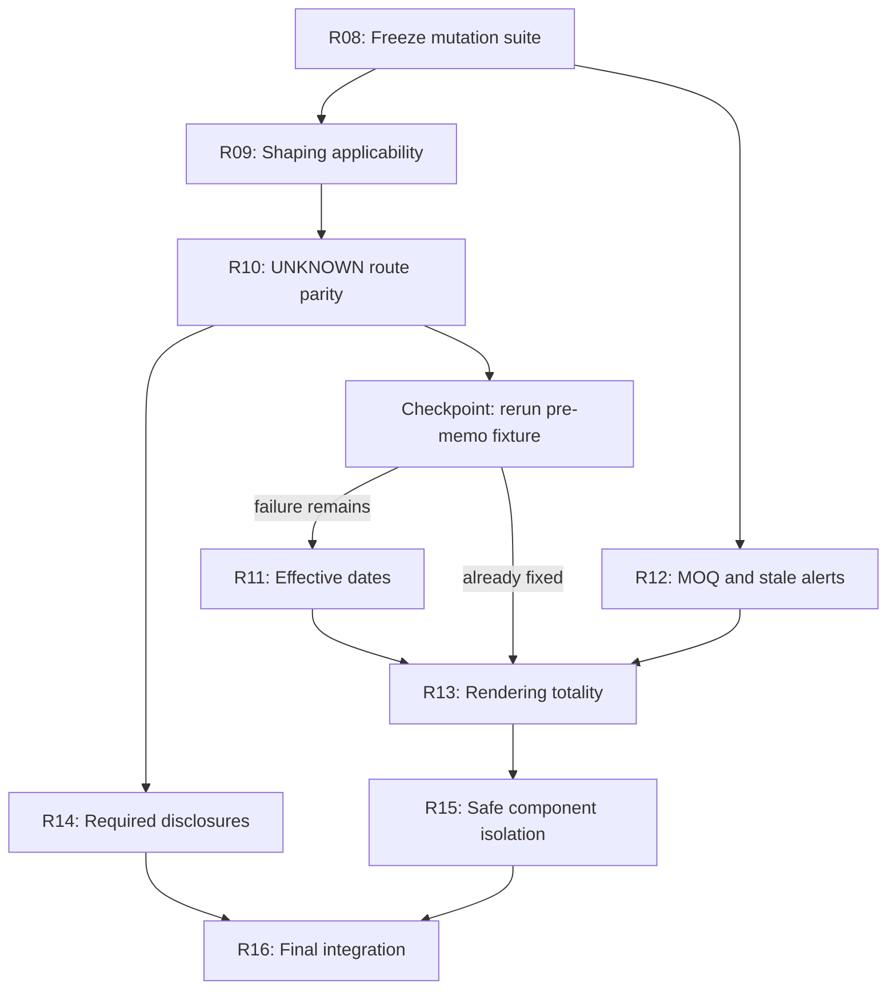

# Apex Procurement Agent — Post-R07 Correctness Plan

**Status:** Proposed implementation sequence after post-R07 mutation testing  
**Baseline:** `main` at `2c54873` (`Merge R07 defensible outputs`)  
**Authority:** `docs/MERGED_PLAN.md` remains the behavioral specification. This document addresses regressions and missing acceptance coverage found after R01–R07 were merged.  
**Safety rule:** Independent validation remains a commit boundary. Component containment may be added only after the root causes are fixed and only with a second validation pass over the surviving plan.

## 1. Outcome

This work makes the agent behave predictably when policy concepts, supplier attributes, named entities, and effective dates do not match the supplied fixtures exactly. It also closes an incoherent MOQ approval loop and prevents dead alerts from surviving reconstruction.

The work is complete when:

1. The post-R07 mutation cases are permanent CLI regressions, not scratch fixtures.
2. An unresolved shaping-only supplier reference affects only the directive's applicable component scope.
3. Planner and independent validator agree under rule-scoped `UNKNOWN` evidence without silently relaxing policy or aborting on rationale reconstruction.
4. Pre-memo and pre-policy dates produce the specified policy behavior without date-model disagreement.
5. An executed MOQ order is not accompanied by a mutually exclusive live sub-MOQ approval request, and obsolete requests disappear on rerun.
6. Every withholding disposition has a terminal, human-readable rendering path known at policy-pack load time where statically possible.
7. Stale source IDs and unknown units of measure produce the disclosures required by `MERGED_PLAN.md`.
8. A proven component-local internal failure may be contained only after unaffected decisions are independently revalidated; global or ambiguous failures still prevent every write.
9. All six supplied scenarios and all new mutations pass the final CLI and idempotency matrix.
10. Every written plan's disposition agrees with the evidence contract and the evidence it actually relies upon.
11. `--llm=auto` reports its deterministic fallback explicitly when no live planning provider is configured.

## 2. Why this work is needed

R01–R07 fixed the original solver, lateness, approval, evidence-contract, policy-authority, quarantine, and output defects. Mutation testing against the merged tree found a smaller set of remaining problems.

### 2.1 Confirmed or reproducible regressions

- **Shaping blast radius:** replacing the two memo-named magnet suppliers causes `POLICY_CONFLICT` and `DECISION_REQUIRED` across unrelated components. The cause is confirmed in `policy/evaluator.py`: named references are resolved and their alerts retained before component selector applicability is established.
- **Route-fact disagreement under `UNKNOWN`:** an unknown supplier country and an unusually named magnet currently reach independent validation with different planner/validator material-rejection facts.
- **Effective-date disagreement:** a pre-memo date can produce `DELIVERY_DATE_MISMATCH` even though the active-rule set should be deterministic for that date.
- **MOQ decision incoherence:** the agent can execute the MOQ quantity while presenting the mutually exclusive sub-MOQ quantity as a live approval request.
- **Stale alert reconstruction:** the sub-MOQ request can remain after committed inbound has eliminated the requirement it was meant to address.
- **Missing disclosures:** stale memo supplier IDs can resolve by legal name without the required `DATA_QUALITY` alert, and unknown units can round discretely without the required `ASSUMPTION` alert.

### 2.2 Risks that must not be mistaken for root causes

- A post-R07 exit-5 failure is safer than a silent policy relaxation, but it is an incidental tripwire rather than the required business behavior.
- Matching error codes do not prove a shared defect. Unknown-country and renamed-concept failures may share route-rejection reconstruction; effective-date delivery reconstruction remains a separate package until a minimal test proves otherwise.
- `ValidationIssue.component_id` does not prove that an error is safe to contain. Scope must be explicit and the survivor set must pass a fresh independent validation.
- A component matching no concept is not the only risky case. Any unresolved membership that changes eligibility, constraints, disposition, or optimization must follow rule-scoped three-valued semantics.

## 3. Design rules

1. **Selector before subject.** Establish whether a rule applies to the component before resolving source-named entities used only by that rule.
2. **Rule-scoped unknowns.** `UNKNOWN` applies only to the predicates it can affect. It must not become global uncertainty, and absence of positive evidence must not be silently treated as proven non-membership where the policy requires both-ways evaluation.
3. **Independent parity, not shared answers.** Planner and validator may share typed policy data and an explicit semantic contract, but the validator continues to reconstruct outcomes independently.
4. **One live decision frontier.** Mutually exclusive alternatives cannot both be presented as currently actionable after one has been committed.
5. **Internal errors are not business decisions.** A validator defect must not be relabeled as ordinary `DECISION_REQUIRED` work for a procurement user.
6. **Containment is fail-safe.** Only explicitly classified component-local failures are containable. Unscoped, structural, accounting, commit, ownership, or ambiguous errors remain global failures.
7. **Tests precede fixes.** Each package lands a regression that fails on the pre-change revision and passes with the package.

## 4. Work packages

### R08 — Freeze the mutation suite

**Purpose:** Preserve the cases that revealed the remaining defects and establish precise target behavior before implementation changes obscure the original symptoms.

**Work**

- Move the scratch mutations into reusable temporary-database fixture builders. Do not check in mutated SQLite outputs.
- Record the pre-fix exit code, validation code, affected component IDs, PO rows, and alert categories for each case.
- Land each target assertion as a temporary **strict** expected failure tied to its owning package, so an unexpected pass fails the suite until the marker is removed. Do not use non-strict `xfail` or permanently assert the defective behavior.
- Remove each expected-failure marker in the same package that implements its fix; no marker may survive R16.
- Cover at least:
  - unknown supplier country (`Freedonia`);
  - renamed magnet (`High-Coercivity Sintered Puck, Grade 52H`);
  - replacement of both memo-named magnet suppliers;
  - a pre-memo date and a pre-policy date;
  - MOQ 25 versus net need 5 across two runs;
  - stale supplier ID with a unique legal-name match;
  - unknown UoM such as `box`;
  - a synthetic known rule kind whose withholding disposition lacks a renderer.
- Exercise the real optimizer/validator boundary. The existing fully-covered `quantity_on_hand = 1_000_000` tests may remain as covered-demand tests but cannot be the evidence for these behaviors.

**Acceptance**

- Every mutation is created from a supplied scenario in a temporary directory.
- The fixture builders are deterministic and do not mutate source databases.
- Each later work package names the mutation test that proves it.
- Every expected failure is strict, names its owning R-package, and becomes an ordinary passing regression with that package.

### R09 — Selector-scoped shaping containment

**Depends on:** R08 fixture builder for supplier replacement

**Purpose:** Stop an unresolved shaping-only named supplier from contaminating unrelated components or independently scoped rules.

**Work**

- Evaluate a rule's component selector before resolving its named supplier or release subject.
- For selector `FAIL`, mark the rule inapplicable and do not resolve or alert on its named references.
- For selector `PASS`, apply the existing source-named resolution ladder.
- For selector `UNKNOWN`, apply the rule's declared three-valued behavior without turning the uncertainty into a global alert.
- When a shaping subject is unresolved, drop only the named-primary directive, emit a component-scoped `POLICY_CONFLICT`, and retain independently scoped rolling-cap and minimum-secondary rules.
- Update the independent validator to reconstruct the same applicability boundary independently.

**Acceptance**

- Replacing the two named magnet suppliers does not emit `POLICY_CONFLICT` for all components.
- Magnet procurement continues when the remaining hard rules are feasible.
- The minimum-secondary and rolling-window rules remain active where their selectors apply.
- The validator's `SHAPING_DEGRADATION_MISSING` check detects a genuinely missing scoped alert but does not create the blast radius itself.

### R10 — Rule-scoped `UNKNOWN` and route-fact parity

**Depends on:** R09

**Purpose:** Make unseen names and unresolved supplier facts conservative, explicit, and identical at the planner/validator contract boundary.

**Work**

- Capture the exact field-level difference between planner and validator material-rejection records before changing either implementation.
- Define and test the evidence result for each relevant attribute instead of assuming every missing value has identical semantics:

| Fact | Required treatment |
|---|---|
| Unknown country | Evaluate the affected domestic/international predicate both ways; never fall back silently to `is_domestic` |
| Unknown sustainability rating | Evaluate the below-B review predicate both ways and disclose the missing ordinal evidence |
| Unknown relationship tier | Preserve uncertainty only in comparators or rules that use the tier |
| NULL approved-list state | Require positive approval-list evidence for an executable route; emit `DATA_QUALITY` |
| Unusually named component | Use negative evidence for proven non-membership; otherwise preserve `UNKNOWN` wherever membership materially changes a rule |

- Ensure a concept-recall miss cannot silently remove a hard constraint or shaping comparator.
- Make planner rationale facts and validator reconstruction use the same reason-code vocabulary, rule IDs, evidence status, and route/date facts while retaining independent calculations.
- Parameterize the tests across country, rating, tier, approved-list state, and load-bearing concept membership.

**Acceptance**

- Unknown-country and renamed-component mutations no longer fail with `RATIONALE_MATERIAL_REJECTION_MISMATCH`.
- The agent executes only a plan safe under every required interpretation; otherwise it emits a component-specific unresolved disposition.
- Unaffected components continue to plan normally.
- No model call is required. Optional residual model resolution remains deferred.

### R11 — Effective-date and delivery reconstruction parity

**Depends on:** R08 date fixtures and the post-R10 checkpoint confirming that the pre-memo failure remains

**Purpose:** Ensure planner and validator construct the same active shipping and policy windows at boundary dates.

**Work**

- Trace standard and air-shipping lead selection from the typed policy registry in both planner and validator.
- Remove fallback dates or lead-time constants that survive outside their effective windows.
- Add exact boundary tests immediately before, on, and after each relevant policy or memo effective date.
- Preserve the safe pre-policy disposition—no procurement writes and exit 4—but replace the current internal registry assertion with a business-facing explanation that no reviewed procurement policy is effective for the scenario date.

**Acceptance**

- The pre-memo mutation completes without `DELIVERY_DATE_MISMATCH`.
- Planner and validator cite the same active rule IDs and independently derive the same material-availability date.
- Before the base policy is effective, the CLI performs no procurement and returns the documented clean refusal without exposing an internal assertion such as `domestic premium rules require critical(any) and ordinary(none) scopes`.

**Post-R10 decision checkpoint**

After R10 merges, rerun the pre-memo fixture before beginning R11 implementation:

- If the fixture now passes its delivery-date, active-rule, and message assertions, move that regression into R10 and mark R11 unnecessary.
- If `DELIVERY_DATE_MISMATCH` or the internal pre-policy message remains, proceed with R11 as an independent package.

This checkpoint tests whether the defects share an implementation root; it does not assume that matching or adjacent symptoms prove they do.

### R12 — Coherent MOQ alternatives and alert applicability

**Depends on:** R08 MOQ fixture

**Purpose:** Make the action presented to the user agree with the action the agent committed, and close the reconstruction loop for obsolete alerts.

**Work**

- Preserve the current policy decision that forced MOQ surplus is advisory and does not by itself block the minimum compliant executable order.
- If an MOQ plan is selected for execution, do not persist the mutually exclusive sub-MOQ proposal as a live `RECOMMEND_APPROVAL` request.
- A sub-MOQ possibility may remain as a clearly labeled cost diagnostic in the rationale; it is not actionable after commitment unless a future cancellation contract exists.
- If no executable MOQ plan is selected for another reason, retain a complete sub-MOQ approval proposal only when it is still applicable.
- During reconstruction, recompute alert applicability from current demand, inventory, committed inbound, policy, and selected action. Remove obsolete managed alerts without deleting human-authored rows.
- Make the executed action explicit in the wording: quantity, supplier, surplus, cost, and what would have to change before any alternative could be considered.

**Acceptance**

- Net need 5 with MOQ 25 produces one coherent live outcome, never an executed 25-unit order plus a live 5-unit approval request.
- A second unchanged run is a row-level no-op and contains no dead sub-MOQ ask.
- Changed inventory or inbound removes an obsolete request while preserving prior commitments and human alerts.

### R13 — Disposition/rendering totality

**Depends on:** R09, R10, R12, and R11 only if the post-R10 checkpoint says R11 is required

**Purpose:** Prevent a valid policy disposition from becoming `SILENT_INITIAL_GAP` because no alert template knows how to explain it.

**Work**

- Introduce a reviewed mapping from supported rule kind and contract disposition to terminal decision/alert rendering.
- At policy-pack load time, reject an unsupported rule kind or a declared disposition with no rendering path where this is statically knowable.
- At runtime, assert that every withheld or residual component has one terminal explanation identifying:
  - what is unresolved or prohibited;
  - what the agent did or withheld;
  - the applicable rule IDs;
  - the action required from a human or from engineering.
- Distinguish internal unsupported behavior from a procurement `DECISION_REQUIRED`; do not assign software defects to business users.
- Keep `SILENT_INITIAL_GAP` and `SILENT_RESIDUAL_GAP` as independent validator backstops.

**Acceptance**

- A synthetic pack mutation with an uncovered declared disposition fails during reviewed pack loading rather than after planning all components.
- Every supported withholding path has a deterministic alert renderer.
- No generic fallback can turn a proven policy violation into an executable plan.

### R14 — Required data-quality and assumption disclosures

**Depends on:** R10

**Purpose:** Bring successful degraded behavior into compliance with the existing specification.

**Work**

- When a source ID is stale but one normalized legal name matches, resolve that supplier and emit a scoped `DATA_QUALITY` alert naming the stale ID and resolved current ID.
- When a unit of measure is unrecognized, preserve the discrete-rounding default and emit `ASSUMPTION` with the unit and rounding rule.
- Deduplicate run-global wording without losing affected-component traceability.
- Do not add a supplier lead-time-drift alert in this package; the schema cannot distinguish current catalog lead, original quoted lead, receipt delay, and receiving buffer well enough to support that claim.

**Acceptance**

- Supplier renumbering preserves the semantic plan and adds exactly the required disclosure.
- `box` and `roll` do not crash, are not assigned a guessed pack size, and disclose discrete rounding.
- Planner and validator agree on both degraded behaviors.

### R15 — Safe component isolation with survivor revalidation

**Depends on:** R13. R14 is not a prerequisite and may proceed in parallel.

**Purpose:** Allow independent components to proceed after a genuinely component-local internal failure without weakening the validation boundary or masking root causes.

**Work**

- Add explicit failure scope metadata or a reviewed code-to-scope registry. A non-null `component_id` alone is insufficient.
- Treat structural snapshot, policy-pack, ownership, accounting, solver-proof, commit, unscoped, and unknown-scope failures as global.
- For an explicitly component-local failure:
  1. remove every executable action and solver result for the affected component;
  2. construct an internal-failure disclosure that cannot be mistaken for a business approval request;
  3. rerun independent validation over the surviving component scope and the exclusion records;
  4. commit only if that second validation and all global invariants pass.
- Preserve atomic commit and snapshot-digest checks.
- Report a structured partial-run status and include affected components in `RUN_ACCOUNTING`.
- Under `--strict`, retain all-or-nothing behavior.

**Acceptance**

- Injecting one allowlisted component-local failure permits only independently revalidated survivor orders.
- Removing the second validation pass makes the regression fail.
- Injecting an unscoped or structural failure writes nothing.
- A component-local failure never leaves a PO for that component and never appears as ordinary `DECISION_REQUIRED` work.
- Repeating a partial run cannot duplicate survivor orders.

### R16 — Final integration and audit

**Depends on:** R08–R10, R12–R15, and R11 only if the post-R10 checkpoint says R11 is required

**Purpose:** Prove that the fixes compose and that test coverage exercises the real application boundary.

**Work**

- Run all six supplied scenarios through the CLI under benchmark and production contracts on temporary copies.
- Run a second pass for every scenario and compare canonical business rows plus zero-write accounting.
- Run every mutation under the applicable contract and strictness modes.
- Retain covered-demand tests, but ensure the principal CLI suite includes shortages that cross optimizer, validator, decision, rendering, and commit layers.
- Assert disposition from evidence rather than from fixture counts:
  - an executable plan relying on benchmark rolling-history assumptions is `EXECUTE_WITH_ASSUMPTION`;
  - a plan with no such assumption may be `EXECUTE` when every other requirement is proven;
  - the production contract never writes a plan whose required evidence remains `UNKNOWN`.
- Keep `--llm=auto` as a non-load-bearing seam, but when no live planning provider is configured, report `model_status=unavailable_deterministic_fallback` in structured JSON/audit output and make the fallback explicit in CLI help. Do not add runtime residual model resolution in this package.
- Confirm that `README.md`, CLI help, runtime JSON, and audit output describe the same contract and exit behavior.
- Run the full unit, integration, generated, and performance suites.
- Record final outputs, test count, elapsed time, and `git status`, distinguishing the pre-existing `docs/PLAIN_PLAN-2x.wav` file.

**Acceptance**

- `python3 -m pytest -q` passes.
- No mutation fixture exists only in a scratch directory.
- No temporary expected-failure marker remains.
- All supplied and mutated scenarios meet their expected exit, write, alert, and idempotency contracts.
- Disposition-contract tests derive the expected disposition from active evidence and contract state rather than hard-coding the current number of purchase orders.
- `--llm=auto` without a configured provider is visibly and deterministically reported as a fallback while producing the same business rows as `--llm=off`.
- No package weakens the rule that an unvalidated executable action is never committed.

## 5. Implementation order and parallel work

### Parallel tracks

| Track | Packages | Can run alongside | Main overlap risk |
|---|---|---|---|
| Test infrastructure | R08 fixture builders, baseline evidence, and strict expected failures | All investigation work | Shared integration-test helpers; split fixtures by theme |
| Policy semantics | R09 → R10 → R14 | R11 and R12 | `policy/evaluator.py`, `policy/entity_resolution.py`, `validator.py` |
| Effective dates | R11 only if the post-R10 checkpoint fails | R12; fixture investigation may run during R09/R10 | `validator.py` is a shared hotspot; hold implementation until the checkpoint |
| Decision lifecycle | R12 | R09–R11 | `decisions.py`, `cli.py`, and `explanations.py` |
| Rendering coverage | R13 | R14 after its interface is agreed | May overlap R12 in `explanations.py`; start after R12's alert lifecycle is stable |
| Containment | R15 | R14 | Must start from the merged root-cause and renderer work; R14 has no behavioral dependency |
| Final audit | R16 | Documentation preparation only | Must wait for both R14 and R15 and run on the fully merged tree |

Recommended merge sequence:

1. Prepare R08 fixture builders, baseline evidence, and strict package-owned expected failures.
2. Run two implementation tracks in parallel, while R11 performs fixture-level investigation only:
   - R09 then R10 for selector and `UNKNOWN` semantics;
   - R12 for MOQ and reconstruction lifecycle.
3. After R10 merges, run the explicit pre-memo checkpoint. Implement R11 only if the date or message regression remains.
4. Implement R14 after R10. Implement R13 after R12 and the date checkpoint; R13's coverage model must reflect the final alert lifecycle and any required R11 behavior.
5. Implement R15 after R13 and all required root-cause packages pass. R15 and R14 may proceed in parallel if R14 has not already merged.
6. Run R16 only after both R14 and R15 merge.

Because `validator.py` participates in R09, R10, and R11, parallel agents should preferentially land separate regression-test files and narrow helper changes. Large concurrent validator edits should be serialized to avoid resolving semantic conflicts as ordinary merge conflicts.

## 6. Deferred and blocked work

The following are deliberately outside this remediation sequence:

- **Approval ingestion:** blocked until Apex answers where approval state lives and whether approval is per rule, component, supplier line, or exact proposal. Optimizer and validator approval-ID seams already exist, but the CLI has no trustworthy approval source or proposal-binding contract; those decisions must precede end-to-end wiring.
- **Optional model residual resolution:** useful for recall only after deterministic `UNKNOWN` behavior is correct; it cannot be load-bearing for safety.
- **Runtime memo ingestion:** the current assignment fixes the policy corpus; reviewed offline compilation remains the boundary.
- **Constraint DSL:** valuable for future rule kinds, but not before the fixed taxonomy is correct and fully rendered.
- **Partial rolling history from owned POs:** useful as a bounded lower-level disclosure, never as proof of complete supplier volume without retention and provenance guarantees.
- **Lead-time drift alerts:** deferred until the data distinguishes promised delivery, actual receipt, catalog lead, and receiving buffer.

## 7. Package protocol

For every package:

1. Start from the latest merged `main` after its dependencies.
2. Reproduce the relevant pre-change failure from an R08 fixture.
3. On the package branch, convert the strict expected failure into an ordinary target regression and verify that it fails before implementation.
4. Implement only the package's semantic change.
5. Remove the expected-failure marker, then run focused tests, the full suite, and the affected supplied scenarios.
6. Review the diff for duplicated policy logic and load-bearing fixture identifiers.
7. Commit the package independently and merge it before starting a dependent package.
8. Preserve unrelated user files and pre-existing untracked artifacts.
